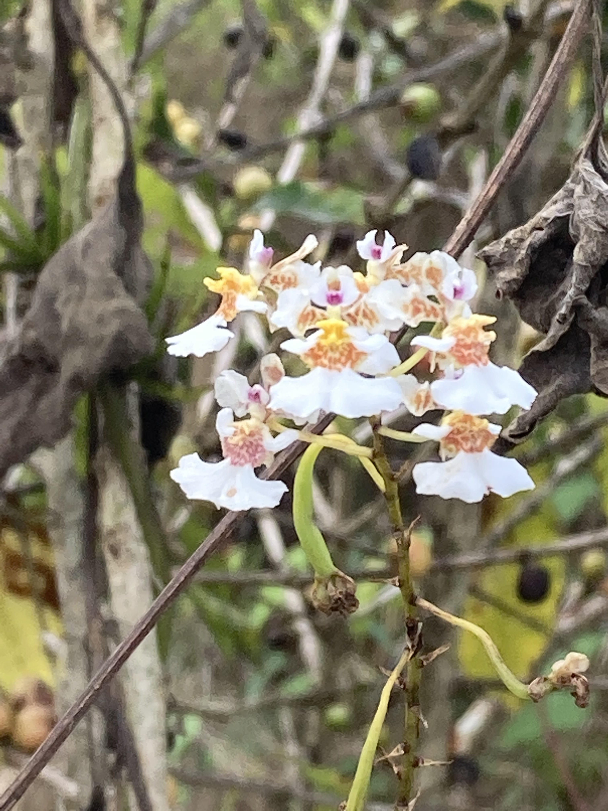
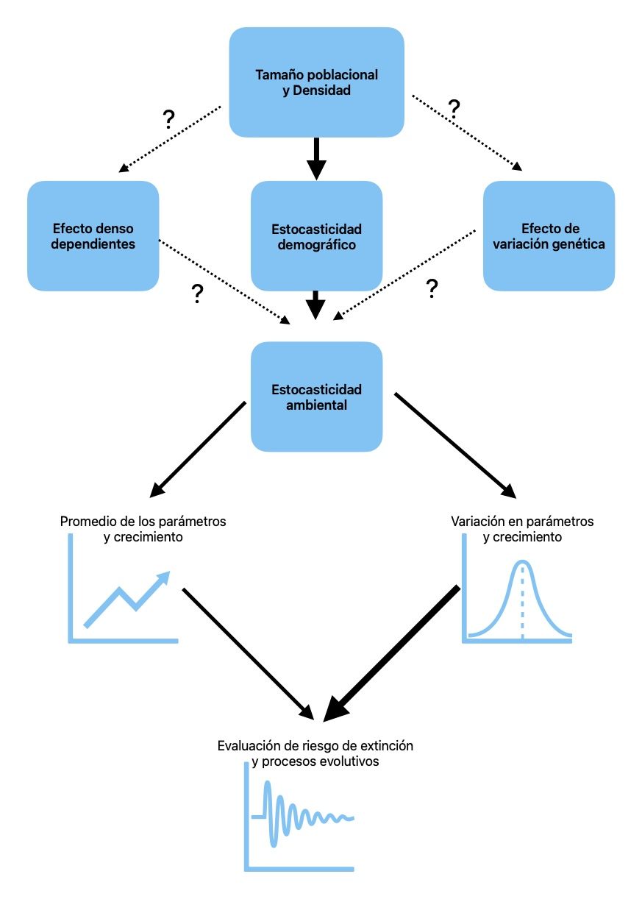

# Diagnóstico poblacional: Introducción {#Intro}

```{css, eval=FALSE, echo=FALSE}
body {
  counter-reset: counter-rchunks;
}

div.main-container {
  padding-left: 5em;
}

pre.r {
  counter-increment: counter-rchunks;
  position: relative;
  overflow: visible;
}

pre.r::before {
  content: 'In [' counter(counter-rchunks) ']: ';
  display: inline-block;
  position: absolute;
  left: -5em;
  color: rgb(48, 63, 159);
}

pre.r {
      background-color: #f5f5f5;
    }

```

Por: Raymond L. Tremblay, Ernesto Mujica Benitez, Demetria Mondragón

Las matrices de proyección poblacional (MPP) son la herramienta cuantitativa estándar para responder preguntas sobre el destino de las poblaciones: ¿están creciendo, en declive, o estables? ¿qué etapa del ciclo de vida es más vulnerable? ¿es viable la cosecha sostenible? ¿qué tan rápido se recuperaría la población después de una intervención de manejo? La dinámica poblacional, como disciplina, vincula los procesos demográficos individuales —supervivencia, crecimiento y reproducción— con los patrones observados a nivel de población.

Construir una MPP a partir de datos de campo es relativamente directo. La parte difícil —y la parte que rara vez se enseña en libros de texto— es **hacerlo bien**: con datos que respeten la biología del organismo, con métodos que respeten los supuestos del modelo, y con resultados que sobrevivan la revisión crítica de un comité editorial, un panel de financiamiento o un reanálisis varios años después.

Este libro está organizado alrededor de esa idea. No pretende ser un tratado completo de dinámica poblacional, para lo cual existen referencias clásicas como Caswell [-@caswell2001matrix], Ebert [-@ebert1999demography] y Morris y Doak [-@morris2002quantitative]. Es, en cambio, una guía práctica que enseña al lector a **construir, diagnosticar, defender e interpretar** un análisis matricial poblacional para una especie determinada, usando como ejemplo recurrente la familia *Orchidaceae*.

&nbsp;

::: callout-tip
## Las cuatro tareas de un demógrafo

1.  **Construir** el modelo: capítulos sobre ciclo de vida, recolección de datos, transiciones, fecundidad y descomposición U/F/C.
2.  **Diagnosticar** los datos y la matriz: capítulo sobre métodos bayesianos para transiciones raras y, sobre todo, el capítulo sobre impactos de datos sin sentido biológico.
3.  **Analizar** el comportamiento: capítulos sobre crecimiento, propiedades, elasticidad, dinámica transitoria, funciones de transferencia, LTRE y simulaciones.
4.  **Comunicar y defender** los resultados: capítulo con la traducción del protocolo estándar para reportar MPP de Gascoigne et al. [@gascoigne2023standard].
:::

&nbsp;

¿Por qué orquídeas? Porque su historia de vida es lo bastante extrema —semillas microscópicas, dependencia obligada de hongos micorrízicos para germinación, longevidad alta, eventos reproductivos raros, fenómenos de latencia— para poner a prueba los supuestos clásicos del modelado matricial. Si los métodos del libro funcionan para orquídeas, funcionan para casi cualquier planta o animal cuyo ciclo de vida quiera modelarse.

&nbsp;

::: callout-note
## Cómo leer este libro

- **Si está empezando** y nunca ha construido una MPP: lea en orden. Los capítulos del 4 al 11 dan los fundamentos.
- **Si ya tiene una matriz preliminar** y quiere validarla antes de seguir: vaya directamente al capítulo sobre impactos de datos sin sentido biológico —es la lista de verificación más útil del libro.
- **Si va a publicar resultados de MPP**: lea el capítulo del protocolo estandarizado antes de redactar la sección de métodos.
- **Si quiere usar COMPADRE** para análisis comparativos: los capítulos sobre `Rcompadre` y `Rage` son guías prácticas.
:::

&nbsp;

#### Librerías de R requeridas para el siguiente módulo

```{r intro-setup, message=FALSE, warning=FALSE}

library(ggplot2)
```

------------------------------------------------------------------------

## Objetivo y fundamentos de la conservación biológica

El propósito central de la conservación biológica es garantizar la persistencia de las especies, asegurando su supervivencia, reproducción y la producción de descendencia viable a lo largo de generaciones. Este objetivo requiere la consideración de factores intrínsecos y extrínsecos, tanto bióticos como abióticos, y sus interacciones. No obstante, la incorporación exhaustiva de todas las interacciones posibles resulta impracticable. Por ello, es necesario simplificar el problema mediante la identificación y priorización de los procesos más determinantes. El desafío metodológico consiste en desarrollar modelos que sean lo suficientemente parsimoniosos para facilitar su interpretación, pero lo bastante complejos para capturar los mecanismos esenciales de la dinámica poblacional.

## Importancia del hábitat en la conservación

El primer requisito para la conservación efectiva es la disponibilidad y protección de hábitats adecuados para cada especie. Durante las últimas cinco décadas, se han observado cambios sustanciales en la cobertura y manejo de ecosistemas en diversas regiones. Por ejemplo, en Puerto Rico, la cobertura boscosa aumentó de aproximadamente 2–5 % en la década de 1910 a más del 40 % en el año 2000 [@pares2008agricultural; @gould2017land]. De manera general, en América Latina se ha registrado una tendencia hacia la reforestación en años recientes [@aide2013deforestation], aunque esta dinámica varía significativamente entre países, tipos de hábitat y periodos temporales. En este contexto, la protección y restauración de hábitats constituye el primer principio operativo para la conservación biológica.

La actividad antropogénica ha generado hábitats completamente nuevos, resultado de la modificación de ecosistemas naturales, la introducción de especies exóticas, la contaminación ambiental y el cambio climático. Muchos de estos hábitats corresponden a bosques secundarios, fragmentados y dominados por especies introducidas, lo que los hace sustancialmente diferentes del ambiente original previo a las transformaciones humanas. Como consecuencia, las especies de interés suelen presentar una reducción significativa en el tamaño poblacional y patrones de distribución altamente fragmentados. Surge entonces la pregunta: ¿son suficientes estos remanentes poblacionales para mantener la viabilidad de la especie? ¿Cómo se determina que una población es viable?

Tradicionalmente, la conservación se ha fundamentado en la premisa de que la protección del hábitat garantiza la persistencia de las especies. No obstante, la mera presencia de individuos en un área protegida, incluso en abundancia, no asegura su supervivencia a largo plazo. Un ejemplo paradigmático es la extinción del dodo (*Raphus cucullatus*), ave endémica de la isla de Mauricio, y su estrecha relación funcional con *Calvaria major*, una especie arbórea de la familia *Sapotaceae* que estuvo al borde de la extinción. Aunque el último dodo fue registrado en 1681, *Calvaria major* persiste hasta la actualidad. Stanley Temple [-@temple1977plant] demostró que el reclutamiento de esta especie dependía del dodo, dado que la germinación de sus semillas requería el paso por el tracto digestivo de un ave para eliminar el endocarpo persistente que inducía latencia (*dormancy*). Este caso evidencia que la supervivencia futura de una especie no puede asumirse sin considerar sus interacciones bióticas y abióticas. Más de tres siglos después de la extinción del dodo, *Calvaria major* sobrevive, aunque en un estado de alta vulnerabilidad.

&nbsp;

::: callout-note
**La presencia no garantiza la persistencia.** La protección del hábitat es necesaria pero no suficiente para asegurar la viabilidad de una especie. La interacción ecológica entre el dodo y *Calvaria major* ilustra cómo una especie puede persistir en abundancia y aún así estar en una trayectoria demográfica comprometida. Esta es una motivación central para el análisis de dinámica poblacional.
:::

&nbsp;

## ¿Qué es el estudio de la dinámica poblacional?

La dinámica poblacional busca considerar todas las etapas y clases de edad de las especies, así como sus interacciones, para evaluar cuáles tienen un impacto relativamente mayor sobre la supervivencia de la especie. Identificar estas etapas críticas permite determinar cuáles podrían modificarse para influir en el crecimiento de las poblaciones estudiadas, siempre considerando las interacciones con su entorno biótico y abiótico.

La dinámica de poblaciones es fundamental en todas las áreas de la ecología y la evolución. Comprenderla es clave para interpretar la importancia relativa del acceso a los recursos y los efectos de la competencia, la herbivoría y la depredación sobre la viabilidad de las especies y la persistencia de las poblaciones. Tradicionalmente, los estudios se enfocaban en el análisis de tablas de vida para el manejo, la fenología y la conservación de especies particulares [@harper1977population]. Sin duda, John L. Harper fue uno de los pioneros de la ecología vegetal y dejó una amplia diversidad de publicaciones y temas [@sagar1985profile]. En años más recientes, los estudios se han diversificado para evaluar las interacciones entre las especies y su ambiente [@caswell2001matrix; @bacaer2011short].

## Definición

&nbsp;

::: callout-note
**Definición operativa.** La dinámica poblacional es el estudio de cómo y por qué cambian el tamaño y la estructura de una población a través del tiempo, como resultado de los procesos demográficos fundamentales: supervivencia, crecimiento (en tamaño o estadio) y reproducción. El objetivo central es cuantificar la contribución de cada proceso al cambio poblacional.
:::

&nbsp;

La definición más precisa de los estudios de dinámica poblacional se refiere al análisis de los factores que influyen en el crecimiento, la estabilidad y la reducción del tamaño de una población a lo largo del tiempo. Por ejemplo, la dinámica poblacional de especies invasoras suele incluir un periodo inicial de crecimiento muy lento durante la colonización de un nuevo sitio, seguido por una fase de crecimiento exponencial y, posteriormente, una disminución en la tasa de crecimiento poblacional. La figura siguiente ilustra el cambio en el número de individuos a lo largo del tiempo para una especie invasora hipotética. Lo fundamental es que la dinámica poblacional constituye una herramienta clave para evaluar el impacto de diferentes factores sobre el crecimiento poblacional y su viabilidad.

## Organización del libro

El libro está organizado de manera progresiva, comenzando con los procesos demográficos básicos y avanzando hacia herramientas analíticas y aplicaciones más complejas:

- Las **transiciones demográficas** introducen los procesos causales que conectan el ciclo de vida con la dinámica poblacional.
- El **crecimiento poblacional** describe cómo estas transiciones se integran en la tasa de crecimiento poblacional ($\lambda$).
- Las **propiedades de las matrices poblacionales** explican el comportamiento estructural y asintótico de las poblaciones.
- El análisis de **elasticidad y sensibilidad** evalúa la importancia relativa de las transiciones para el crecimiento poblacional.
- Los **modelos bayesianos de proyección poblacional** incorporan la incertidumbre y permiten evaluar escenarios alternativos.

## Capítulos complementarios y aplicaciones

Además del núcleo teórico, el libro incluye capítulos dedicados a métodos, aplicaciones empíricas y material de referencia, que amplían y contextualizan los conceptos centrales de la dinámica poblacional. Estos capítulos abordan, entre otros temas:

- La recopilación y organización de datos demográficos en el campo.
- La construcción práctica de matrices de transición (matrices **U**, **F** y **C**).
- Métodos de simulación poblacional y evaluación de escenarios.
- Análisis retrospectivos como los **LTRE**.
- Estudios de caso y ejemplos aplicados en sistemas reales.
- Material histórico, bases de datos y apéndices de apoyo.

Estos contenidos permiten aplicar el marco teórico a datos reales y profundizar en aspectos metodológicos y contextuales del análisis de la dinámica poblacional.

```{r chap1_1, echo=FALSE}

source("R/rlt_theme.R") # tema + paleta canónicos (R/rlt_theme.R)
```

```{r}
#| label: fig-Pop-fig_1
#| fig-cap: "Cambio poblacional en tiempo"

ggplot(pressure, aes(temperature, pressure)) +
  geom_point() +
  rlt_theme +
  xlab("Tiempo") +
  ylab("Tamaño poblacional, N")
```

## Un recuento histórico breve de la ecología de poblaciones

Los primeros estudios poblacionales se enfocaron en contar cuántos individuos de varias especies había en un sitio y en evaluar el impacto de diferentes tipos de efectos antropogénicos o de especies invasoras [@crawley1990population]. Crawley [@crawley1990population] indica que los primeros estudios publicados sobre el conteo de individuos en plantas fueron realizados por Carr (1848) y Burdon (1856), ambos presidentes de la Tyneside Natural History Society en Inglaterra. En la publicación de Burdon se menciona la presencia de individuos de *Cypripedium calceolus* en Castle Eden Dene, en el condado de Durham, hasta la pérdida completa de todos los individuos en 1850 (extraído de la revisión de Michael J. Crawley [@crawley1990population]). Sin embargo, al evaluar la publicación original, desafortunadamente no se menciona la cantidad exacta de individuos en el sitio [@baker1867northumberland].

Otro estudio pionero sobre dinámica poblacional fue establecido por V. M. Spalding en 1906 en el Carnegie Institute Desert Laboratory, con el objetivo de contabilizar la cantidad de individuos del cactus saguaro (*Carnegiea gigantea*) y evaluar la reducción de esta especie en relación con el aumento de la especie invasora *Prosopis glandulosa* y su correlación con el incremento de la ganadería en el área.

En su revisión sobre la dinámica de poblaciones de plantas, Crawley [@crawley1990population] identifica siete componentes consistentes en la biología vegetal:

- Plasticidad del tamaño: El tamaño de las plantas es una característica plástica, por lo que no constituye un buen indicador de la edad. Las correlaciones entre tamaño y edad varían entre especies [@gatsuk1980age; @le2004use; @vanderklein2007plant; @baden2021effects].

- Interacciones con vecinos: Debido a que las plantas son organismos sedentarios, la interacción con sus vecinos inmediatos es crucial. La densidad de individuos circundantes afecta su crecimiento, reproducción y supervivencia [@mitchell1987analysis; @pantone1992path; @postma2021dividing]. En la revisión de Postma [@postma2021dividing], basada en 334 experimentos, se observa que al aumentar la densidad, el tamaño de las plantas disminuye junto con el número de tallos y ramas, aunque la altura permanece estable.

- Cambios sucesionales: Las variaciones en la estructura poblacional a lo largo del tiempo son la norma, no la excepción [@young1987seed; @de2013early]. Por ello, el reclutamiento y la supervivencia en una parcela específica pueden variar significativamente en tiempo y espacio, influenciados por factores bióticos y abióticos [@acacio2007multiple; @luzuriaga2008determines].

- Reclutamiento impredecible: El reclutamiento puede ser infrecuente, impredecible y variable en el tiempo. Muchas especies forman bancos de semillas, lo que permite que el reclutamiento provenga de semillas almacenadas durante años [@saatkamp201411; @fenner2017ecology; @tomowski2023recruitment], incluso de diferentes cohortes.

- Competencia asimétrica: La competencia intraespecífica [@weiner1986size; @connolly1996asymmetric; @weiner2001effects] e interespecífica [@freckleton2001asymmetric] es común y generalmente asimétrica: las plantas grandes afectan a las pequeñas, pero rara vez ocurre lo contrario.

- Mortalidad relacionada al tamaño: La mortalidad está fuertemente asociada al tamaño, siendo más frecuente en etapas o tamaños pequeños, tanto entre especies [@moles2006seed] como a nivel intraespecífico [@fricke2019linking].

- Oportunidades tras la muerte de individuos grandes: La muerte de plantas grandes y viejas, ya sea por accidentes, herbivoría o enfermedades, puede generar espacios que faciliten el reclutamiento [@wright2003gap].

## El análisis de dinámica poblacional y su uso

Determinar el tamaño poblacional futuro tiene múltiples aplicaciones, que pueden agruparse en tres grandes categorías: 1) comprender las interacciones ecológicas, 2) manejo y conservación, y 3) procesos evolutivos. Los estudios enfocados en conservación se enmarcan dentro del enfoque de viabilidad poblacional.

En este libro presentaremos una introducción a cada una de estas vertientes. Nuestros ejemplos son ilustrativos y no constituyen una profundización exhaustiva de cada tema. En la siguiente tabla se muestran algunos usos específicos de la metodología de matriz de proyección poblacional (MPP). La lista de aplicaciones proviene en parte de las ideas de Morris y Doak [@morris2002quantitative], con ampliaciones posteriores.

### Tabla: El uso potencial de los diferentes acercamientos de MPP

| Categoría de Uso | Uso específico | Referencias generales | Referencias con Orquídeas |
|:-----------------|:-----------------|:-----------------|-----------------:|
| Manejo | Identificar las etapas o procesos demográficos claves | [@crouse1987stage] | [@shefferson2003life; @kery2004demographic; @zotz2006population; @zhongjian2008correlation; @tremblay2009dormancy; @tremblay2009population] |
|  | Determinar cuántos individuos en una población son necesarios para reducir el riesgo de extinción | [@shaffer1981minimum; @armbruster1993population; @traill2007minimum; @flather2011minimum] |  |
|  | Determinar cuántos individuos se necesitan introducir en un sitio para establecer una población viable | [@bustamante1996population; @bell2003projecting] |  |
|  | Determinar cuántos individuos se pueden extraer sin afectar negativamente la viabilidad de una población | [@nantel1996population; @ticktin2002effects; @ghimire2008demographic; @jansen2018towards] | [@emeterio2021does; @ticktin2020synthesis] |
|  | En especies invasoras, determinar cuántos individuos y en qué etapas se deben remover para controlar la población | [@arroyo2022prescriptions; @caplat2012modeling] |  |
|  | Determinar cuántas poblaciones se necesitan para lograr la viabilidad de una especie a nivel local o global | [@lindenmayer1996ranking] | [@tremblay2006epiphytic; @lind2007metapopulation; @winkler2009population; @garcia2010living; @kindlmann2014disobedient] |
| Evaluación de riesgos | Evaluar el riesgo de extinción de una población | [@gotelli2006forecasting] | [@nicole2005population; @iriondo2009peligro; @hutchings2010population; @thorpe2011trends; @raventos2015transient; @hens2017low; @ackerman2020small; @berry2021population; @timsina2021six] |
|  | Comparar el riesgo relativo entre dos o más poblaciones o especies | [@earl2019evaluating] | [@raventos2018comparison; @schodelbauerova2010prediction; @crain2019sheltered] |
| Interacciones ecológicas | Evaluar interacciones ecológicas abióticas y bióticas para entender las variables importantes para la supervivencia de una población | [@halpern2006approaches; @mandle2015resilience; @ehrlen2016advancing; @souza2018fire] | [@coates2006effects; @sletvold2010long; @sletvold2013climate; @ospina2023effect] |
| Procesos y patrones evolutivos | Identificar procesos, interacciones y patrones evolutivos del ciclo de vida que impactan el crecimiento poblacional | [@coste2020analysis] | [@calvo1993evolutionary; @jakalaniemi2011orchids; @shefferson2012linking; @falcon2017quantifying] |
| Metodología | Identificar la metodología adecuada según el tipo de muestreo o historia de vida | [@van1994loop; @gerlach2003testing; @rademaker2024we; @jops2025life] | [@gregg2006comparison; @kery2004demographic; @tremblay2009dormancy; @shefferson2014life; @tremblay2014bayesian; @tremblay2021population] |

## Preguntas que aborda el análisis de dinámica poblacional

### Identificar las etapas o procesos demográficos claves

Es fundamental reconocer cuáles son las etapas de vida más susceptibles a cambios bióticos y abióticos, así como su impacto sobre la persistencia de una población. Un ejemplo clásico en la literatura, utilizando modelos matriciales por etapas (MPP), son los estudios sobre la dinámica poblacional de la tortuga boba o cabezona (*Caretta caretta*) [@crouse1987stage; @crowder1994predicting]. Crouse y Crowder demostraron que, aun salvando todos los huevos de la depredación, esta estrategia tendría un impacto mínimo en el crecimiento poblacional. El mayor efecto sobre la tasa de crecimiento se lograría protegiendo a los adultos, específicamente reduciendo su mortalidad en redes de pesca mediante modificaciones que permitan su escape sin ahogarse. Estos trabajos fueron pioneros en mostrar que es posible simular diferentes escenarios basados en la historia de vida del organismo y evaluar su impacto. Esto no implica que no se deba proteger los huevos, sino que el beneficio es menor comparado con la protección de los adultos.

En estudios realizados en Cuba hace casi 20 años sobre tres especies epífitas (*Cattleyopsis cubensis*, *Dendrophylax lindenii* y *Encyclia bocourtii*), se demostró que la protección de individuos adultos es esencial para mantener el equilibrio poblacional. Esto se debe al alto valor reproductivo de los individuos más grandes, que poseen mayor capacidad para reemplazar a los individuos jóvenes, los cuales presentan mayor probabilidad de morir [@raventos2021effects]. Entre los principales riesgos para estas especies se encuentran la incidencia de huracanes, la mortalidad de las especies que actúan como forófitos y, en menor medida, la depredación.

### Determinar cuántos individuos en una población son necesarios para reducir el riesgo de extinción

El efecto del tamaño poblacional sobre la biología y la probabilidad de extinción en poblaciones naturales está bien documentado [@shaffer1985population; @nunney1993assessing; @harris2022abundance]. Surge entonces la pregunta: ¿cuál es la probabilidad de extinción de una población considerando la cantidad de individuos en cada etapa del ciclo de vida?

En general, se observa que a menor tamaño poblacional (N), mayor es el riesgo de extinción. Sin embargo, esta correlación puede variar si algunas etapas del ciclo de vida presentan reducciones significativas o si la probabilidad de sobrevivir o avanzar a la siguiente etapa es muy baja.

En el caso de las orquídeas, se sabe que una de las etapas más vulnerables es la de semilla, ya que en condiciones naturales depende del establecimiento de una interacción micorrícica específica. Por ejemplo, ¿cuál es la probabilidad de que las semillas se depositen en un sitio adecuado, encuentren su hongo específico, germinen y cuenten con las condiciones ambientales necesarias para crecer hasta convertirse en juveniles? Estas transiciones son extremadamente raras.

Por consiguiente, al evaluar la viabilidad de una nueva población de orquídeas, no basta con considerar la cantidad de individuos presentes; también es necesario estimar la probabilidad de que las semillas lleguen a convertirse en adultos reproductores. Darwin [@darwin1877various] estimó que un fruto de *Orchis maculata* produce aproximadamente 6,200 semillas, y una planta puede generar hasta 30 cápsulas, lo que equivale a 186,300 semillas. En un acre, la suma de todas las plantas podría producir más de 32,400,000,000 semillas. Sin duda, la probabilidad de que una semilla germine y llegue a ser una planta adulta es extremadamente baja; de lo contrario, estaríamos cubiertos de orquídeas en apenas dos generaciones.

### Determinar cuántos individuos se necesita introducir en un sitio para establecer una población viable

Determinar cuántos individuos se necesitan introducir en un sitio para establecer una población viable es una pregunta clave en conservación. Naturalmente, a mayor cantidad de individuos reintroducidos, mayor será la probabilidad de éxito, asumiendo que el área seleccionada permite la supervivencia, crecimiento y reproducción en todas las etapas del ciclo de vida. Sin embargo, los recursos son limitados, por lo que la pregunta debería enfocarse en cuál es el número mínimo de individuos necesario para garantizar un porcentaje determinado de éxito en el establecimiento de una nueva población.

En los últimos años, diversas organizaciones y científicos han implementado programas de reintroducción de especies en sus hábitats nativos, e incluso en áreas urbanas [@bellis2024identifying; @d2024best].

En Corea, dos estudios ilustran la complejidad del proceso. En la isla de Jeju, se translocó la orquídea *Thrixspermum japonicum*, cuya población original era de aproximadamente 50 individuos, de los cuales solo uno produjo frutos. A partir de este individuo se propagaron plántulas que fueron reintroducidas en el sitio. De los 216 individuos translocados, el 73% sobrevivió el primer año y el 63% el segundo año; entre el 16% y el 35% produjo frutos en los dos años siguientes [@kim2016restoration]. En otro estudio, en la isla de Bogildo, se reintrodujeron más de 13,000 individuos de *Dendrobium moniliforme* propagados artificialmente. Los autores demostraron que la ubicación y las condiciones del microhábitat son variables críticas: las áreas abiertas con luz solar directa favorecieron un crecimiento más rápido que las zonas sombreadas, y la especie de árbol huésped también influyó significativamente [@kim2016restoration].

Desafortunadamente, ninguno de estos estudios aplicó métodos de análisis de viabilidad poblacional (PVA) para determinar el tamaño mínimo de reintroducción necesario para establecer poblaciones viables. Además, no se consideraron factores como la probabilidad de germinación y el éxito en alcanzar la etapa adulta. Un ejemplo de esta complejidad es el trabajo de Zoe Fae Smith [@smith2006reintro], quien evaluó la germinación in situ de *Diuris fragrantissima* y *D. punctata* en Australia utilizando 640 mallas según el método de [@rasmussen1993seed]. Ninguna semilla germinó en campo, lo que evidencia la necesidad de estudios más detallados sobre viabilidad y estrategias de reintroducción.

En otro estudio, Zettler y colaboradores [@zettler1993symbiotic] evaluaron la germinación de semillas de *Goodyera pubescens* en un sitio de reintroducción en el estado de Illinois, EE.UU. Los autores encontraron que la germinación de las semillas fue muy baja y que la presencia de hongos micorrícicos específicos era esencial para este proceso. En consecuencia, la reintroducción de orquídeas en un sitio debe considerar la presencia de hongos micorrícicos adecuados, así como la cantidad de individuos que se deberían reintroducir para garantizar la viabilidad de la población.

### Determinar el número de individuos que pueden ser extraídos sin comprometer la viabilidad poblacional

La extracción de individuos, seudobulbos o flores desde su ambiente natural responde principalmente a tres propósitos:

- Obtención de individuos para programas de conservación ex situ.
- Utilización de un grupo de individuos para su propagación.
- Extracción con fines comerciales sin objetivos de conservación (por ejemplo, uso medicinal, cultivo ornamental u otros usos).

Se suele asumir que la colecta de individuos de especies de orquídeas desde sus hábitats naturales, tanto para conservación ex situ como para propagación comercial, tiene un impacto mínimo y no afecta la supervivencia poblacional a largo plazo. Sin embargo, este supuesto requiere una evaluación crítica. La historia del fanatismo por la recolección de orquídeas con fines comerciales está bien documentada [@subedi2013collection]. Aunque se podría pensar que estas prácticas son cosa del pasado, persisten casos de extracción ilegal por personas inescrupulosas que no consideran el impacto sobre la población o la especie [@hinsley2018review].

&nbsp;

::: callout-warning
**Cuidado con la "extracción de bajo impacto".** Es común suponer que la recolección de un número reducido de individuos —para conservación *ex situ*, propagación o uso comercial— tiene un impacto demográfico despreciable. Este supuesto requiere evaluación crítica: el impacto depende del estadio extraído, de la elasticidad de ese estadio sobre $\lambda$, y de la frecuencia con que se repite la extracción. Sin un análisis demográfico explícito, no se puede afirmar que la extracción es sostenible.
:::

&nbsp;

Por lo tanto, la pregunta central es: ¿cuántos individuos, y en qué etapas del ciclo de vida, pueden ser extraídos sin afectar negativamente el crecimiento poblacional? [@ticktin2020synthesis]. Responder esta cuestión implica comprender la dinámica poblacional y aplicar modelos que permitan estimar umbrales de extracción sostenible.

### En especies invasoras, determinar cuántos individuos y en qué etapas se necesitan remover para controlar la población

Actualmente, se reconoce ampliamente el impacto negativo que los organismos invasores pueden ejercer sobre la flora y fauna nativas. Esto plantea interrogantes fundamentales: ¿cuáles son las características que confieren a una especie su potencial invasivo? y ¿qué programas de manejo pueden implementarse para mitigar su impacto?

En términos generales, las especies invasoras se caracterizan por presentar altas tasas de crecimiento y reproducción, elevada supervivencia, baja mortalidad y gran capacidad de dispersión. Por consiguiente, cualquier estrategia de manejo debe identificar las etapas del ciclo de vida más vulnerables a la intervención. En la mayoría de los casos, la etapa de semillas constituye el punto más susceptible para la manipulación y control.

Los impactos más notorios de especies invasoras han sido documentados en Australia, incluyendo la introducción del conejo (*Oryctolagus cuniculus*) [@alves2022single] y del cactus *Opuntia* [@novoa2015introduced], entre otros ejemplos ampliamente discutidos en cursos de ecología de comunidades. No obstante, la problemática de las especies invasoras continúa siendo un tema que requiere investigaciones y evaluaciones más profundas.

Diversos estudios han empleado matrices de proyección poblacional (MPP) para analizar la demografía de especies invasoras [@buckley2003demography; @koop2005projection; @mcmahon2008transient; @ramula2008general; @li2015demographic]. Un caso particular evaluó el efecto de una hormiga invasora y un insecto nativo sobre la dinámica poblacional de una orquídea invasora [@falcon2017quantifying].

### Evaluar el riesgo de una población

La mayoría de los estudios que emplean matrices de proyección poblacional (MPP) se centran en evaluar el riesgo de reducción poblacional o de extinción. Un ejemplo clásico es el trabajo de Forsman [@forsman1996demography], quien analizó 11 poblaciones del búho moteado (*spotted owl*) y demostró que 10 de ellas estaban en declive, mientras que la población de California se encontraba en riesgo de extinción.

Los análisis basados en MPP como herramienta para estimar el riesgo de extinción incluyen diferentes métricas, tales como la probabilidad de extinción, la cuasiextinción y la probabilidad de cuasiextinción. Estas estimaciones son fundamentales para especies cuyo manejo demográfico busca reducir el riesgo de desaparición [@crone2011plant; @semmens2016quasi]. Sin embargo, aunque este enfoque es común en la literatura de conservación, puede resultar problemático si no se considera la confiabilidad de los parámetros estimados y la incertidumbre asociada a los datos [@ludwig1999meaningful].

Un ejemplo del uso de MPP en orquídeas amenazadas es el caso de *Crepidium acuminatum*, una especie en peligro de extinción del sudeste asiático, afectada por la extracción para uso medicinal [@timsina2021six]. Un estudio demográfico de seis años reveló que la tasa de crecimiento poblacional fluctuó entre 0.80 y 1.05, sin diferencias significativas entre años ni entre poblaciones. Otros ejemplos incluyen el trabajo de [@borrero2023populations], quienes estudiaron *Trichocentrum undulatum* y evaluaron el riesgo asociado a su ubicación en la periferia de la distribución. En ambos casos, el objetivo fue estimar el riesgo de extinción de las poblaciones analizadas.

### Determinación del número de poblaciones necesarias para la viabilidad de una especie a nivel local o global

La mayoría de las especies están divididas en múltiples poblaciones, aunque el concepto de “población” puede variar según el contexto. Con frecuencia, los autores no explicitan la definición utilizada y emplean el término para referirse simplemente a una agrupación de individuos. La definición práctica más común considera una población como un conjunto de individuos suficientemente cercanos entre sí, lo que facilita la recolección de datos. Sin embargo, este enfoque puede carecer de validez ecológica o evolutiva.

En ecología, una población debería definirse como un grupo de individuos que interactúan entre sí, o que al menos tienen cierta probabilidad de hacerlo. Por ejemplo, si hablamos de una población de *Catasetum*, los individuos deberían estar lo suficientemente próximos para que las abejas polinizadoras (i.e., *Euglossa* spp.) puedan transportar el polen entre ellos. La distancia y el potencial de movimiento de estas abejas varían considerablemente según la especie y la estructura del paisaje [@tonhasca2003dispersal; @pokorny2015dispersal; @opedal2017euglossine].

Otra definición, de carácter evolutivo, considera una población como el conjunto de individuos entre los cuales ocurre flujo génico a lo largo de una generación. El tiempo generacional depende de la longevidad de la especie, que puede variar ampliamente. Por ejemplo, en las orquídeas epífitas de ramitas (*twig epiphytes*), el ciclo generacional puede ser de 3 a 4 años, mientras que en *Cypripedium calceolus*, una especie terrestre de zonas templadas, los individuos adultos pueden vivir más de 50 años. Cabe destacar que la “longevidad” se define como la mediana de la edad de los individuos en una población, excluyendo casos extremos. El único estudio que ha evaluado la longevidad en orquídeas es [@tremblay2000plant], limitado a especies del género *Lepanthes*.

&nbsp;

::: callout-tip
**¿Qué es una población? Tres maneras de pensarlo.**

- **Operativa:** un grupo de individuos suficientemente cercanos para muestrearlos juntos. Útil en campo, pero sin justificación ecológica explícita.
- **Ecológica:** un grupo de individuos que interactúan entre sí (o que pueden hacerlo) — la distancia operativa depende de la movilidad del polinizador, dispersor, herbívoro, etc.
- **Evolutiva:** un grupo entre el cual ocurre flujo génico durante una generación. La escala depende del tiempo generacional de la especie.

Estas definiciones a menudo no coinciden, y la elección afecta directamente la interpretación de los resultados de un análisis de dinámica poblacional.
:::

&nbsp;

### Procesos y patrones evolutivos del ciclo de vida que impactan el crecimiento poblacional

Un trabajo que aprovecha la MPP para evaluar procesos evolutivos es el de Ricardo Calvo [@calvo1993evolutionary], quien analizó la dinámica poblacional de *Tolumnia variegata* para determinar si la limitación de polinizadores afecta su viabilidad. El estudio combinó experimentos de polinización manual con modelos matriciales para estimar la tasa de crecimiento poblacional bajo distintos niveles de polinización. Los resultados mostraron que la fructificación natural es extremadamente baja (\<1 %), pero aumenta significativamente con polinización artificial, aunque con costos reproductivos en crecimiento y floración futura. Las simulaciones sugieren que incluso una baja producción de plántulas por fruto podría compensar estos costos, favoreciendo la selección hacia mayor polinización. Sin embargo, la persistencia de baja fructificación en orquídeas engañosas indica que la estrategia puede ser estable si el reclutamiento de plántulas es limitado. Esto resalta la importancia de considerar las interacciones ecológicas y los datos de establecimiento al evaluar la viabilidad poblacional. Este caso nos recuerda que la conservación y la evolución no dependen solo de la presencia de individuos, sino de la compleja red de procesos que sostienen la vida a largo plazo.

::: img-float
{#fig-tolumnia-variegata-tremblay style="float: right; margin: 10px;width: 50% ; "}
:::

------------------------------------------------------------------------

## Visualización de la dinámica poblacional

&nbsp;

::: callout-important
**Un modelo es una caricatura útil, no una representación completa.** Todo modelo demográfico es deliberadamente una simplificación. Si se complica en exceso, los patrones no pueden atribuirse a efectos identificables y el modelo pierde generalidad. El criterio práctico es: un modelo debe ser **lo más simple posible, pero no más simple** — suficientemente parsimonioso para interpretarse, pero suficientemente complejo para capturar los procesos esenciales.
:::

&nbsp;

Representar el cambio poblacional mediante diagramas y sus posibles causas permite integrar los diferentes componentes bióticos y abióticos que influyen en la dinámica de una especie. Es importante aclarar que un modelo es una simplificación —una “caricatura”— y no incluye todos los factores que afectan la población. El objetivo de un modelo es reducir la complejidad biológica a los procesos más relevantes; si se complica en exceso, los patrones y dinámicas no pueden atribuirse a efectos proporcionalmente importantes. Además, un modelo demasiado específico sería aplicable solo a una especie o población, limitando su utilidad en otros sistemas.

En la figura se ilustran los factores principales que influyen en el crecimiento poblacional y las variables más relevantes para evaluar el riesgo de extinción. Todo análisis de dinámica poblacional parte del tamaño de la población (N) o su densidad, ya que este parámetro impacta directamente otros factores demográficos. En el diagrama, las líneas entrecortadas con signos de interrogación indican relaciones con poca o nula evidencia en orquídeas, mientras que las líneas continuas representan factores respaldados por estudios.

Los efectos denso-dependientes pueden influir en el número de individuos en el siguiente intervalo, así como las diferencias genéticas entre ellos. Aunque esto se ha documentado en otros organismos, en orquídeas los estudios son escasos y suelen asumir que las diferencias genéticas tienen mayor impacto. Por el contrario, los efectos estocásticos —tanto demográficos como ambientales— son bien conocidos en orquídeas y afectan los parámetros de crecimiento y su variación. Finalmente, la variación temporal es el factor que más incide en el riesgo de extinción: cuando esta variación es alta en poblaciones pequeñas, la probabilidad de extinción aumenta significativamente. Por ello, la variación en el tiempo debe considerarse en todos los estudios de dinámica poblacional.

------------------------------------------------------------------------

::: {}
{#fig-demografia-de-una-poblacion width="50%" style="left; margin: 10px;" fig-align="center"}
:::

------------------------------------------------------------------------

## Convenciones gráficas del libro

A lo largo del libro las gráficas comparten un mismo estilo visual: un tema de `ggplot2` (`rlt_theme`), una paleta cualitativa común (`diverging`) y dos funciones de conveniencia, `rlt_style_fill()` y `rlt_style_colour()`, que combinan el tema con la escala de color correspondiente. Para evitar repetir esta definición en cada capítulo, vive en un único archivo, `R/rlt_theme.R`, que cada capítulo carga con `source("R/rlt_theme.R")`. La paleta es la de Okabe-Ito (ocho colores **seguros para daltonismo**), con el tercer color sustituido por el teal de la marca del libro (`#009392`); ocho colores bastan para todas las figuras. El código completo se muestra aquí una sola vez:

```{r}
#| label: rlt-theme-mostrar
#| eval: false
#| file: R/rlt_theme.R
```

## Convención numérica

En todo el libro, los valores numéricos en las **tablas se muestran con cuatro cifras significativas**. Se eligen cifras significativas —y no un número fijo de decimales— para no perder valores muy pequeños: por ejemplo, un prior de fecundidad del orden de `1e-5` (capítulo bayesiano) se mostraría como `0.000` con tres decimales, pero conserva su información con cuatro cifras significativas. Este formato es **solo de presentación**: los cálculos internos (matrices, valores propios, elasticidades, simulaciones, etc.) se realizan siempre con la **precisión completa** de R. Por lo tanto, si reproduce un cálculo a partir de los valores que aparecen en una tabla, puede obtener pequeñas diferencias respecto al resultado del libro; para replicar exactamente, use los datos sin redondear. El separador decimal es el **punto** (`0.5`), de forma consistente con la salida de R.

------------------------------------------------------------------------

<br>
