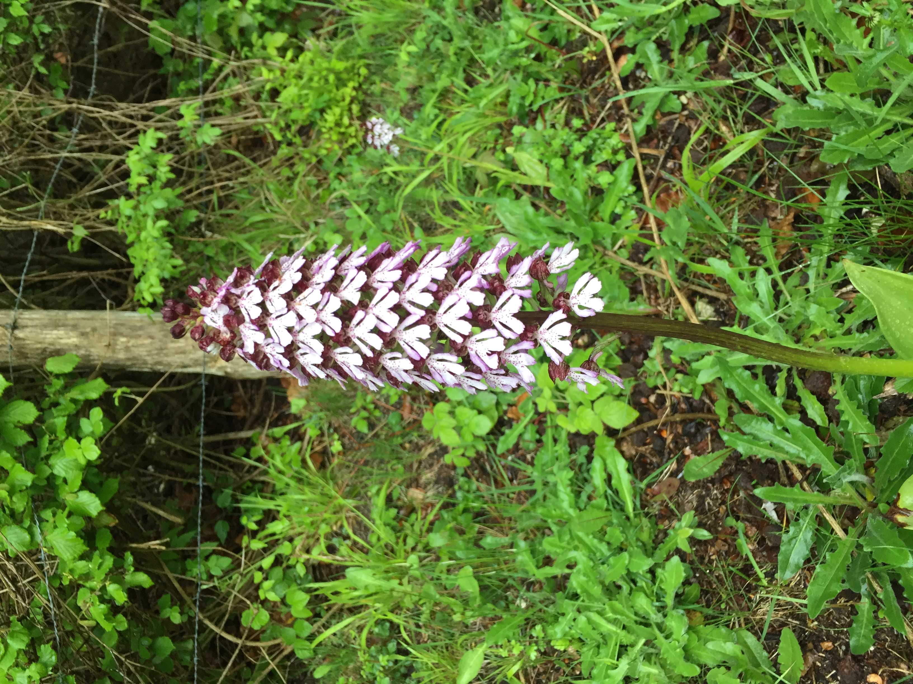
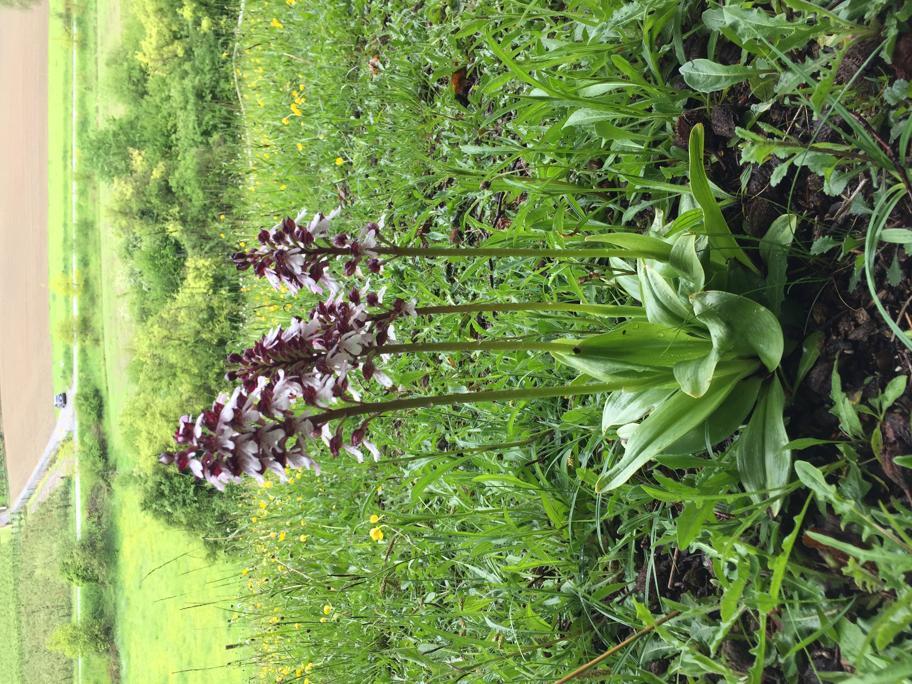

# El Ciclo de Vida {#Ciclo_Vida}

Raymond L. Tremblay

#### Librerías de R requeridas para el siguiente módulo

```{r CV1-setup-diagrams, include=FALSE, tidy=FALSE}
#| error: true

# Install (if needed) and load
pkgs <- c("DiagrammeR", "DiagrammeRsvg", "rsvg", "Rage", "knitr", "ggplot2")
to_install <- setdiff(pkgs, rownames(installed.packages()))
if (length(to_install)) install.packages(to_install, dependencies = TRUE)

library(DiagrammeR)
library(DiagrammeRsvg)  # export_svg()
library(rsvg)           # rsvg_png()
library(Rage)
library(knitr)
library(ggplot2)

# Carpeta de salida para PNGs
out_dir <- "figs"
if (!dir.exists(out_dir)) dir.create(out_dir, recursive = TRUE)

PNG_WIDTH  <- 2400
PNG_HEIGHT <- 1600

# Helper: DOT -> PNG
grviz_dot_to_png <- function(dot, outfile, width = PNG_WIDTH, height = PNG_HEIGHT) {
  g   <- DiagrammeR::grViz(dot)             # crea el widget (no se imprime aquí)
  svg <- DiagrammeRsvg::export_svg(g)       # SVG en texto
  rsvg::rsvg_png(charToRaw(svg), outfile, width = width, height = height)
  outfile
}

# Helper: construir DOT a partir de nodos / aristas
build_dot <- function(nodes, edges, title = NULL) {
  paste(
    "
digraph {
  {
    graph[overlap=false];
    rank=same;
    node [shape=", "egg", ", fontsize=", 12, "];",
    nodes, "
  }",
    "ordering=out
  x [style=invis]
  x -> {", nodes, "} [style=invis]", edges,
    "labelloc=\"t\";
  label=\"", ifelse(is.null(title), "", title), "\"
}",
    sep = ""
  )
}

# Helper: construir nodos/aristas (como en el capítulo)
make_nodes_edges <- function(stages, mat, cols, minlen_scale = 3, digits = 3, fontsize = 10) {
  graph <- expand.grid(to = stages, from = stages)
  graph$trans <- round(c(mat), digits)
  graph <- graph[graph$trans > 0, ]

  nodes <- paste(paste0("'", stages, "'"), collapse = "; ")
  graph$min_len <- (as.numeric(graph$to) - as.numeric(graph$from)) * minlen_scale

  if (length(cols) != nrow(graph)) {
    stop("Longitud de 'cols' (", length(cols), ") != número de aristas (", nrow(graph), ").")
  }

  edges <- paste0(
    "'", graph$from, "'", " -> ", "'", graph$to, "'",
    "[minlen=", graph$min_len,
    ",fontsize=", fontsize,
    ",color=", cols,
    ",xlabel=", "\"", graph$trans, "\"",
    "]\n",
    collapse = ""
  )

  list(nodes = nodes, edges = edges)
}

# Helper: mostrar en HTML el widget; en PDF, PNG estático
render_dual <- function(dot, png_name) {
  if (knitr::is_html_output()) {
    DiagrammeR::grViz(dot)
  } else {
    pngfile <- file.path(out_dir, png_name)
    # Ensure the output directory exists (e.g. figs/images/) before writing.
    dir.create(dirname(pngfile), recursive = TRUE, showWarnings = FALSE)
    grviz_dot_to_png(dot, pngfile)
    knitr::include_graphics(pngfile)
  }
}

```

## Introducción

Todas las especies biológicas poseen una historia de vida que comienza con el nacimiento y culmina con la muerte. En su hábitat natural, la supervivencia de la mayoría de las plantas depende de la continuidad de todas las etapas de desarrollo —semilla, plántula, juvenil, adulto y eventos reproductivos— a lo largo del ciclo vital. Aunque estas etapas suelen incluirse en los análisis, algunas pueden omitirse; por ejemplo, la fase de semilla en especies que se reproducen vegetativamente mediante clones (como plátanos, papas, piñas, vainillas y numerosas plantas ornamentales y medicinales).

Desde la perspectiva de la conservación y la ecología, es fundamental evaluar el ciclo de vida completo, identificar las características que limitan la supervivencia y la reproducción en el hábitat natural, y determinar cuáles etapas son más relevantes para el crecimiento poblacional. La persistencia de una especie depende de procesos viables que mantengan una población estable o en aumento. El método más adecuado para evaluar esta persistencia consiste en analizar las etapas críticas de la historia de vida y aplicar matrices de proyección poblacional para estimar los cambios en el tiempo, identificando si la población crece, disminuye o se mantiene estable.

Antes de iniciar cualquier estudio poblacional, se recomienda elaborar un diagrama del ciclo de vida de la especie de interés. Este paso previo a la recolección de datos permite visualizar el ciclo hipotético, identificar etapas críticas, factores que influyen en el crecimiento y supervivencia, y definir qué información debe obtenerse en campo. Los diagramas son herramientas esenciales para comprender la biología del organismo y anticipar los factores que afectan su desarrollo.

Un diagrama de ciclo de vida es una representación gráfica de los estadios que atraviesa un organismo a lo largo de su existencia. En este capítulo, se mostrará cómo crear diagramas de ciclo de vida en `R` utilizando la librería `Rage`, enfatizando la diferencia entre el modelo hipotético y los datos que pueden recolectarse en campo.

------------------------------------------------------------------------

## Ejemplo de ciclos de vida sencillo

En este primer ejemplo se presenta un ciclo de vida simple con tres estados: semillas, plántulas y adultos. Supongamos que se trata de una planta que se reproduce sexualmente y cuyas semillas no forman un banco, lo que implica que no hay latencia y germinan en el mismo año en que son dispersadas. En este escenario, las semillas germinan y se convierten en plántulas o mueren; las plántulas crecen y se transforman en adultos o mueren; y los adultos se reproducen y finalmente mueren. Cada etapa dura un año: el primero corresponde a la semilla, el segundo a la plántula y el tercero al adulto, que contribuye con nuevas semillas. Por lo tanto, el ciclo completo dura tres años. Este es un ejemplo hipotético, ya que en la naturaleza los organismos rara vez presentan ciclos tan simples.

La matriz de transición para este ciclo es la siguiente: el 50 % de las semillas germinan y se convierten en plántulas, el 40 % de las plántulas alcanzan la etapa adulta y cada adulto produce en promedio 3.2 semillas. En el diagrama, las líneas verdes representan crecimiento y las líneas amarillas representan reproducción.

```{r CV_2}
#| error: true
# 1) Build data/state as you already do

matA <- rbind(
  c(0.0, 0.0, 3.2),
  c(0.5, 0.0, 0.0),
  c(0.0, 0.4, 0.0)
)
etapas <- c("semillas", "plantulas", "adultos")
cols   <- c("PaleGreen4", "PaleGreen4", "Goldenrod1")

ne  <- make_nodes_edges(etapas, matA, cols, minlen_scale = 3, digits = 3, fontsize = 10)
dot <- build_dot(ne$nodes, ne$edges, title = "Especie hipotética")

render_dual(dot, "images/CV_2.png")

```

------------------------------------------------------------------------

## Ejemplo de una orquídea hipotética

El ciclo de vida hipotético de una orquídea epífita se representa en el gráfico mediante líneas verdes para indicar transición entre etapas, líneas rojas para señalar permanencia y líneas amarillas para la reproducción. El ciclo comienza con la germinación de la semilla sobre la corteza de un árbol, seguida por las fases de plántula, juvenil y adulto, etapa en la cual ocurre la floración y producción de semillas. Exceptuando la fase de semilla, cada etapa puede prolongarse de un año a otro, lo que evidencia un ciclo plurianual; esta característica se refleja en la diagonal principal de la matriz de transición, cuyos valores son mayores a cero cuando existe permanencia. Solo los individuos adultos son capaces de reproducirse. Si el diagrama correspondiera a datos empíricos, sería necesario contar con información para todas las etapas (semilla, plántula, juvenil y adulto); sin embargo, la revisión bibliográfica realizada no identificó estudios que incluyan datos completos, debido principalmente a la dificultad de localizar semillas y plántulas en condiciones naturales, dado su tamaño extremadamente reducido (milimétrico) y la complejidad de seguir su desarrollo a lo largo del tiempo.

```{r CV_3}
#| error: true

matA_ho <- rbind(
  c(0.0, 0.0, 0.0, 3.2),
  c(0.5, 0.3, 0.0, 0.0),
  c(0.0, 0.4, 0.20, 0.0),
  c(0.0, 0.0, 0.40, 0.80)
)
etapas_ho <- c("semillas", "plantulas", "juvenil", "adultos")
cols      <- c("PaleGreen4", "red", "PaleGreen4", "red", "PaleGreen4", "Goldenrod1", "red")

ne  <- make_nodes_edges(etapas_ho, matA_ho, cols, minlen_scale = 3, digits = 3, fontsize = 10)
dot <- build_dot(ne$nodes, ne$edges, title = NULL)

render_dual(dot, "images/CV_3.png")

```

------------------------------------------------------------------------

## Ciclo de vida de orquídeas en la literatura científica

A continuación se presentan diversos esquemas de ciclo de vida utilizados en distintas publicaciones. Estos ejemplos evidencian la ausencia de un modelo estandarizado, ya que cada investigador define un ciclo particular en función de su comprensión del ciclo biológico de la especie estudiada, la factibilidad de seguimiento de individuos a lo largo del tiempo y los objetivos específicos de la investigación.

Los casos analizados incluyen tanto especies terrestres como epífitas, y reflejan la diferencia entre los ciclos de vida hipotéticos y las limitaciones impuestas por la recolección de datos en condiciones de campo. Esta variabilidad pone de manifiesto la complejidad inherente al estudio demográfico de orquídeas y la necesidad de adaptar los modelos a las características ecológicas y metodológicas de cada estudio.

### Especies epífitas

#### *Laelia speciosa*

La información presentada se basa en la tesina de Mariana Hernández-Apolinar [@hernandez1992dinamica], uno de los primeros estudios sobre dinámica poblacional en orquídeas epífitas. El objetivo principal de dicho trabajo fue evaluar el impacto de la recolección sobre la dinámica poblacional de *Laelia speciosa*.

El ciclo de vida propuesto se compone de cinco etapas, según lo ilustrado en la figura 25a de la tesina:

- Semillas
- Plántulas
- 3 etapas de tamaño de planta donde 2 de las etapas son adultos y pueden producir semillas

Es importante señalar que se realizó una estimación tanto de la cantidad de semillas producidas como de la proporción que germina y se convierte en plántula en el ciclo siguiente. Este enfoque permitió incorporar procesos de transición y reproducción en el modelo, a pesar de las limitaciones inherentes a la observación directa de semillas y plántulas en condiciones naturales.

```{r CV_5}
#| error: true

matA_Ls <- rbind(
  c(0.0, 0.0, 0.00, 52686, 127324),
  c(0.00022, 0.0, 0.00, 0.0, 0.0),
  c(0.0, 0.71, 0.93, 0.0, 0.0),
  c(0.0, 0.0, 0.07, 0.76, 0.0),
  c(0.0, 0.0, 0.00, 0.24, 0.75)
)
etapas_Ls <- c("semillas", "plántulas", "adulto 1", "adulto 2", "adulto 3")
cols      <- c("PaleGreen4","PaleGreen4","red","PaleGreen4","Goldenrod1","red","PaleGreen4",
               "Goldenrod1","red")

ne  <- make_nodes_edges(etapas_Ls, matA_Ls, cols, minlen_scale = 3, digits = 5, fontsize = 10)
dot <- build_dot(ne$nodes, ne$edges, title = NULL)

render_dual(dot, "images/CV_5.png")

```

#### *Telipogon helleri*

El estudio de [@raventos2018comparison] analizó la dinámica poblacional de Telipogon helleri considerando tres clases de tamaño: individuos inmaduros, adultos reproductivos pequeños y adultos reproductivos grandes. El ciclo de vida se representó mediante tres etapas, según lo ilustrado en la figura 1 de la publicación. El objetivo principal fue evaluar el efecto de las perturbaciones sobre el crecimiento poblacional, utilizando un enfoque basado en análisis de dinámica transitoria. Los autores identificaron tres tipos de transición en la historia de vida de la especie:

- Transición a una etapa subsiguiente (indicada en verde)
- Permanencia en la misma etapa (flechas rojas)
- Regresión en tamaño (color violeta)
- Reproducción (color amarillo)

Cabe destacar que los individuos adultos grandes presentan una mayor contribución a la producción de semillas (0.5359) en comparación con los adultos pequeños (0.1573), lo que subraya la importancia de la estructura de tamaños en la dinámica poblacional.

```{r CV_6Telipogon_helleri}
#| error: true

matA_Th <- matrix(c(0.1548, 0.1573, 0.5309,
                    0.2738, 0.4425, 0.1606,
                    0.0238, 0.4060, 0.7368),
                  byrow = TRUE, ncol = 3)
etapas_Th <- c("inmaduros", "reproductivo_pequeños", "reproductivo_grandes")
cols      <- c("red","PaleGreen4","PaleGreen4","Goldenrod1","red","PaleGreen4",
               "Goldenrod1","MediumOrchid4","red")

ne  <- make_nodes_edges(etapas_Th, matA_Th, cols, minlen_scale = 3, digits = 3, fontsize = 10)
dot <- build_dot(ne$nodes, ne$edges, title = NULL)

render_dual(dot, "images/CV_6Telipogon_helleri.png")

```

### Especies terrestres

#### *Prasophyllum correctum*

En el trabajo de Coates y colaboradores con *Prasophyllum correctum* se recolectaron datos de la etapa de plántula, juvenil, adulto y latencia de los individuos [@coates2006effects]. La historia de vida de la especie está representada por 4 etapas. Los datos provienen de la figura 4 de la publicación de [@coates2006effects], donde hay un periodo de 3 o más años entre los periodos de régimen de fuegos. Una de la etapas distintivas de esta especie es la latencia vegetativa, lo que significa que las plantas no emergen cada año sus tubérculos (estructura de perennación) se mantienen vivos debajo del suelo. Muchas especies de orquídeas terrestres tienen latencia en las etapas de plántulas, juvenil y adultos.

En *P. correctum*, al igual que en otras especies terrestres, es difícil estimar su muerte debido a la presencia de latencia vegetativa. Esto típicamente es un problema de muestreo y no de la biología de la especie, ya que es muy difícil estimar la muerte de los individuos. La ausencia de una planta marcada no significa que esté muerta, sino que potencialmente está en su fase latente. Poder diferenciar un estado de otro también es difícil, ya que no es ético modificar el hábitat para determinar si la planta está viva o muerta, más aún si consideramos que muchas de las especies terrestres están en peligro de extinción. Una manera de dar solución a esta situación es hacer análisis para determinar cuál es la probabilidad de que esté vivo un individuo con latencia vegetativa de múltiples años. En este caso, se realizan análisis usando un enfoque bayesiano [@tremblay2009dormancy] para determinar cuál es la probabilidad de que un individuo con latencia de múltiples años se encuentre vivo.

El tránsito a la fase de latencia vegetativa se indica en azul, en verde el crecimiento, en amarillo la reproducción y en rojo la permanencia en una misma etapa, incluyendo latente a latente.

```{r CV7Prasophyllum_correctum}
#| error: true

matA_lat <- rbind(
  c(0.0, 0.0, 0.0125, 0.0000),
  c(0.0, 0.2874, 0.3750, 0.1364),
  c(0.0, 0.0230, 0.1500, 0.0303),
  c(1.0, 0.6897, 0.4750, 0.7475)
)
etapas_lat <- c("plántulas", "adultos vegetativos", "adultos reproductivos", "latencia")
cols       <- c("black","red","palegreen4","black","goldenrod1","blue","red","black",
                "blue","blue","red")

ne  <- make_nodes_edges(etapas_lat, matA_lat, cols, minlen_scale = 2, digits = 4, fontsize = 10)
dot <- build_dot(ne$nodes, ne$edges, title = NULL)

render_dual(dot, "images/CV7Prasophyllum_correctum.png")

```

#### *Ophrys sphegodes*

En el trabajo de Waite y Hutchings 1991 con *Ophrys sphegodes* se recolectaron datos de la etapa vegetativa, plantas en flor y latencia de uno y dos años; por consecuencia, la historia de vida está representada por 4 etapas. Los datos provienen de la figura 1 y la tabla 3b (periodo de herbivoría por oveja) de la publicación de [@waite1991effects]. En este caso, se hacen análisis para determinar cuál es la probabilidad de que un individuo con latencia vegetativa múltiple (uno o dos años) esté vivo, al comparar poblaciones que están sujetas a la herbivoría por ovejas o ganado.

Dado que el análisis se enfoca en la sobrevivencia, en el estudio no se incluye la reproducción (no hay línea amarilla). Las etapas que pasen a latente el siguiente año se señalan en azul, las que se quedan en la misma etapa están en rojo, mientras que en verde el tránsito a una etapa no latente.

```{r CV8_Ophrys}
#| error: true

G1 <- matrix(c(0.0080, 0.0184, 0.0149, 0.0148,
               0.0180, 0.4249, 0.1214, 0.1214,
               0.1853, 0.2770, 0,      0,
               0,      0,      0.3050, 0),
             byrow = TRUE, ncol = 4)
etapas_Op <- c("Vegetativa", "Ind. con Flores", "Latencia año 1", "Latencia año 2")
cols      <- c("red","PaleGreen4","blue","PaleGreen4","red","blue",
               "PaleGreen4","PaleGreen4","blue","PaleGreen4","PaleGreen4")

ne  <- make_nodes_edges(etapas_Op, G1, cols, minlen_scale = 2, digits = 4, fontsize = 10)
dot <- build_dot(ne$nodes, ne$edges, title = NULL)

render_dual(dot, "images/CV8_Ophrys.png")

```

#### *Cypripedium parviflorum*, *Epipactus atrorubens* y *Orchis purpurea*

::: img-float
{style="float: left; margin: 10px;width: 50% ; "}
:::

La dimensiones de la matriz y la cantidad de etapas o años incluidos en un análisis depende de múltiples factores. Cuando se trabaja con datos de campo, el acceso a individuos de cada etapa del ciclo de vida es, sin duda, un factor determinante. En la revisión de la publicaciones sobre orquídeas se encuentran análisis matriciales que varían entre 3 y 29 etapas de desarrollo, en promedio 5.6 etapas (desv. estandard de 3.2). El trabajo con mayor número de etapas es el de [@shefferson2014life], que utilizó 29 en *Cypripedium parviflorum* var. *parviflorum*.

El costo de pasar a una fase latente después de diferentes etapas se evaluó en *Epipactus atrorubens*. En este análisis se definieron 11 estados, considerando la posibilidad de entrar en latencia vegetativa desde todas estas fases emergentes [@jakalaniemi2011orchids]. En *Orchis purpurea*, los autores modelaron el diagrama del ciclo de vida, definiendo 6 etapas de desarrollo: protocormos, turberculos, plántulas, juveniles (más de un año y menos de 3 hojas), plantas sin flores (más de 3 hojas) y plantas con flores, a continuación se presenta la matriz correspondiente tomada de [@jacquemyn2010seed]. La transiciones a una etapa subsiguiente se señalan en verde, en violeta las transiciones a una etapa más pequeña y la reproducción en amarillo. En este ciclo de vida las etapas de protocormos, tubérculos y plántulas son de un año cada una. Si estos individuos no crecen a la próxima etapa se supone que fallecieron.

::: img-float
{style="float: right; margin: 20px;width: 45% ; "}
:::

<br>

------------------------------------------------------------------------

```{r CV9_Os, echo=FALSE}
#| error: true

matA_Os <- matrix(c(
  0.000, 0.000, 0, 0.00, 0.000, 84.88725,
  0.012, 0.000, 0, 0.00, 0.000,  0.00000,
  0.000, 0.041, 0, 0.00, 0.000,  0.00000,
  0.000, 0.000, 1, 0.75, 0.000,  0.00000,
  0.000, 0.000, 0, 0.25, 0.615,  0.62500,
  0.000, 0.000, 0, 0.00, 0.385,  0.37500),
  byrow=TRUE, ncol=6)

etapas_Os <- c("Protocormos", "tuberculos", "Plantulas", "Juveniles", "Sin Flores", "Con Flores")
cols      <- c("PaleGreen4","PaleGreen4","PaleGreen4","red","PaleGreen4",
               "red","PaleGreen4","Goldenrod1","MediumOrchid4","red")

ne  <- make_nodes_edges(etapas_Os, matA_Os, cols, minlen_scale = 2, digits = 3, fontsize = 10)
dot <- build_dot(ne$nodes, ne$edges, title = NULL)

render_dual(dot, "images/CV9_Os.png")

```

------------------------------------------------------------------------

### Ejemplo de un ciclo de vida incompleto (y biológicamente erróneo)

La importancia de este capítulo radica en reconocer la diferencia entre la historia de vida real de un organismo y la información que se puede recolectar en el campo. En los estudios poblacionales de orquídeas, dos desafios en su investigación y muestreo son la dificultad, por un lado, de rastrear y hacer una seguimiento de las semillas en el campo y, por otro, el determinar los sitios adecuados para su germinación (sitios seguros). Este segundo aspecto implica considerar la presencia de micorrizas, cuya asociación con las semillas es determinante para su germinación. Estas etapas tempranas en del ciclo de vida de las orquídeas suelen estar rodeadas de gran incertidumbre, lo que limita los análisis e interpretaciones de su evolución y conservación.

Además de los anteriores, existen otros problemas. La recolección de datos en campo puede ser irreal en el contexto de la historia de vida y la base matemática del modelo representado. Para más detalles ver el capítulo "Impacto de datos sin sentido". Por ejemplo, en la @fig-cv10 aparecen tres errores comunes durante la recolección de datos de la historia de vida de una especie. El primero es que no hay mortalidad de los individuos en una de las etapas (juveniles), el segundo es que todos los individuos se mueren (plántulas) y el tercero es que los individuos se mantienen en la misma etapa de desarrollo (adultos) y no hay muerte. Dada la muerte de las plántulas, no hay flecha que una a este estado con otros estados. La falta de continuidad o conexión entre las etapas del ciclo de vida son errores que ocurren típicamente cuando el tamaño de muestra es pequeño o la probabilidad de transición es rara o poco frecuente; por ejemplo, los árboles grandes no fallecen. Estos son los tres errores típicos a los que nos enfrentamos cuando se lleva a cabo un análisis de dinámica poblacional en especies con transiciones poco comunes.

```{r}
#| error: true
#| label: fig-cv10
#| fig-cap: "Ejemplo de un ciclo de vida incompleto con tres errores típicos durante la recolección de datos: ausencia de mortalidad en juveniles, mortalidad total de plántulas y permanencia perpetua en adultos sin muerte."

matA_incom <- rbind(
  c(0.0, 0.0, 3.2),
  c(0.0, 1.0, 0.1),
  c(0.0, 0.0, 0.9)
)
etapas_incom <- c("plántula", "juvenil", "adulto")
cols         <- c("red","Goldenrod1","MediumOrchid4","red")

ne  <- make_nodes_edges(etapas_incom, matA_incom, cols, minlen_scale = 3, digits = 3, fontsize = 10)
dot <- build_dot(ne$nodes, ne$edges, title = NULL)

render_dual(dot, "images/CV10.png")

```

------------------------------------------------------------------------

## Ejemplo de un diagrama de un ciclo de vida usando el paquete ggplot

En la graficación del ciclo de vida podemos usar otro paquete de R, `Rage` (ver @fig-cv11). La diferencia es que no se pueden cambiar los colores de las líneas y los nodos (círculos que representan los estados de desarrollo). Esta es una opción más sencilla para crear diagramas de ciclo de vida, además de ser práctica para publicaciones donde no se necesita cambiar los colores de las líneas y nodos.

```{r cv11_rage, echo=FALSE, message=FALSE, warning=FALSE}
#| error: true


## 0) Packages you may need
pkgs <- c("Rage", "DiagrammeRsvg", "rsvg", "htmlwidgets", "webshot2", "ggplot2")
to_install <- setdiff(pkgs, rownames(installed.packages()))
if (length(to_install)) install.packages(to_install, dependencies = TRUE)

library(Rage)
library(ggplot2)

## 1) Helper: save either ggplot or htmlwidget to PNG
save_plot_png <- function(obj, file, width_px = 2400, height_px = 1600, dpi = 300, zoom = 1.5) {
  dir.create(dirname(file), showWarnings = FALSE, recursive = TRUE)

  if (inherits(obj, "ggplot")) {
    # ggplot path
    ggsave(filename = file, plot = obj, width = width_px / dpi, height = height_px / dpi, dpi = dpi)
    message("Saved ggplot to: ", file)
    return(invisible(file))
  }

  if (inherits(obj, "htmlwidget") || inherits(obj, "grViz")) {
    # Preferred: export_svg -> rsvg_png (crisp, vector-based)
    ok <- FALSE
    if (requireNamespace("DiagrammeRsvg", quietly = TRUE) && requireNamespace("rsvg", quietly = TRUE)) {
      try({
        svg_txt <- DiagrammeRsvg::export_svg(obj)
        rsvg::rsvg_png(charToRaw(svg_txt), file, width = width_px, height = height_px)
        message("Saved htmlwidget via SVG->PNG to: ", file)
        ok <- TRUE
      }, silent = TRUE)
    }
    # Fallback: webshot2 (headless browser screenshot)
    if (!ok) {
      if (!requireNamespace("htmlwidgets", quietly = TRUE) ||
          !requireNamespace("webshot2", quietly = TRUE)) {
        stop("Need packages 'DiagrammeRsvg'+'rsvg' or 'htmlwidgets'+'webshot2' to save htmlwidgets.")
      }
      htmlfile <- tempfile(fileext = ".html")
      htmlwidgets::saveWidget(obj, file = htmlfile, selfcontained = TRUE)
      webshot2::webshot(htmlfile, file = file, vwidth = width_px, vheight = height_px, zoom = zoom)
      message("Saved htmlwidget via webshot2 to: ", file)
    }
    return(invisible(file))
  }

  stop("Unsupported object class: ", paste(class(obj), collapse = ", "))
}

```

```{r}
#| error: true
#| label: fig-cv11
#| fig-cap: "Diagrama de ciclo de vida construido con el paquete `Rage`."

## 2) Your example rewritten correctly
out_dir <- "figs"
dir.create(out_dir, showWarnings = FALSE)

matA <- rbind(
  c(0.0, 0.0, 3.2),
  c(0.5, 0.0, 0.0),
  c(0.0, 0.4, 0.0)
)

p <- Rage::plot_life_cycle(
  matA,
  stages   = c("semillas", "plantulas", "adultos"),
  fontsize = 0.1
)

# Show in interactive session (optional)
print(p)

# Save to PNG regardless of whether it's ggplot or htmlwidget
save_plot_png(p, file = file.path(out_dir, "CV11_Rage_plot.png"), width_px = 2400, height_px = 1600)

```

```{r, echo=FALSE, message=FALSE, warning=FALSE}
#| error: true
## Code for color coding figure
# http://rich-iannone.github.io/DiagrammeR/

```
