# Recopilación de datos en el campo {#Recopilacion}

Por: Aucencia Emeterio-Lara, Mariana Hernández-Apolinar y Raymond L. Tremblay

La recopilación de datos demográficos en el campo constituye la base empírica de los modelos de dinámica poblacional. Este capítulo presenta los principios conceptuales y prácticos para diseñar y ejecutar muestreos de campo que permitan estimar de forma coherente las tasas vitales utilizadas en modelos poblacionales estructurados.

## Datos de campo y su vínculo con la dinámica poblacional

Existe una relación crítica entre los modelos de dinámica poblacional y la calidad y estructura de los datos recolectados en el campo. Las decisiones tomadas durante el diseño del muestreo —qué medir, cuándo medir y a qué escala— tienen implicaciones directas sobre la estimación de supervivencia, crecimiento y fecundidad, y por lo tanto sobre la interpretación de la dinámica poblacional.

En este capítulo se discuten los fundamentos conceptuales de la recopilación de datos demográficos, destacando la importancia de alinear los protocolos de campo con la estructura del ciclo de vida representado en los modelos. Se analiza cómo distintas estrategias de muestreo influyen en la definición de estadios, en la estimación de transiciones demográficas y en la construcción posterior de matrices de proyección poblacional.

Asimismo, se abordan consideraciones prácticas como la frecuencia de muestreo, el seguimiento individual, la detección de eventos reproductivos y el manejo de datos faltantes o censurados. Este capítulo se diferencia de los posteriores porque se centra en el **origen empírico** de los parámetros demográficos, estableciendo el puente entre el trabajo de campo y las herramientas analíticas desarrolladas más adelante. Una recopilación de datos adecuadamente diseñada es esencial para garantizar inferencias robustas y proyecciones poblacionales biológicamente interpretables.

::: callout-tip

**Las decisiones de muestreo definen las inferencias posibles.** Lo que no se mide en el campo no se puede recuperar después. La elección de etapas, la frecuencia del censo, el tamaño de la muestra y el método de marcaje determinan qué tasas vitales podrán estimarse y con qué precisión. Antes de salir al campo, conviene preguntarse: dado el ciclo de vida hipotético, ¿este protocolo me permitirá estimar todas las transiciones que necesito para construir la matriz?

:::

## Diseño de muestreo y protocolos de campo

A continuación se describen los métodos y protocolos utilizados para la recopilación de datos demográficos en el campo, incluyendo ejemplos de seguimiento individual y medición de tasas vitales.

#### Librerías de R requeridas para el siguiente módulo

```{r recop-setup, message=FALSE, warning=FALSE}

library(knitr)
library(tidyverse)
library(dplyr)
library(flextable)
library(Rcompadre)
```

## Recopilación de datos en campo: consideraciones

Con el propósito de evaluar el estado de conservación, los estudios de dinámica poblacional se enfocan en analizar los cambios en la abundancia (i.e., número de individuos) y comprender los procesos biológicos y abióticos que influyen en su variación temporal [@silvertown2009introduction]. Este capítulo destaca aspectos clave a considerar al planificar un estudio poblacional en orquídeas, y con el objetivo de orientar la organización de actividades de campo, garantizar la consistencia en la toma de datos y minimizar errores durante la recolección. Los datos de campo constituyen la base para estimar las transiciones demográficas utilizadas en los modelos poblacionales.

Las recomendaciones abarcan desde elementos biológicos hasta procedimientos técnicos, incluyendo estrategias de muestreo, métodos de marcaje (i.e., captura) y seguimiento (i.e., recaptura), todos esenciales para la obtención de información confiable. Dada la amplia diversidad morfológica presente en las orquídeas, se sugiere adquirir experiencia previa tanto en gabinete como en campo mediante revisión bibliográfica y consulta con expertos y cultivadores antes de iniciar el trabajo de campo. La estimación de la fecundidad a partir de datos reproductivos se desarrolla en el capítulo sobre [Cálculo de fecundidad](#MatricesF). Las tasas estimadas en el campo se integran posteriormente en las Matrices **U**, **F** y **C**, descritas en el capítulo sobre [Matrices U, F y C](#MatricesTFC).

------------------------------------------------------------------------

### Tipo de crecimiento en las orquídeas

::: img-float

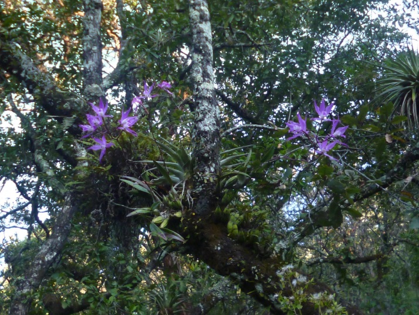{#fig-laelia-epi style="float: left; margin: 10px 20px 10px 0; width: 65%;"}

:::

Al momento de localizar poblaciones en su hábitat natural, no basta con conocer el tipo de vegetación donde se distribuye la especie de interés; también es fundamental identificar su tipo de crecimiento. Este atributo indica el sustrato o hábitat en el que las orquídeas se establecen y desarrollan, pudiendo ser: terrestre, epífito o rupícola (también denominado litófito) [@tellez2007orquideas].

En términos generales:

- Las especies terrestres crecen directamente sobre el suelo.
- Las epífitas se desarrollan sobre ramas y troncos de árboles.
- Las rupícolas se establecen sobre rocas.

El tipo de crecimiento suele ser característico de ciertas subfamilias. Por ejemplo, las especies de *Cypripedioideae*, *Orchidoideae* y *Spiranthoideae* son predominantemente terrestres, mientras que las de *Epidendroideae* se distinguen por su hábito mayormente epífito [@cribb1999].

No obstante, como señala Rasmussen [@rasmussen199912], las especies no están estrictamente limitadas a un único tipo de crecimiento. Existen casos como *Dipodium*, que puede ser tanto epífito como terrestre, o géneros como *Lepanthes* y *Laelia*, que presentan hábitos epífitos y rupícolas (ver @fig-laelia-epi y @fig-laelia-rupi).

### Identificación de las orquídeas

Durante la búsqueda de poblaciones en campo, resulta fundamental contar con una capacitación adecuada que facilite la identificación precisa de la especie de interés. Este proceso puede abordarse desde dos niveles:

- Una aproximación inicial basada en la apariencia general, y
- Una determinación rigurosa mediante análisis botánico.

#### Apariencia e identificación visual preliminar

La identificación visual, aunque menos precisa, permite reconocer de manera general distintos géneros de orquídeas a partir de rasgos morfológicos característicos y de su tipo de crecimiento. Entre los atributos morfológicos se incluyen la forma y disposición de las hojas, el tipo de pseudobulbo y la estructura floral.

::: img-float

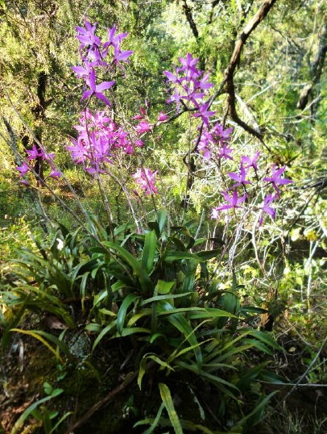{#fig-laelia-rupi style="float: right; margin: 10px 0 10px 20px; width: 65%;"}

:::

i.  En las epífitas se reconocen al menos tres grupos de plantas:

- con tallos engrosados y modificados (i.e. pseudobulbos), e.g. *Laelia*, *Oncidium*, *Encyclia*, *Stanhopea*, *Maxillaria* y *Rhynchostele* (ver @fig-laelia-rupi);
- con tallos simples o delgados, e.g. *Epidendrum* y *Dichaea*; y
- con hojas engrosadas y tallos compactos o pseudobulbos poco visibles, e. g. *Trichocentrum* (ver @fig-trichocentrum-1 y @fig-trichocentrum-2).

ii. En las terrestres se han identificado seis grupos:

- con tallos y hojas alternas o en espiral, e. g. *Cypripedium*, *Dichromanthus*, *Habenaria* y *Triphora*;
- con hojas solitarias o en pares, e.g. *Bletia*, *Schiedeella*, *Malaxis* y *Govenia*;
- con hojas en roseta, e.g. *Brachystele*, *Deiregyne* y *Sarcoglottis*;
- con hojas en abanico, e.g. *Paphiopedilum*, *Phragmipedium*;
- sin hojas, e.g. *Rhizanthella*, *Triphora*; y
- con pseudobulbos, e.g. *Oeceoclades* y *Cymbidium*.

iii. En las rupícolas se han reconocido dos grupos:

- con pseudobulbos e.g. *Cattleya*, *Hoffmannseggella*, *Laelia* y *Paphiopedilum*; y
- sin pseudobulbo, e.g. *Lepanthes*.

::: img-float

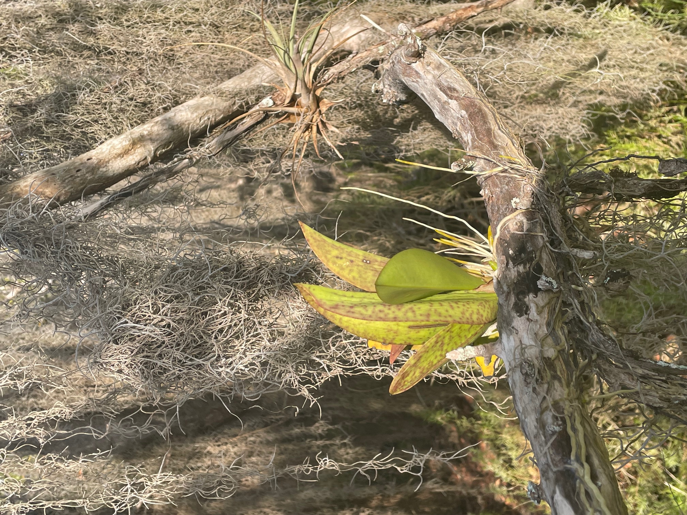{#fig-trichocentrum-1 style="float: left; margin: 10px; width: 48%;"}

:::

::: img-float

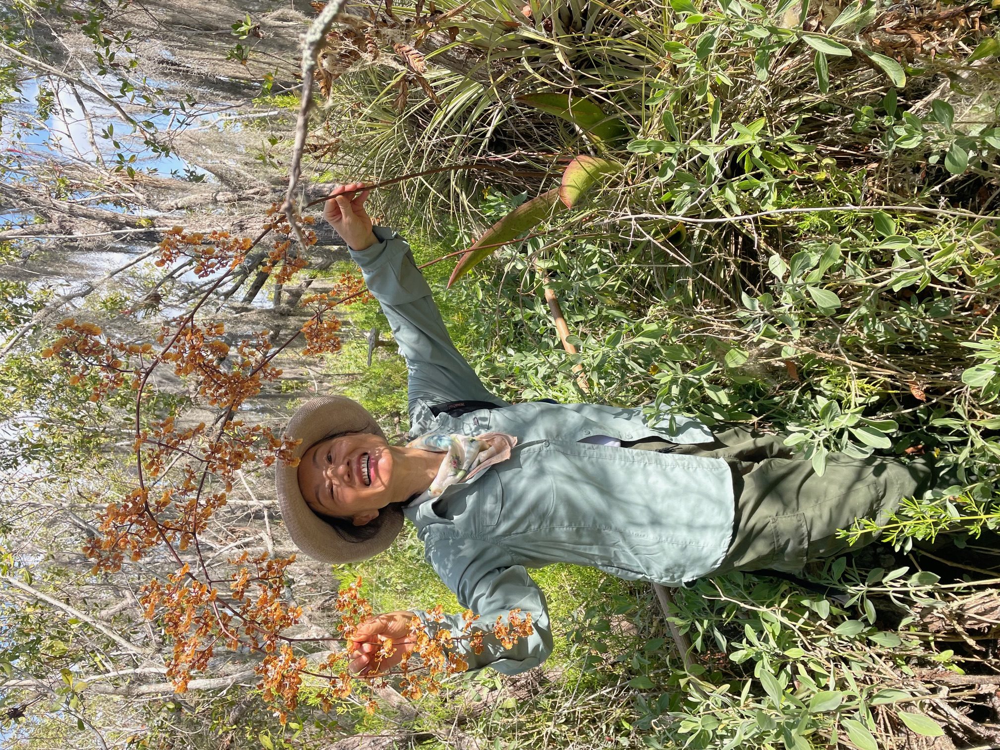{#fig-trichocentrum-2 style="float: right; margin: 10px; width: 48%;"}

:::

Cabe señalar que, si bien esta clasificación resulta útil para ofrecer una visión general de la diversidad morfológica presente en las orquídeas, su fundamento es principalmente descriptivo y visual, por lo que carece de rigor desde una perspectiva botánica. Se trata de un criterio cualitativo, basado en la apariencia externa de las plantas, que facilita una identificación aproximada (*grosso modo*), pero no refleja necesariamente relaciones filogenéticas ni características funcionales del grupo.

#### Identificación botánica de la especie

Cuando no se dispone de estudios previos sobre la especie de interés, y considerando la gran diversidad de la familia *Orchidaceae*, es fundamental garantizar la identificación taxonómica. Para ello, se recomienda contar con el apoyo de un especialista en la familia. Este proceso requiere disponer de una muestra fértil, ya sea fresca o herborizada, que incluya estructuras diagnósticas como hojas, tallos o pseudobulbos, flores y/o frutos, en estado fresco o seco.

El acompañamiento de un experto resulta aún más necesario cuando dos o más especies del mismo género coexisten en el mismo hábitat, ya que pueden presentar características morfológicas y florales muy similares, lo que incrementa el riesgo de confusión. Por ejemplo, en el género *Lepanthes* es particularmente difícil diferenciar individuos recién germinados, debido a su gran similitud morfológica. En estas primeras etapas, la semejanza puede ser tan marcada que incluso especies de familias distintas, como *Bromeliaceae* y *Orchidaceae*, podrían confundirse por personas sin experiencia. En tales casos, la intervención de un botánico especializado es esencial para evitar errores en la identificación y garantizar la validez de los datos.

------------------------------------------------------------------------

### Etapas o estados de desarrollo en orquídeas {#sec-etapas-orquideas}

Aunque las poblaciones están conformadas por individuos de la misma especie, en los estudios demográficos se reconoce que su contribución a la abundancia poblacional varía según la etapa o estado de desarrollo en que se encuentren (véase el [Capítulo de Ciclo de Vida](#Ciclo_Vida)). Al igual que en los seres humanos, donde se distinguen fases como recién nacidos, infantes, adolescentes y adultos, las plantas atraviesan diferentes etapas a lo largo de su vida, tales como semillas, plántulas, juveniles, adultos de tamaño pequeño y adultos de gran tamaño, entre otras.

Cada etapa debe asociarse a características biológicas y morfológicas que permitan su identificación en campo. Por ejemplo, la presencia de flores, frutos o varas florales (escapos) frescos o secos se vincula con la fase adulta en las orquídeas, lo que facilita diferenciar a los individuos reproductivos del resto de la población. Aunque la fase adulta es la más familiar para los orquidófilos, las poblaciones también incluyen individuos no reproductivos: juveniles (similares a los adultos pero sin estructuras reproductivas), plántulas (individuos pequeños recién establecidos) y semillas, responsables de la dispersión y perpetuación de la especie. Esta clasificación constituye la estructura poblacional [@silvertown2009introduction].

La delimitación de estas etapas puede requerir criterios específicos. Un ejemplo es el trabajo de Tremblay y colaboradores [@tremblay2003population] con *Lepanthes*, donde se diferenciaron plántulas y juveniles mediante la presencia de una vaina lepanthiforme (*lepanthiform sheath*) en al menos uno de los pecíolos. Los individuos no reproductivos sin esta estructura fueron considerados plántulas. Para distinguir juveniles de adultos, además de las vainas en pecíolos, se consideró la presencia de inflorescencias secas o activas, estas últimas en floración, con escapos en desarrollo (indicando floración potencial) o secos (evidencia de floración previa), tal como se ilustra en la @fig-lep-rupestris.

::: img-float

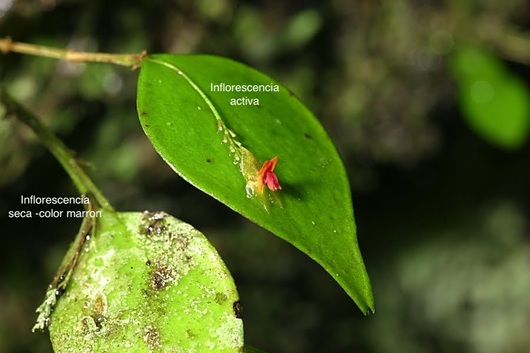{#fig-lep-rupestris style="float: left; margin: 10px 20px 10px 0; width: 55%;"}

:::

En los adultos, el desarrollo de las inflorescencias y su floración son eventos de corta duración, por lo que, en nuestros muestreos puntuales, tomaremos en cuenta todas las estructuras reproductivas, sin importar si se trata de botones florales, de flores abiertas, de frutos, de flores o inflorescencias seniles o, incluso, de cicatrices florales (ver @fig-lep-rupestris). Lo importante es poder reportar su presencia a fin de estimar, con base en éstas, la fecundidad de las categorías adultas en la población (ver el capítulo [Cálculo de fecundidad](#MatricesF)).

En las plantas, la definición de las etapas del ciclo de vida de una población puede incluir un número mayor o menor que las cuatro categorías comúnmente utilizadas (semillas, plántulas, juveniles y adultos). Esta variación se debe a que las categorías pueden subdividirse o agruparse, como se discutirá en la sección [Ejemplos de categorización en especies de estudio](#sec-ejemplos-categorizacion).

Independientemente del número de etapas o estados definidos para una población, es fundamental contar con un sistema de clasificación claro y sencillo, basado en características distintivas y únicas de cada etapa. Este principio garantiza la coherencia en la recolección de datos y la interpretación de los procesos demográficos, evitando ambigüedades que puedan comprometer la validez del análisis.

<br/>

------------------------------------------------------------------------

## Etapas y cambios en el crecimiento de las orquídeas

Para definir las etapas de desarrollo, es fundamental comprender cómo ocurre el crecimiento a nivel individual en las orquídeas. Este proceso permite inferir el incremento en volumen o tamaño de cada planta, resultado tanto del crecimiento vegetativo como del crecimiento reproductivo [@harper1977population]; es decir:

- El crecimiento vegetativo se refiere a la formación de nuevas estructuras no reproductivas que conforman el cuerpo de la planta, tales como hojas, tallos, raíces, pseudobulbos y ramas.
- El crecimiento reproductivo, por su parte, implica la producción de flores, inflorescencias, frutos y semillas.

En las orquídeas, ambos tipos de crecimiento se originan a partir de la activación de una yema de reiteración, mecanismo que permite la generación de nuevas estructuras y la continuidad del ciclo vital [@dressler1993phylogeny].

::: img-float

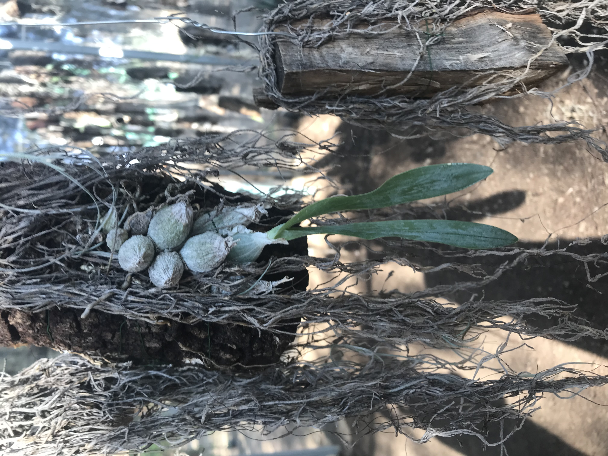{#fig-pk-modulo style="float: right; margin: 10px 0 10px 20px; width: 55%;"}

:::

Como ocurre en todas las plantas [@harper1977population], las estructuras vegetativas y reproductivas generadas a partir de las yemas de reiteración se organizan en unidades repetitivas denominadas módulos, que en conjunto conforman el cuerpo de la orquídea.

Las @fig-pk-modulo y @fig-ci-modulo muestran el crecimiento modular de las orquídeas y la variación existente en los módulos o unidades de crecimiento en los individuos:

- En *Prosthechea karwinskii*, el módulo está representado por el pseudobulbo y sus estructuras asociadas: yema de reiteración, hojas, rizoma, raíces, flores y frutos.
- En *Cypripedium irapeanum*, la unidad modular está integrada por el rizoma y las estructuras derivadas de este: yema de reiteración, raíces, tallo, hojas, flores y frutos.

En ambos casos, las yemas de reiteración originarán nuevas unidades de crecimiento y darán continuidad al crecimiento de la planta.

::: {}

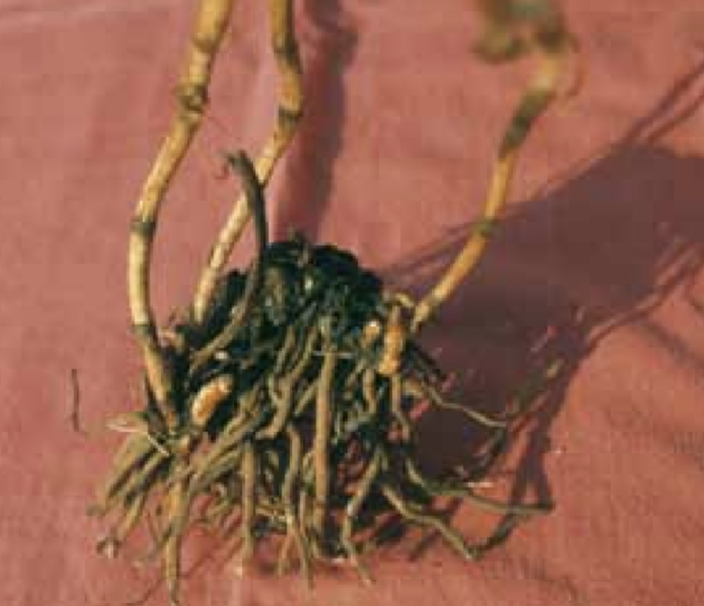{#fig-ci-modulo width="50%" style="left; margin: 10px;"}

:::

Para un análisis detallado de la morfología y del impacto del crecimiento modular en los procesos evolutivos, véase el libro de Carlos Herrera *Multiplicity in Unity* [@herrera2009multiplicity].

Por otro lado, el hábito de crecimiento, como se conoce a la forma o disposición final de la planta —erecta, rastrera o colgante— también está determinado por la posición de las yemas de reiteración [@dressler1993phylogeny; @hagsater2005orchids]. Se reconocen dos tipos principales:

- Monopodial, donde la yema es apical; y
- Simpodial, donde la yema es axilar.

El hábito monopodial se caracteriza por la presencia de un eje vegetativo principal o tallo único vertical (módulo), originado por la reiteración consecutiva de la yema apical. En este patrón, las flores o inflorescencias se desarrollan de manera lateral [@dressler1993phylogeny]. Este tipo de crecimiento se observa en géneros como *Campylocentrum*, *Dendrophylax*, *Dichaea*, *Renanthera*, *Vanilla* y *Vanda* (ver @fig-vanilla).

::: {}

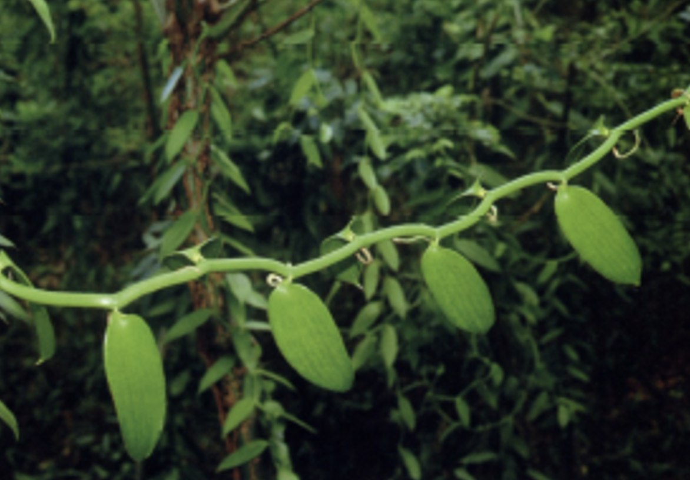{#fig-vanilla width="50%" style="right; margin: 10px;"}

:::

Por otro lado, el hábito simpodial se define por el crecimiento mediante brotes consecutivos (módulos), que pueden estar agrupados o separados y conectados por un rizoma. Estos brotes se originan a partir de una yema axilar, ubicada basal, lateral o apicalmente en el brote anterior. En este patrón, las flores o inflorescencias en plantas adultas son apicales o laterales, como ocurre en géneros tales como *Cypripedium*, *Laelia* y *Prosthechea* (ver @fig-laelia-speciosa).

::: {}

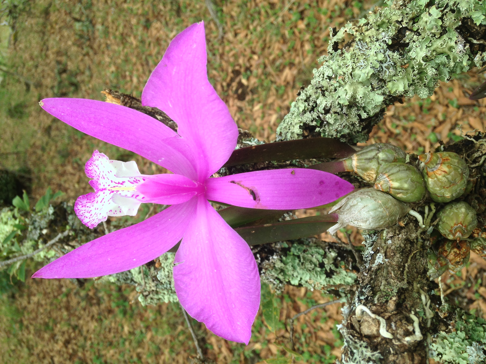{#fig-laelia-speciosa width="50%" style="right; margin: 10px;"}

:::

Según Rasmussen [@rasmussen1986vegetative], las orquídeas presentan más de una yema de regeneración, clasificadas en dos tipos según su actividad: yemas de renuevo y yemas de reserva; o sea:

- Las yemas de renuevo se activan regularmente y aseguran la continuidad del crecimiento de la planta en cada temporada.
- Las yemas de reserva, en cambio, permanecen inactivas y se activan de manera eventual; por ejemplo, cuando la yema de renuevo es eliminada por ramoneo de herbívoros [@emeterio2016usos], o cuando las condiciones ambientales son favorables para sostener el desarrollo de más de un módulo.

En este último caso, la activación de yemas de reserva genera nuevas líneas o frentes de crecimiento, lo que incrementa el tamaño de la planta [@hernandez1992dinamica]. Este fenómeno ha sido documentado en especies como *Cypripedium irapeanum* y *Govenia lagenophora* [@hernandez2012ecological; @martinez2024estimation].

------------------------------------------------------------------------

<br/>

## Consideraciones durante la recopilación de información en campo

A continuación se describen los métodos y técnicas más comunes utilizados para acceder a las poblaciones de orquídeas en el campo.

### Métodos y técnicas de muestreo

Las orquídeas epífitas y rupícolas se distribuyen a diferentes alturas en árboles y acantilados, lo que implica retos logísticos y de seguridad en la colecta de información. Las técnicas empleadas pueden ser tan rudimentarias como el uso de escaleras, hasta tan especializadas como equipos de ascenso utilizados en alpinismo. Cabe señalar que estas mismas técnicas han sido empleadas para la extracción ilegal de orquídeas [@united2024world]. A continuación se describen tres técnicas:

1.  **Uso de escaleras.** Esta técnica es práctica cuando las orquídeas se encuentran en zonas bajas de acantilados o en forófitos como arbustos y árboles de porte bajo a medio [@hernandez1992dinamica]. Su principal desventaja es la dificultad de transportar el equipo hasta el sitio de muestreo.

2.  **Técnica de rapel.** Resulta útil y segura cuando las orquídeas se localizan a gran altura en acantilados. Consiste en descender mediante cuerdas hasta alcanzar los individuos a muestrear. Es fundamental contar con experiencia o apoyo de personal especializado [@larson1978vegetation]. Ver @fig-ascenso-laelia.

3.  **Ascenso con cuerda única.** Esta técnica es considerada segura [@jepson2000tree] para acceder a orquídeas epífitas en árboles de porte medio y alto con troncos y ramas robustas. Sin embargo, presenta limitaciones para alcanzar ramas delgadas en estratos superiores. Al igual que en el rapel, se recomienda la asistencia de expertos para evitar riesgos. Ver @fig-ascenso-pk.

::: img-float

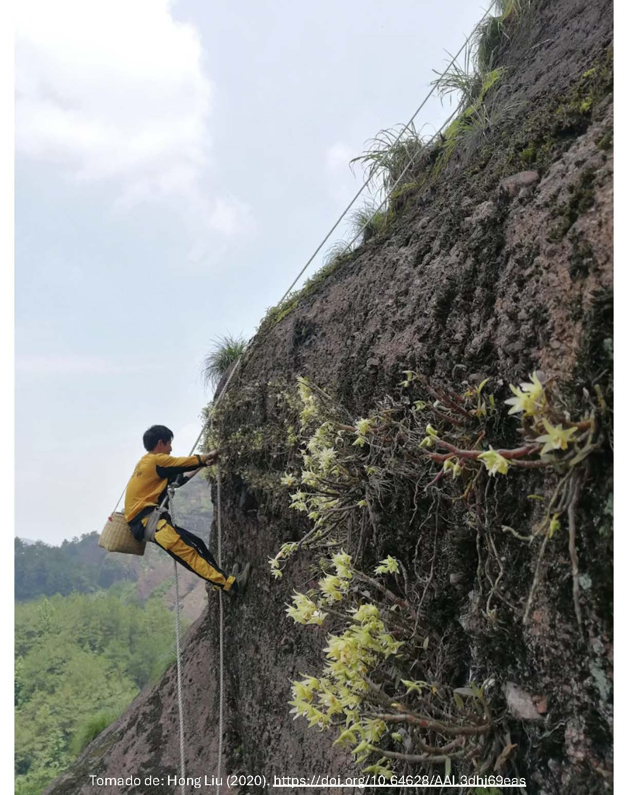{#fig-ascenso-laelia style="float: left; margin: 10px; width: 48%;"}

:::

::: img-float

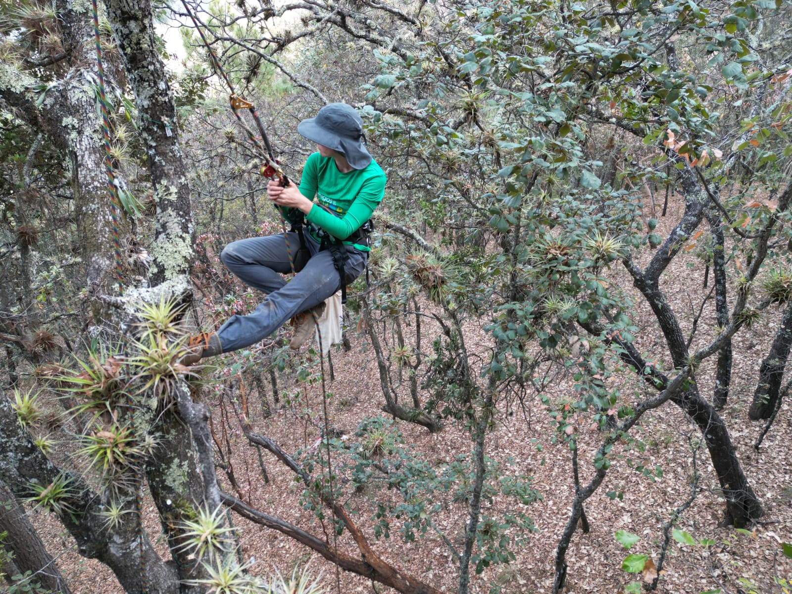{#fig-ascenso-pk style="float: right; margin: 10px; width: 48%;"}

Debido a que la copa de los árboles no es un ambiente homogéneo [@johansson1974ecology; @catling1986epiphytic], durante el ascenso se debe reportar la zona en que se encuentran las plantas marcadas. Esta información permite suponer las condiciones microclimáticas preferentes para la especie. De acuerdo con Johansson [@johansson1974ecology] y Catling [@catling1986epiphytic], en un árbol hospedero existen seis zonas o estratos, en las cuales es distinta la predominancia de epífitas vasculares y no vasculares, tal como se destaca en la @tbl-zonas-arbol. Podemos apreciar particularmente que en los estratos medios II, III, IV se registra la mayor concentración de orquídeas [@mondragon2007life], mientras que la Zona VI está asociada a las ramas más externas y delgadas del árbol, las cuales sobrepasan el límite de la zona V, en donde raramente se encuentran algunas orquídeas.

:::

------------------------------------------------------------------------

<br/> <br/>

## Zona de distribución de orquídeas en árboles

La @fig-zonificacion muestra las zonas de vida de epífitas basado en Johansson (1974) y Catling (1986) (ver también @tbl-zonas-arbol).

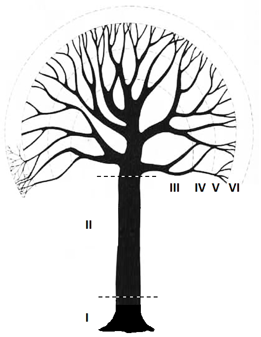{#fig-zonificacion width="40%"}

------------------------------------------------------------------------

Las zonas se pueden describir de la siguiente manera:

```{r Datos_1, message=FALSE, warning=FALSE, echo=FALSE}

zones <- tribble(
  ~Zona, ~Descripción,
  "I", "Parte basal del tronco, donde se encuentra musgo y líquenes",
  "II", "Tronco hasta el inicio de las primeras ramificaciones",
  "III", "Zona inicial de las ramas o copa interna del árbol",
  "IV", "Zona media de las ramas o copa media del árbol",
  "V", "Zona final de las ramas o copa externa del árbol, son ramas más pequeñas que la zona IV",
  "VI", "Ramitas delgadas de los árboles"
)
```

```{r}
#| label: tbl-zonas-arbol
#| tbl-cap: "Zonificación de árbol hospedero."
#| echo: false
flextable(zones)
```

En la @tbl-orquideas-zonas se muestran algunos ejemplos de orquídeas en cada una de las zonas. Nota que no es una lista exhaustiva, ya que hay muchas más especies que pueden encontrarse en cada una de las zonas. Además, la arquitectura de cada árbol va a influenciar la presencia de cada zona, de manera tal que podrían encontrarse en más de un lugar [@tremblay1997lepanthes].

```{r Datos_3,  message=FALSE, warning=FALSE, echo=FALSE}

Epifitas_zonas <- dplyr::tribble(
  ~Zona, ~"Epífita dominante", ~"Orquídea predominante", ~Especie, ~Referencia,
  "I", "Capa de musgo", "raramente", "*Lepanthes caritensis*", "@tremblay1997lepanthes",
  "II", "Plantas trepadoras", "Orquídeas miniatura y grandes", "*Vanilla planifolia*", "Hernández-Apolinar, observación personal, 2015",
  "III", "Pteridophytas y otras epífitas vasculares", "Orquídeas miniatura y grandes", "*Campylocentrum fasciola*", "Tremblay observación personal",
  "IV", "Orquídeas", "Mayor concentración y diversidad de orquídeas grandes y miniatura", "*Laelia autumnalis*", "@emeterio2021does",
  "V", "Líquenes", "Mayor concentración y diversidad de orquídeas grandes y miniatura", "*Hintonella mexicana*", "Emeterio-Lara observación personal",
  "VI", "Líquenes", "Pocas orquídeas, miniatura", "*Tolumnia variegata*", "@ackerman1996seedling"
)

# Epifitas_zonas
```

```{r}
#| label: tbl-orquideas-zonas
#| tbl-cap: "Orquídea predominante por zona."
#| warning: false
#| message: false
#| echo: false

list_epi <- Epifitas_zonas %>%
  flextable() %>%
  ftExtra::colformat_md()

list_epi
```

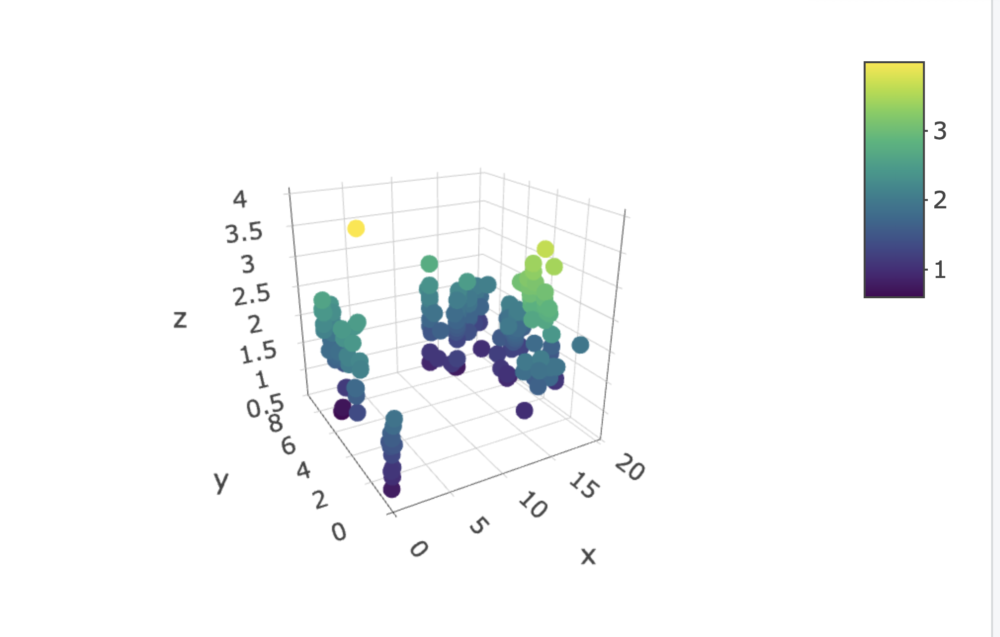{#fig-tridim fig-align="center" width="85%"}

4)  **Método de triangulación.** Es un método con área que complementa el uso de las técnicas de escalera y de ascenso con una cuerda. Se trata de una técnica no invasiva que permite registrar la ubicación espacial de las orquídeas sobre los árboles [@hernandez1992dinamica]. El método consiste en definir el área de muestreo (e.g. 20 x 10 m), que corresponde a aquella en la que se ubican los árboles con mayor número de orquídeas. Las esquinas del cuadro o rectángulo definido se marcan con estacas permanentes y se colocan cintas métricas sobre los lados, las cuales se tomarán como referencia para ubicar espacialmente a las orquídeas en ejes de coordenadas **x**, **y**, **z** (@fig-tridim), siendo ésta última la altura (m) del suelo a la orquídea sobre el tronco o alguna rama. Esta técnica tiene cierto grado de dificultad; sin embargo, es muy precisa, permite estimar la abundancia de la especie por superficie y se tiene la opción de evitar el etiquetado de plantas para su seguimiento. Además, en caso de robo de plantas y/o etiquetas es posible reconocer con facilidad a los individuos faltantes.

Aunque la distribución espacial de los árboles hospederos en el área de muestreo suele representarse en dos dimensiones (**x**, **y**; @fig-tree-dist), la de las orquídeas epífitas, como *Laelia speciosa*, incorpora un tercer componente espacial: la altura (@fig-tridim). En consecuencia, esta distribución tridimensional puede influir en las características demográficas de los individuos. Por ejemplo, en *Tolumnia variegata* la planta ubicada en las ramitas más externas (más sol) versus las del interior del árbol (en la sombra) impacta su esfuerzo reproductivo [@tremblay2010riding].

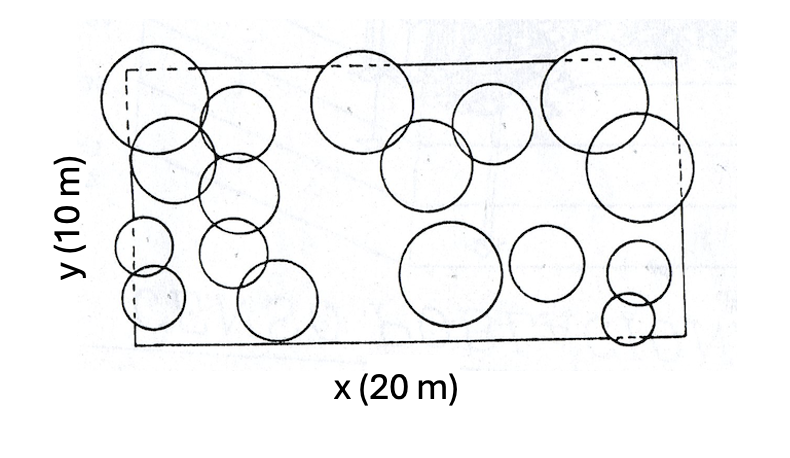{#fig-tree-dist fig-align="center" width="85%"}

### Orquídeas terrestres

En el muestreo de poblaciones de orquídeas terrestres se han implementado varias técnicas. En esta sección se abordan dos de las más utilizadas: el método de triangulación y el método sin área. El primero permite estimar el área en que se establece la población, mientras que el segundo se centra en el marcaje de individuos sin considerar el área, como se explica a continuación.

a)  *Método de triangulación.* El método de triangulación es una técnica no invasiva, comúnmente utilizada para monitorear las poblaciones terrestres en Australia [@tremblay2009population]. Este método no requiere de una etiqueta para identificar a los individuos de una orquídea, ya que las plantas se reconocen a partir de su posición ($P_{x}$) en un espacio bidimensional (x, y). Para determinar su posición es necesario clavar dos estacas o clavijas permanentes en el suelo, formando un cuadro (ver @fig-triangulation). La distancia entre estaca y estaca generalmente es de un metro (adaptarla a su necesidad). Sobre las estacas se puede sobreponer un clavo donde se amarran las cintas métricas. Para la ubicación espacial de los individuos dentro del cuadro, se usa la distancia de cada planta a partir de dos de los lados, en un eje de coordenadas **x**, **y**. Esta técnica es muy buena cuando los individuos están separados uno del otro, pero hay que tener cuidado cuando están muy cercanos (menos de 1 cm de distancia). Además, es muy precisa, fácil de implementar y deja muy poca evidencia en el campo.

b)  *Método sin área.* En el campo, las orquídeas terrestres forman pequeñas colonias, e.g. *Bletia campanulata*, *B. macristhmochila*, *Govenia lagenophora*, *Sarcoglottis schaffneri* y *Schiedeella albovaginata* [@tellez2007orquideas]; e incluso hay especies con individuos aislados, e.g. *Dichromanthus cinnabarinus*, *D. aurantiacus* [@tellez2007orquideas], *Cypripedium irapeanum* [@hernandez2012ecological] y *Govenia lagenophora* [@hernandez2012biologia], por lo que su dinámica poblacional generalmente se describe a partir de la información obtenida en varias colonias o subpoblaciones. El método sin área ha sido ampliamente usado en este tipo de orquídeas, no es invasivo y consiste en la selección de una colonia o subpoblación en la que se marcan todas las plantas observadas en el lugar [@martinez2024estimation]. Asimismo, la ubicación de los sitios y los individuos puede georreferenciarse y/o hacer mapas de localización.

::: img-float

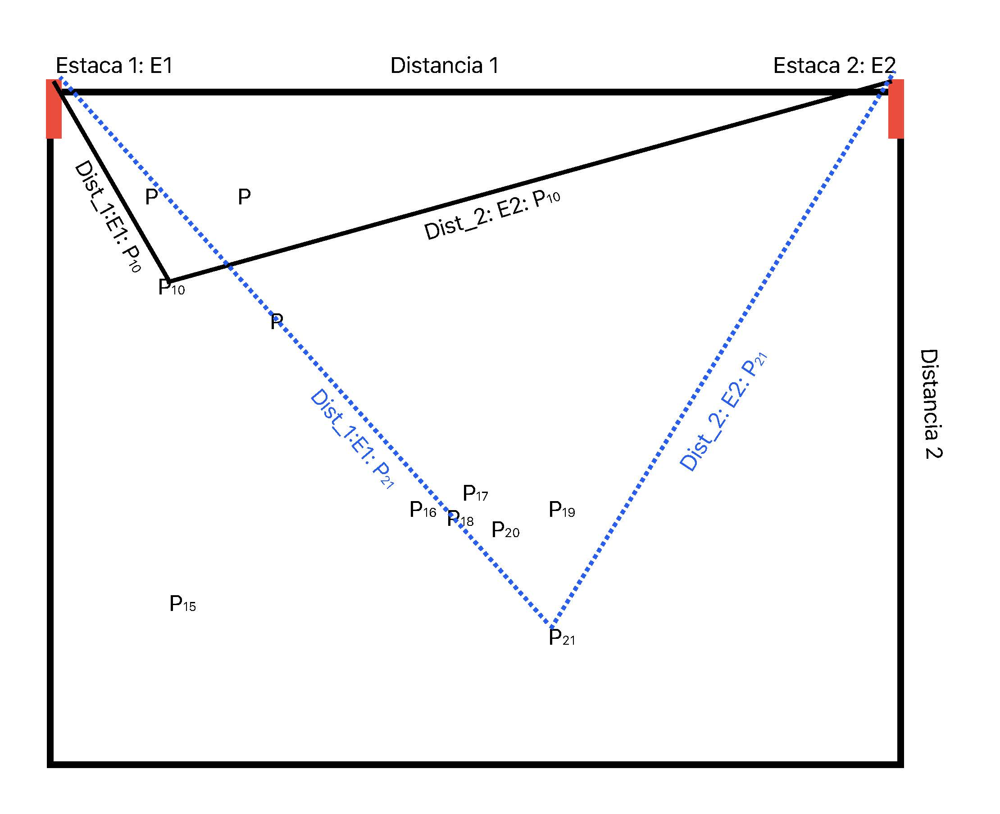{#fig-triangulation fig-align="center" width="70%"}

:::

<br>

------------------------------------------------------------------------

## Marcaje y monitoreo de los individuos en el tiempo

La dinámica o cambio en una población se evalúa marcando y siguiendo a todos los individuos que se encuentran en un sitio (i.e. censo) o de solo una parte de éstos (i.e. muestreo) entre periodos de tiempo (típicamente anual) a lo largo de sus distintas etapas de desarrollo (i.e. semillas, plántulas, juveniles y adultos). Sin importar si censamos o muestreamos, tenemos que asegurar tres aspectos durante el marcaje o etiquetado de una población.

::: callout-important

**Tres condiciones que debe cumplir cualquier marcaje.**

1.  **Cobertura de etapas:** incluir individuos de todas las categorías que conforman la población.
2.  **Tamaño de muestra suficiente:** incluir un número suficiente de individuos para que el análisis demográfico refleje la dinámica real de la población y no variaciones derivadas del muestreo.
3.  **Registro libre de errores:** emplear un sistema de codificación claro, consistente y trazable que minimice errores durante el trabajo de campo y el análisis posterior.

:::

------------------------------------------------------------------------

### Identificación y etiquetado de individuos

Debido a la naturaleza sésil de las plantas, una vez delimitada la población resulta relativamente sencillo contar e identificar a todos los individuos en su estado juvenil y adulto, si se toma en cuenta su aspecto morfológico similar y la presencia o ausencia de estructuras reproductivas (i.e. flores, inflorescencias y/o frutos; ver Sección [Etapas o estados de desarrollo en orquídeas](#sec-etapas-orquideas)). Sin embargo, la identificación y monitoreo de semillas y plántulas es muy difícil de lograr en campo, de ahí que señalemos las dos siguientes consideraciones:

a)  *Semillas.* La fase de semillas es uno de los mayores retos en el estudio de las orquídeas, ya que su tamaño tan pequeño (i.e. son conocidas como semillas polvo o "dust-seeds") dificulta el seguimiento de su dispersión y germinación en el campo [@ackerman1996seedling; @ticktin2020synthesis]. La evaluación de ambos procesos es de gran utilidad en los estudios poblacionales al momento de estimar los valores de fecundidad o de transición al primer estadio del ciclo de vida. El método más usado para evaluar la germinación en el medio natural es la introducción de bolsas pequeñas de malla de plancton [@rasmussen1993seed; @rasmussen2011methods; @anghelescu2023asymbiotic]. Estas bolsas son selladas y contienen un número de semillas definido que posteriormente se colocan en el suelo o sobre los árboles (e.g. ramas, tronco) y se recogen en uno o distintos periodos del año a fin de evaluar la germinación y el establecimiento de nuevos individuos [@emeterio2016usos].

b)  *Plántulas.* El seguimiento e identificación de plántulas en campo ha sido poco abordado debido a la dificultad para encontrarlas (especialmente en especies terrestres) y por el desconocimiento de su morfología en la gran mayoría de las orquídeas. Estas condiciones han limitado la estimación de parámetros poblacionales como la supervivencia y la transición a la fase juvenil [@emeterio2024acclimatization]. Por ejemplo, durante el muestreo en un bosque templado en el año 2003, de *Cypripedium irapeanum*, una orquídea terrestre, se encontró un número muy limitado de plántulas en el campo (ver @fig-cirap-plantula). Estos individuos tuvieron una talla pequeña y además presentaron una morfología distinta a la de un adulto, al ser tallos muy delgados y de apariencia semejante al de un pasto. Durante su búsqueda se hurgó principalmente alrededor de las plantas juveniles y adultas de la misma especie, ya que varias se ubicaron en esta zona.

::: img-float

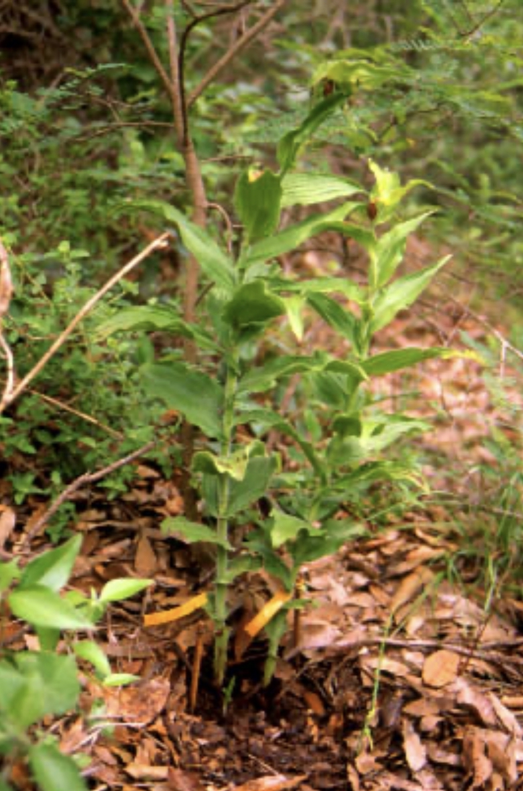{#fig-cirap-plantula style="float: right; margin: 10px 0 10px 20px; width: 50%;"}

:::

Las plántulas son los individuos más pequeños en la población de orquídeas epífitas, las cuales pueden no reconocerse con facilidad al estar cubiertas de musgo y liquen. Tremblay ha encontrado a estas pequeñas plantas alrededor de las plantas adultas, por lo que recomienda esta estrategia de búsqueda en esta fase de desarrollo. Cuando más de una especie del mismo género comparte el mismo hospedero, la identificación se complica; por ejemplo, en el caso de las plántulas de *Lepanthes* (ver @fig-lep-woodburyana) se establecen entremezcladas en el mismo forófito y carecen de caracteres distintivos en esta etapa, por lo que es imposible distinguirlas por especie [@tremblay2003population]; esto se logra únicamente cuando se marcan y siguen cuidadosamente a etapas posteriores (juvenil o adulto).

::: img-float

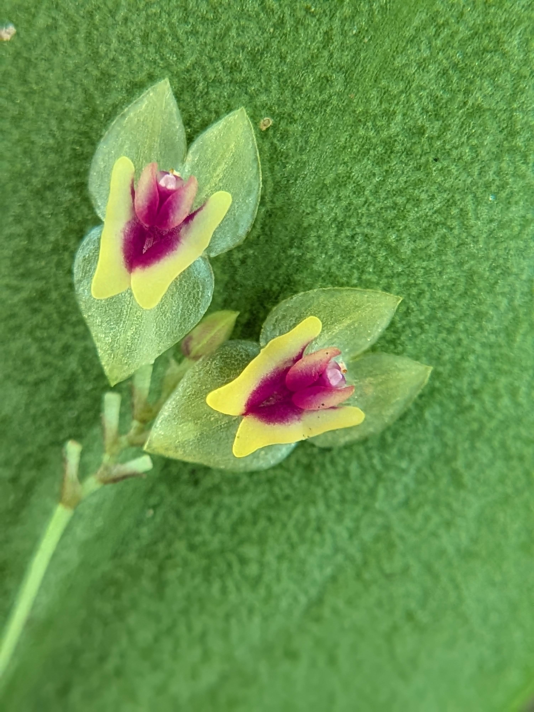{#fig-lep-woodburyana style="float: left; margin: 10px 20px 10px 0; width: 45%;"}

:::

A través de esta estrategia (ver @fig-lep-woodburyana), el autor ha logrado distinguir entre plántulas de *Lepanthes eltoroensis* y *L. woodburyana*, las cuales se diferencian en la forma de crecimiento del tallo. Al continuar el desarrollo, *Lepanthes eltoroensis* tendrá un crecimiento postrado, mientras que será erecto en *L. woodburyana*. Si bien este método es bueno, es importante considerar que puede representar un periodo de tiempo largo y que se corre el riesgo de no poder reconocer la especie cuando las plántulas no sobreviven a la siguiente etapa o el estudio termina antes que las plántulas crezcan a la próxima etapa.

<br>

------------------------------------------------------------------------

## Etiquetado de individuos

Los cambios en abundancia (i.e. número de individuos) de las poblaciones y los procesos biológicos que influyen sobre ésta se estiman a partir del monitoreo y secuenciación de todos y cada uno de los procesos o eventos por los que transitan los individuos en cada estado de un periodo a otro (e.g. un mes o un año). Esto es sólo posible cuando contamos con material de marcaje de calidad y un sistema de identificación sencillo y claro.

Estos dos sencillos pasos evitarán mezclar la información entre individuos de una misma población o confundir la información con plantas de otras poblaciones o periodos de tiempo. Es decir, la calidad de nuestros datos dependerá, en parte, de cómo marquemos y de qué calidad sea el material que usemos para el marcaje.

------------------------------------------------------------------------

### Material recomendado para marcar o etiquetar un individuo o sitio de muestreo

La calidad y la durabilidad del material de marcaje es muy importante cuando hacemos un estudio poblacional, más aún cuando se trata de uno de largo plazo. Si las marcas se desintegran de un periodo a otro, se perderá la identidad de cada planta y si no nos damos cuenta podríamos suponer dos cosas en nuestro siguiente monitoreo: i) que el individuo murió (al no aparecer la etiqueta), o ii) que hay un nuevo reclutamiento en la población (aparece un nuevo individuo sin marca). Esto sesgaría nuestros resultados al suponer un aumento en la mortalidad o, en su defecto, un aumento en el reclutamiento. Naturalmente, ese sesgo dependerá del número de individuos que marquemos (i.e. tamaño de la muestra). Por regla general se ha considerado que a menor tamaño de muestra, mayor es el sesgo.

::: callout-warning

**Una etiqueta perdida sesga dos parámetros a la vez.** Si la marca se desintegra entre censos, el individuo aparece como muerto (sobreestima la mortalidad) y vuelve a aparecer como nuevo recluta en el siguiente período (sobreestima el reclutamiento). El sesgo es proporcionalmente mayor en muestras pequeñas. Por eso conviene invertir desde el inicio en material durable (cinta de *dymo*, aluminio laminado) y un protocolo de re-etiquetado conservador.

:::

Las etiquetas de *dymo* (ver @fig-cypripedium-acaule) resultan ser un buen material al marcar los individuos de las orquídeas de cualquier tipo de crecimiento (i.e. epífito, terrestre o rupícola). Este material ha resultado ser muy duradero en sistemas tropicales; por ejemplo, fueron legibles después de más de 15 años de haber marcado a individuos de *Lepanthes*. Por otro lado, el aluminio laminado es otro material barato y duradero sobre el cual se puede escribir fácilmente, por lo que se garantiza la permanencia de la marca o etiqueta y la de las inscripciones que hayamos hecho sobre ésta. Además, este tipo de etiquetas, al igual que las de *dymo*, pueden sujetarse a la planta o colocarse cerca de ésta con diferentes materiales; por ejemplo, hilo de pescador, cinchos de plástico, alambre galvanizado o plastificado, clavos, chinchetas y grapas, entre los más usados (ver @fig-laelia-cincho). Un aspecto que hay que cuidar al marcar individuos es que las etiquetas se enmascaren con el ambiente; es decir, que no sean muy grandes, que estén protegidas y que no sean evidentes para todos, a fin de evitar su pérdida o, incluso, el robo de plantas por gente ajena a la investigación.

::: img-float

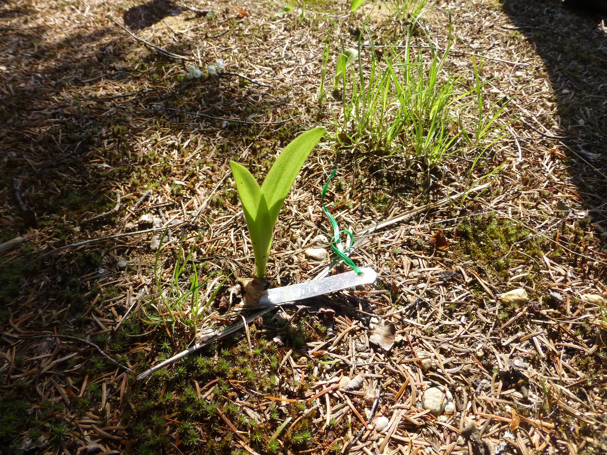{#fig-cypripedium-acaule style="float: right; margin: 10px; width: 48%;"}

:::

::: img-float

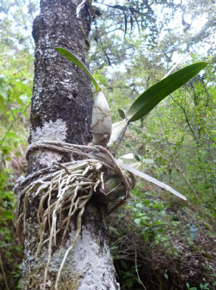{#fig-laelia-cincho style="float: left; margin: 10px; width: 48%;"}

:::

La durabilidad del material usado es muy importante cuando existen eventos en el ciclo de vida de una especie que pueden prolongarse por varios años. Este es el caso de algunas orquídeas terrestres que pueden no rebrotar y mantenerse en latencia vegetativa por más de un ciclo anual de forma consecutiva. Por ejemplo, la latencia vegetativa puede durar un periodo consecutivo de tres años en *Liparis liliifolia* [@hutchings1987population; @wells1991demographic], cinco a siete años en *Epipactis helleborine* [@light2006appearance; @coates2006effects], e incluso ser mayor en *Prasophyllum correctum* [@coates2006effects]. Es así que una buena secuenciación de estos eventos en un individuo en el mediano y largo plazo depende de la calidad del material usado al marcar las plantas, lo cual a su vez permitirá tener buenas estimaciones del tamaño poblacional y la supervivencia y reproducción en la población.

Al igual que los individuos, los sitios de muestreo también se marcan a fin de facilitar su ubicación en el medio natural. Estos pueden ser marcados usando banderines, etiquetas grandes de aluminio o plástico, cinta de señalización (*flagging tape*) o pintura permanente; asimismo, también se pueden georreferir y hacer mapas de localización.

Cuando se trata de marcas de colores, se deben preferir colores poco llamativos camuflajeados con la vegetación circundante. Si el sitio está bien protegido se puede optar por colores fuertes y llamativos; sin embargo, hay que considerar que los animales (mamíferos, aves, herbívoros) pueden ser atraídos por las marcas e ingerirlas o destruirlas (a ciertas orugas les gusta la cinta de **dymo** y dejan su evidencia), de ahí que se sugiera utilizar etiquetas discretas que favorezcan su permanencia en el mediano y largo plazo. Es sumamente importante poner el máximo esfuerzo en el muestreo consistente entre periodos y tratar de encontrar todos los individuos previamente marcados.

<br>

------------------------------------------------------------------------

### Información básica en una etiqueta

La marca o etiqueta de cada uno de los individuos de una población debe compactar la mayor cantidad de información posible, no solo números consecutivos. Es decir, generalmente escribimos números consecutivos (1, 2, 3, 4, etc.) en las etiquetas que colocamos a cada individuo en campo. Sin embargo, si no hay notas guía, esta información es limitada cuando se retoma la investigación en campo, ya que es difícil determinar cuándo ingresaron los nuevos individuos a la población o cuándo se fragmentó una planta para dar origen a un individuo de una categoría distinta al de plántula. Asimismo, si se seleccionan distintas poblaciones o colonias y los números consecutivos son los mismos, podemos confundir la información y llegar a conclusiones erróneas.

Cuando se estudia una sola población, una forma sencilla de evitar errores y anexar más información es escribir en la etiqueta el año de estudio y el número consecutivo de la planta. Por ejemplo, si el estudio comenzó en 2023 y la población está formada por 152 individuos (i.e. captura), éstos se podrían codificar así: 23001, 23002, 23003, ... 23152. En el siguiente año (2024) se revisarán o censarán los 152 individuos originalmente marcados (i.e. recaptura) y se etiquetarán los nuevos individuos que ingresan a la población (e.g. plántulas), cuya marca iniciará con 24 y el número consecutivo (153 en adelante). De esta forma se conocerá el año de ingreso, marcaje e inicio de la captura de datos del individuo, lo cual evitará la redundancia en el código y ayudará a reducir los errores de identificación.

Cuando la orquídea de interés no tiene una distribución regular y tiene una distribución aparchonada (concentrada en un área) en distintas zonas de un mismo lugar, para evitar errores de codificación se sugiere que en cada parche se mantengan números consecutivos (23001, 23002, 23003, etc.) y se evite mezclar los números asignados (23001, 23012, 23043, etc.). Esta misma regla se mantiene cuando se trabaja con distintas poblaciones de la misma especie.

Otra forma de codificar las múltiples poblaciones o subpoblaciones es a través de una codificación alfanumérica, en la que la letra del alfabeto representa a la población y el número a los individuos marcados para su monitoreo. De esta manera, las marcas individuales se verían de la siguiente forma: A23001, A23002, ..., A23xxx para la primera población y B23001, B23002, ..., B23xxx para la segunda población y así sucesivamente, en caso de estudiar más de dos poblaciones. Una tercera opción es asignar un número a cada población y añadir el número consecutivo correspondiente. En este caso las etiquetas de las plantas número 10 en dos sitios se verían de la siguiente manera: 1.10 y 2.10. Si queremos añadir el año del estudio, éste también puede ser al final y sería de la siguiente forma: 1.10.23 y 2.10.23. Para los nuevos ingresos se sigue la misma lógica del inciso anterior, por lo que a la nueva planta 155 que ingresa en 2024 a la población 1 le corresponderá la etiqueta 1.155.24.

::: callout-tip

**Una buena etiqueta es un identificador estructurado, no un número correlativo.** Conviene combinar tres componentes: año de marcaje + número consecutivo + identificador de población. Por ejemplo, `A23001` (población A, año 2023, individuo 001) o `1.10.23` (población 1, planta 10, año 2023). Esta convención permite reconocer de inmediato cuándo entró el individuo al estudio, a qué población pertenece y evita colisiones cuando hay múltiples sitios.

:::

------------------------------------------------------------------------

### Colocación de la etiqueta

Existen distintas formas de colocar las etiquetas o marcas en los individuos seleccionados para el estudio y, por regla general, su ubicación no debe afectar el desempeño de la planta marcada y se debe asegurar su permanencia en el mediano y largo plazo. Por ejemplo, en las orquídeas epífitas de tamaño grande, la etiqueta de identidad se puede colocar abrazando a la planta, incluyendo la rama o tronco donde se desarrolla, o bien, colocarse abrazando a uno solo de los módulos. En el caso de *Laelia autumnalis* [@emeterio2021does], además de la etiqueta de identificación, se identificó con otra etiqueta el último módulo (el más joven o reciente) de cada uno de los frentes de crecimiento (ver @fig-laelia-speciosa-marcaje). Este tipo de marcaje permitió determinar la biomasa nueva que se agrega cada año a cada planta y, al mismo tiempo, permitió identificar la permanencia, crecimiento o retrogresión entre fases de crecimiento.

::: img-float

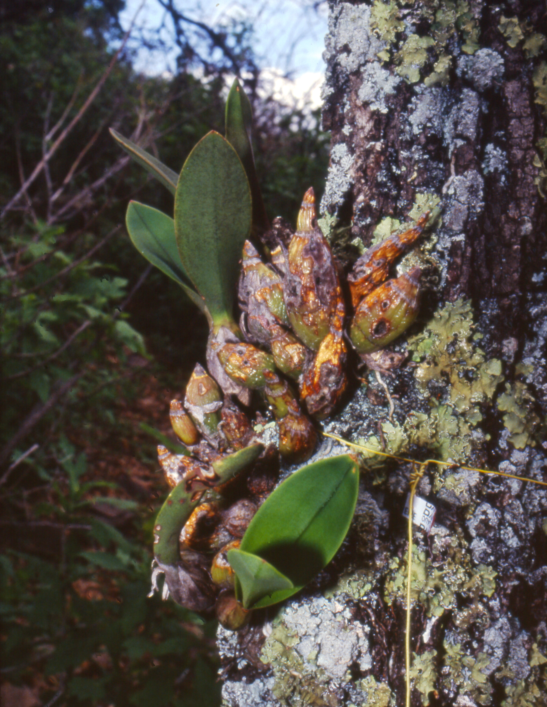{#fig-laelia-speciosa-marcaje style="float: right; margin: 10px 0 10px 20px; width: 50%;"}

:::

Las plántulas son muy frágiles, por lo que para no dañar sus estructuras se debe contar con material suave y, preferentemente, se debe evitar el contacto con las plantas. En *Lepanthes eltoroensis*, Tremblay fijó las etiquetas a un lado de las plántulas con clavos pequeños y posteriormente cambió a grapas, que causan menos daño al árbol hospedero (ver @fig-lep-eltoroensis).

::: img-float

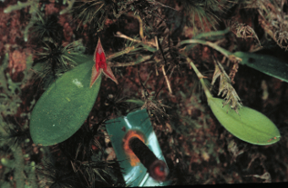{#fig-lep-eltoroensis style="float: right; margin: 10px 0 10px 20px; width: 55%;"}

:::

En las orquídeas terrestres *Cypripedium irapeanum* y *Govenia lagenophora* las etiquetas de aluminio o cinta **dymo** fueron amarradas con alambre plastificado a palos o clavos, semejando banderitas, que luego fueron clavadas en el suelo cerca de los tallos o pseudobulbos de las plantas (ver @fig-cirap-marcaje y @fig-cyp-acaule-flag).

::: img-float

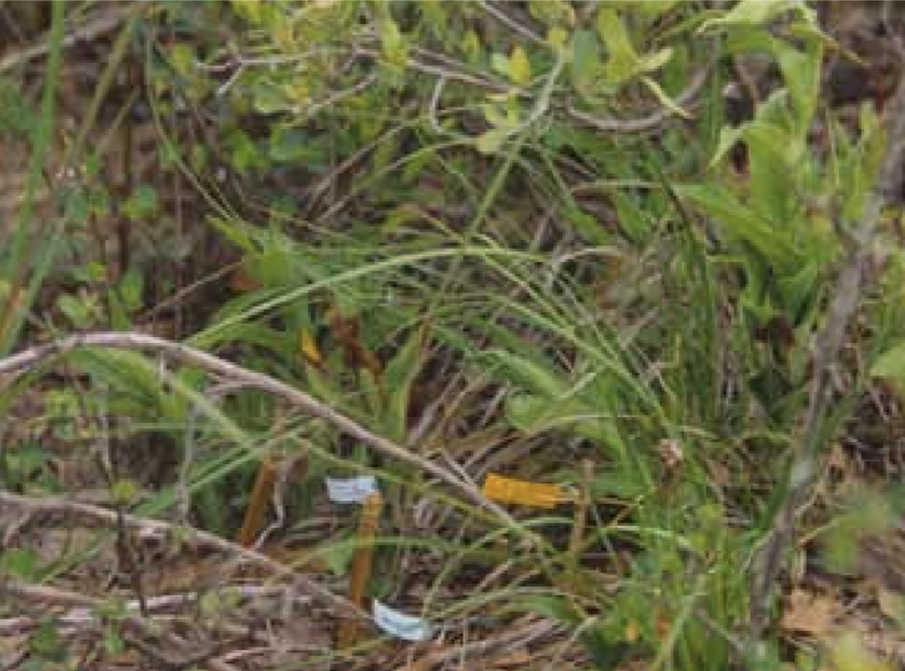{#fig-cirap-marcaje style="float: right; margin: 10px 0 10px 20px; width: 50%;"}

:::

::: img-float

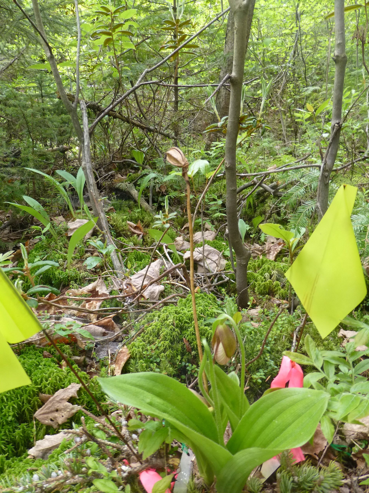{#fig-cyp-acaule-flag style="float: right; margin: 10px 0 10px 20px; width: 50%;"}

:::

------------------------------------------------------------------------

## Variables a identificar en campo

En esta sección se presentan algunos ejemplos de cómo se ha dividido la estructura poblacional en orquídeas con distinto hábito de crecimiento. A través de los ejemplos es evidente que las categorías de etapa/estado no siempre son las mismas en las especies, ya que dependen de aspectos biológicos de las plantas (e.g. características morfológicas, de crecimiento, de reproducción), de la información disponible, del número de individuos marcados y de las preguntas de interés en la investigación [@hernandez1992dinamica; @mondragon2013population].

No importa las variables que usemos en la clasificación de las plantas, lo que se captura es información relevante en las especies, la cual es común en todos los estudios poblacionales por estados (@tbl-variables-censo). La primera información se obtiene al inicio del estudio, definido como el tiempo cero o inicial $t_{0}$ y se refiere a las características básicas más simples que permiten diferenciar un estadio de otro, mientras que los siguientes periodos de toma de datos, denominados como $t_{+1}$ (i.e. n = 2, 3, 4, … n), permiten entender los cambios que ocurren en los individuos de un periodo a otro (i.e. crecen, se reproducen, viven o mueren) y, además, captar de dónde provienen los nuevos individuos que ingresan a la población (i.e. semilla, origen vegetativo o clonación) en el periodo $t_{+n}$.

Las variables esenciales (@tbl-variables-censo), junto con las características definidas en cada etapa de desarrollo (ver [Ejemplos de categorización](#sec-ejemplos-categorizacion)), permiten conocer, por un lado, cuál o cuáles de las categorías son muy dinámicas o, por el contrario, constantes en el ciclo de vida de la especie de interés; y por otro, el estado de conservación de la población en su conjunto. Esta última se define a partir de la tasa finita de crecimiento poblacional como se establece en el Capítulo *XX*.

```{r DC1, message=FALSE, echo=FALSE}

Variable_Censo <- tribble(
  ~"Tiempo inicial t_0",
  ~"Muestreo posterior t+1",
  "Etapa del individuo",
  "Etapa del individuo",
  "",
  "Presencia/ausencia del individuo",
  "Presencia/ausencia de flores/inflorescencia y/o frutos",
  "Presencia/ausencia de flores/inflorescencia y/o frutos",
  "Cantidad de flores",
  "Cantidad de flores",
  "Cantidad de frutos",
  "Cantidad de frutos",
  "",
  "Cantidad de individuos en la población"
)
```

```{r}
#| label: tbl-variables-censo
#| tbl-cap: "Variables esenciales en un censo demográfico."
#| echo: false
#| message: false

flextable(Variable_Censo) |>
  add_footer_lines(values = "Nota: Especificar si se trata de individuos procedentes de semilla o si su origen es por clonación (e.g. keikis, pseudobulbos separados, activación de yemas de reserva en pseudobulbos y rizomas, etc.).") |>
  fontsize(size = 8, part = "footer") |>
  italic(part = "footer")
```

------------------------------------------------------------------------

### Crecimiento o reiteración vegetativa

El crecimiento en las orquídeas ocurre a partir de las yemas de reiteración, las cuales se encuentran en la base de pseudobulbos de plantas epífitas y justo por debajo del suelo en los cormos, rizomas, tubérculos y pseudobulbos de plantas terrestres. Con la activación de estas yemas, en cada temporada de crecimiento se desarrollan estructuras que dan continuidad al crecimiento individual, las cuales en conjunto son conocidas como módulo de iteración o unidad de crecimiento básico. El módulo es característico de todas las plantas [@harper1977population] y varía en forma según la especie que se trate. En algunas orquídeas terrestres, por ejemplo, este módulo está representado por un cormo, yemas de regeneración, hojas, flores y frutos (estos dos últimos cuando se trata de plantas adultas). Las mismas estructuras se desarrollan en otras orquídeas, aunque en lugar del cormo se genera un pseudobulbo, un rizoma o un tubérculo, según la orquídea en cuestión.

Las yemas de regeneración se pueden clasificar por su actividad en dos tipos: renuevo y reserva [@rasmussen1995terrestrial]. Las primeras son aquellas que se activan y dan continuidad al crecimiento de una planta en cada temporada, mientras que las segundas se activan eventualmente. En orquídeas epífitas como *Laelia autumnalis* y *L. speciosa* [@emeterio2016usos; @hernandez1992dinamica], así como en las orquídeas terrestres *Cypripedium irapeanum* y *Govenia lagenophora* [@hernandez2012ecological; @martinez2024estimation], se ha observado que las yemas de renuevo se activan (i.e. generalmente una) y dan origen al nuevo módulo al inicio de una temporada de crecimiento, que se suma a la secuencia de módulos formados en periodos previos. En el caso de *Govenia lagenophora* el nuevo cormo que se produce reemplaza al módulo del año previo al morir. Asimismo, estos autores también han reconocido que las yemas de reserva pueden activarse cuando las condiciones ambientales son favorables para sostener el desarrollo de más de un módulo, dando origen a nuevas líneas o frentes de crecimiento que amplían su tamaño.

Si bien las orquídeas epífitas y terrestres son perennes, lo que significa que viven por más de dos años consecutivos, es importante hacer notar que el crecimiento es estacional en un gran número de estas plantas; es decir, que la gran mayoría de las especies solo producen módulo de crecimiento en una época del año (e.g. lluvias o primavera) caracterizada por presentar las condiciones ambientales (i.e. luz, agua, etc.) adecuadas que permiten su reiteración. Después de este periodo, las orquídeas no tienen actividad y, por lo tanto, no producen nuevas estructuras, sino que solo captan y/o usan los recursos necesarios para sobrevivir. Este comportamiento es muy evidente en las orquídeas epífitas, pero lo es más aún en muchas de las orquídeas terrestres, ya que éstas emergen del suelo sólo en un periodo del año específico (generalmente lluvias o primavera/verano) para después marchitarse y desaparecer en la época menos favorable (e.g. época seca o fría, con nieve). Sin embargo, el hecho de que no estén visibles no implica que hayan muerto, como sería el caso de las plantas anuales (e.g. cosmos). Por el contrario, como parte de su ciclo de vida, las orquídeas terrestres viven bajo el suelo una parte del año, fase conocida como subterránea o latencia vegetativa [@shefferson2020demography]. Esta condición es equivalente a la hibernación en los animales, ya que las plantas sobreviven reduciendo sus actividades fisiológicas y consumiendo los recursos que almacenaron en los cormos, pseudobulbos, tubérculos o rizomas, los cuales son a su vez órganos de almacenamiento (**referencia**). Aunque a diferencia de los animales, la latencia vegetativa puede prolongarse por más de un año en forma consecutiva en muchas especies, cuando la planta no almacenó suficientes recursos o no existen las condiciones ambientales propicias para su desarrollo [@shefferson2020demography]. Por ejemplo, los tubérculos de *Liparis liliifolia* [@hutchings1987population; @wells1991demographic] y *Orchis simia* [@willems1991population] pueden sobrevivir de forma subterránea por tres años, mientras que *Epipactis helleborine* por 5 a 7 años [@light2006appearance]. En los estudios poblacionales esta situación dificulta la estimación de la mortalidad en las orquídeas terrestres y, por ello, se desconoce la supervivencia real de las distintas fases de desarrollo de la especie y el tamaño real de una población de interés. Múltiples acercamientos han sido desarrollados para considerar el periodo de no avistamiento en la dinámica de orquídeas [@shefferson2003life; @kery2004demographic; @shefferson2005adult]. Nuevos métodos bayesianos para estimar los parámetros de supervivencia condicional, basados en si las plantas estaban vistas el año anterior o no y la cantidad de años sin ser vistas, han ayudado a estimar parámetros del ciclo de vida más acordes con los patrones naturales de las especies [@tremblay2009dormancy; @tremblay2009population].

::: callout-warning

**La latencia puede durar varios años, no uno.** En orquídeas terrestres, la fase subterránea no se limita a un ciclo: *Liparis liliifolia* y *Orchis simia* pueden permanecer latentes hasta tres años, *Epipactis helleborine* entre cinco y siete, y *Prasophyllum correctum* incluso más. Si el estudio dura menos que la latencia máxima, individuos vivos se contabilizan como muertos. Conviene diseñar series temporales suficientemente largas y/o aplicar métodos bayesianos que estimen la probabilidad de seguir vivo dado el número de años sin avistamiento [@tremblay2009dormancy].

:::

------------------------------------------------------------------------

### Ejemplos de categorización en especies de estudio {#sec-ejemplos-categorizacion}

En esta sección mencionamos algunas de las clasificaciones de las etapas de desarrollo en orquídeas terrestres y epífitas, que han sido utilizadas en distintos estudios poblacionales. En la mayoría de los casos, las categorías se definen a partir de la morfología de los individuos y su actividad reproductiva, aunque también se han considerado otros aspectos como el número de módulos o pseudobulbos por planta, el número de hojas y la presencia o ausencia de flores y frutos. En algunos casos, se ha considerado la presencia o ausencia de inflorescencias secas como un indicador del estado del individuo. En algunas especies terrestres hay de vez en cuando una etapa no vista, cuando no se sabe si el individuo está vivo o latente.

### *Govenia lagenophora*

Martínez-Villegas y colaboradores [@martinez2024estimation] definieron cuatro categorías de estado (i.e. Reproductivo, No reproductivo, Cormo y Ausente) para la orquídea terrestre *Govenia lagenophora*, cuya dinámica poblacional fue analizada en la Reserva del Pedregal de San Ángel, Ciudad de México, México. La estimación de las variables poblacionales se realizó a partir de cuatro años de monitoreo; o sea:

- **Reproductivo**: Individuos con hojas y con inflorescencia.
- **No reproductivo**: Individuos con hojas y sin evidencia de ser reproductivos.
- **Cormo**: Individuos latentes, sin producción de hojas o inflorescencias; y
- **Ausente**: Individuos no detectados.

<br/>

### *Caladenia*

Tremblay y colaboradores [@tremblay2009dormancy; @tremblay2009population] estudiaron nueve especies del género *Caladenia* en distintas localidades de Australia, cuya demografía fue analizada a partir de tres categorías de estado: individuos vegetativos, individuos en floración e individuos latentes; o sea:

- **Vegetativos**: Individuos con hojas y sin evidencia de ser reproductivos.
- **Reproductivos**: Individuos con hojas y en flor; y
- **Latentes**: Individuos sin actividad aérea.

<br/>

### *Laelia speciosa*

Hernández-Apolinar [@hernandez1992dinamica] por su parte trabajó con la especie epífita *Laelia speciosa*, en la cual se identificaron cuatro fases: plántulas, juveniles y dos estadios de adultos. Las fases de adultos y juveniles se determinaron a partir del conteo de módulos, que en este caso se trató del número de pseudobulbos por planta; o sea:

- **Plántula**: Individuo con un pseudobulbo pequeño (3 mm de alto) o sin pseudobulbos y presentando 2 hojas pequeñas (hasta 5 mm de alto) y 1-2 raíces.
- **Juvenil**: Individuo no reproductivo, con 2 a 10 pseudobulbos y que presenta las puntas de los pseudobulbos redondeadas sin evidencia del escapo floral, que es persistente.
- **Adulto 1**: Individuo con o sin flores, con escapos florales previos y de 11 a 20 pseudobulbos; y
- **Adulto 2**: Individuo con o sin flores, con escapos florales previos y con 21 o más pseudobulbos.

<br/>

### *Laelia autumnalis*

Emeterio-Lara y colaboradores [@emeterio2021does] estudiaron poblaciones de la orquídea epífita *Laelia autumnalis*. Las plantas de *Laelia autumnalis* fueron clasificadas en cinco categorías con base en su biomasa; o sea:

- **Plántula**: Individuos con un pseudobulbo pequeño.
- **Juveniles 1**: Individuos no reproductivos y peso \< 9.5 g.
- **Juveniles 2**: Individuos con peso de 9.5-23.5 g, ocasionalmente reproductivos.
- **Adulto 1**: Individuos reproductivos con peso de 23.5-49.5 g; y
- **Adulto 2**: Individuos reproductivos con peso \> 49.5 g.

<br/>

### *Ophrys sphegodes*

Hutchings [@hutchings2010population] analizó la dinámica poblacional de *Ophrys sphegodes* por 30 años. Esta orquídea terrestre se monitoreó durante su fase aérea, considerando la presencia o ausencia de plantas. A las plantas que emergieron del suelo se les trató como *ramets* (i.e. plantas independientes con la misma información genética), debido a que de los tubérculos (i.e. órganos de perennación subterráneos) de *Ophrys sphegodes* se da origen a más de una planta. Por convención los *ramets* (i.e. fragmentos de una planta con vida independiente y con la misma información genética) se analizan como si fueran genéticamente independientes. En el estudio utilizaron tres categorías para su análisis; o sea:

- **Vegetativos**: Individuos no reproductivos caracterizados por la presencia de hojas en roseta.
- **En floración**: Individuos con hojas en roseta que presentan inflorescencia; y
- **Latentes**: Individuos que no emergen en la época de crecimiento.

<br/>

### *Brassavola cucullata*

Ackerman y colaboradores [@ackerman2020small] trabajaron con tres poblaciones de *Brassavola cucullata* en las Islas de San Eustaquio y Saba, en las Antillas. En estas islas, la especie presenta un hábito de crecimiento epífito o rupícola. Usando el número de hojas se establecieron cuatro categorías de estado; o sea:

- **Juveniles 1**: Plantas con 1 o 2 hojas.
- **Juveniles 2**: Plantas con 3 a 6 hojas.
- **Adultos 1**: Plantas con 7 a 20 hojas; y
- **Adultos 2**: Plantas con más de 20 hojas.

<br/>

### *Aspasia principissa*

Zotz y Schmidt [@zotz2006population] analizaron el comportamiento poblacional de *Aspasia principissa* en la Isla de Barro Colorado, Panamá. A partir del tamaño del pseudobulbo más reciente, los investigadores determinaron siete categorías de tamaño en la población, desde menor de 1.5 cm y hasta mayor de 11.0 cm. Además, se evaluó la presencia de flores y frutos en las plantas con un pseudobulbo reciente mayor a 7 cm de altura; o sea:

- **a**: Individuos con tamaño del pseudobulbo reciente \< 1.5 cm.
- **b**: Individuos con tamaño del pseudobulbo reciente de 1.6 a 2.5 cm.
- **c**: Individuos con tamaño del pseudobulbo reciente de 2.6 a 4.0 cm.
- **d**: Individuos con tamaño del pseudobulbo reciente de 4.1 a 6.0 cm.
- **e**: Individuos con tamaño del pseudobulbo reciente de 6.1 a 8.0 cm.
- **f**: Individuos con tamaño del pseudobulbo reciente de 8.1 a 11.0 cm; y
- **g**: Individuos con tamaño del pseudobulbo reciente \> 11.0 cm.

<br/>

### *Lepanthes*

Tremblay y colaboradores [@tremblay2003population] en su estudio con el género *Lepanthes*, una orquídea miniatura epífita, definieron cuatro categorías generales básicas que permiten establecer la estructura de su ciclo de vida; o sea:

- **Plántula**: individuo sin hojas y con peciolo.
- **Juvenil**: individuo con hojas y peciolo, pero sin evidencia de haber sido reproductivo en el pasado (la base de las inflorescencias es persistente).
- **Adulto no-reproductivo**: individuos con inflorescencias secas (ninguna verde); y
- **Adulto reproductivo**: individuo con inflorescencias verdes con o sin flores o frutos previos.

Estas categorías básicas fueron las usadas para el análisis poblacional de *L. caritensis* [@tremblay2003population]. Sin embargo, el autor destaca que estas categorías pueden subdividirse, siempre y cuando se tenga un buen tamaño de muestra y se tengan claras las características tomadas en cuenta. Por ejemplo, el número de categorías aumentó a cinco al incluir una segunda etapa de adulto reproductivo en *L. rubripetala* y *L. eltoroensis*, e incluso pasó a seis en *L. rupestris* al incluir además otro estado no reproductivo [@tremblay2001gene].
