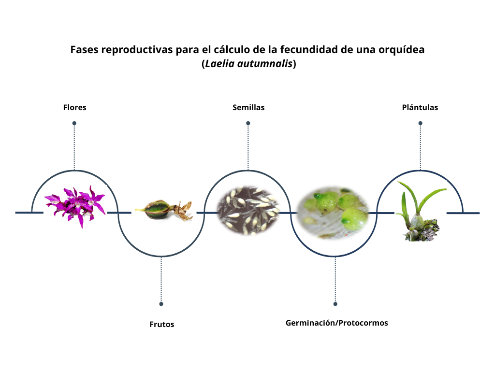
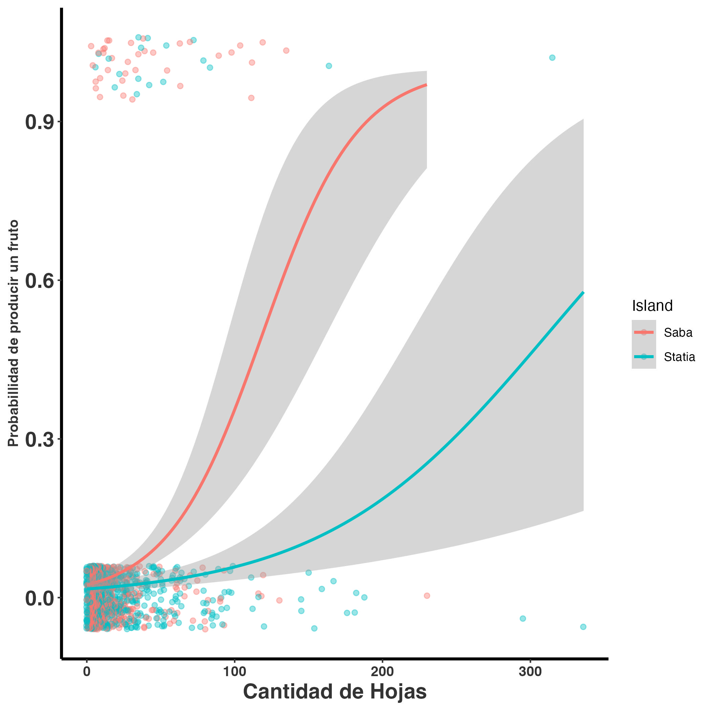

# Fecundidad {#MatricesF}

La fecundidad describe la contribución reproductiva de los individuos a la
población y constituye uno de los componentes clave de los modelos de
proyección poblacional. Este capítulo presenta los principios conceptuales
y prácticos necesarios para calcular la fecundidad y su incorporación en
matrices poblacionales estructuradas.

## Por: Aucencia Emeterio-Lara y Raymond L Tremblay

## Fecundidad y su representación en modelos matriciales de población

La fecundidad representa el proceso mediante el cual los individuos
contribuyen nuevos reclutas a la población y es un componente esencial de
la dinámica poblacional. En los modelos matriciales, la fecundidad suele
integrarse como una combinación de producción reproductiva, supervivencia
temprana y transición hacia los estadios iniciales del ciclo de vida.

En este capítulo se examinan los fundamentos para calcular la fecundidad a
partir de datos empíricos, destacando las decisiones conceptuales necesarias
para traducir observaciones biológicas —como floración, producción de
semillas o reclutamiento— en parámetros demográficos coherentes. Se discuten
las diferencias entre fecundidad potencial y fecundidad realizada, así como
las implicaciones de estas distinciones para la interpretación de la
dinámica poblacional.

Asimismo, se analiza cómo la fecundidad se integra en la matriz de
proyección, generalmente a través de la submatriz **F**, y cómo su
parametrización influye en el crecimiento poblacional y en análisis
posteriores de sensibilidad y elasticidad. Este capítulo se diferencia de
los anteriores porque se centra en la cuantificación explícita de un
proceso demográfico específico, estableciendo el vínculo entre datos
reproductivos y modelos poblacionales utilizados para inferir patrones de
crecimiento y evaluar escenarios de manejo.

#### Librerías de R requeridas para el siguiente módulo

```{r Trans1, message=FALSE}
#| error: true

library(Rage)
library(tidyverse)
library(gt)

```

## Introducción

Toda población de organismos depende de la reproducción para su crecimiento; sin ella, la población no puede aumentar. Por esta razón, la reproducción es un proceso esencial para evaluar el crecimiento poblacional y determinar si el reclutamiento es suficiente para sostener dicho crecimiento. En el caso de las plantas, la reproducción puede ser sexual o vegetativa. Cuando se considera el crecimiento vegetativo, es necesario incorporar una matriz de clonación. Sin embargo, en este capítulo nos enfocaremos únicamente en la reproducción sexual, que es la más común en estudios de ecología de poblaciones.

La forma en que se obtiene e integra la reproducción en los modelos de crecimiento poblacional es crucial, ya que su incorporación puede influir en los resultados y en las conclusiones derivadas del modelo. Por ello, comenzaremos describiendo errores frecuentes en el uso de matrices de transición para calcular la fecundidad. La fecundidad constituye una forma particular de transición demográfica,
discutida en el capítulo sobre transiciones poblacionales. La influencia de la fecundidad sobre la dinámica poblacional se refleja
directamente en la tasa de crecimiento poblacional introducida en el capítulo sobre crecimiento poblacional. La importancia relativa de la fecundidad frente a otros procesos vitales se evalúa posteriormente mediante el análisis de elasticidad poblacional.

El primer paso para calcular la fecundidad consiste en definir las clases de edad o tamaño de los individuos. Estas clases agrupan organismos con características similares en términos de edad o tamaño. Por ejemplo, en una población de peces, las clases pueden ser: juveniles, adultos jóvenes y adultos viejos; mientras que en plantas, las clases suelen ser: plántulas, juveniles y adultos. Si la primera etapa del modelo corresponde a “plántula”, el reclutamiento debe contabilizar las “nuevas plántulas” que ingresan a la población en cada periodo. Es fundamental que la etapa reproductiva se mida en la misma escala y periodo que las demás etapas.

Un error común es calcular la fecundidad usando el número de semillas producidas cuando la primera etapa del modelo son plántulas. En este caso, la fecundidad debe expresarse en términos de plántulas, no de semillas. Para ello, es necesario convertir la cantidad de semillas en plántulas mediante una tasa de germinación o de supervivencia.

## Estimación de la fecundidad a partir de datos

A continuación se presentan los métodos y cálculos utilizados para estimar
la fecundidad y su incorporación en matrices de proyección poblacional.

## La fecundidad de las orquídeas en la demografía poblacional

La fecundidad en orquídeas se refiere a la capacidad reproductiva efectiva de una población, evaluada a través de una serie de eventos: producción de flores, éxito en la polinización, formación de frutos, germinación de semillas y establecimiento de plántulas. En consecuencia, la fecundidad constituye un conjunto de procesos que determinan la viabilidad poblacional a largo plazo. Aunque puede parecer un mecanismo sencillo, en realidad es complejo, ya que depende de múltiples factores como la disponibilidad de recursos, competencia entre individuos, depredación y enfermedades.

El proceso inicia con la producción de flores, lo que implica una inversión significativa de nutrientes y agua acumulados por la planta. Además, las flores desarrollan atributos específicos para maximizar la probabilidad de polinización, tales como color, aroma, néctar y polen. Estos rasgos, sin embargo, son costosos en términos energéticos, por lo que su expresión debe ser cuidadosamente optimizada. En algunos casos, los costos reproductivos son tan elevados que pueden comprometer la supervivencia de la planta.

Diversos estudios ilustran este fenómeno. Por ejemplo, en la orquídea Comparettia falcata [@melendez2000reproduction], la polinización manual mostró una correlación positiva entre el número de flores producidas y el porcentaje de frutos abortados. En Spiranthes spiralis, un año con alta producción floral se tradujo en más del 80% de individuos en estado vegetativo al año siguiente [@willems2000flowering]. De manera similar, en la orquídea perenne Cypripedium acaule se observó una reducción en la probabilidad de florecer y en el tamaño foliar en la temporada posterior [@primack1998cost]. Otro caso se reportó en Encyclia krugii, donde el incremento en la producción de frutos se compensó en la siguiente temporada con menor crecimiento vegetativo (reducción en tamaño de hojas, número de flores, inflorescencias y mayor aborto de frutos) [@ackerman1989limitations].

Estos hallazgos sugieren que cada ciclo reproductivo requiere un periodo de recuperación para que la planta acumule los nutrientes necesarios para la siguiente temporada. Por lo tanto, un alto índice reproductivo —y el consecuente costo energético— puede representar una desventaja significativa, especialmente en especies con reservas limitadas.

## La polinización en las orquídeas

La familia Orchidaceae exhibe una notable diversidad en sus sistemas reproductivos, incluyendo especies autógamas y alógamas [@willmer2011pollination; @bateman2020implications]. Aunque muchas orquídeas presentan barreras físicas o genéticas que limitan la autopolinización (por ejemplo, el rostelo o la incompatibilidad genética), se ha documentado que varias especies pueden utilizar su propio polen para producir frutos y semillas viables [@ackerman2023beyond]. De hecho, Catling reporta al menos 350 especies en las que alguna población se autopoliniza [@catling1990auto]. Se estima que aproximadamente el 31% de las especies de orquídeas producen frutos mediante autopolinización [@evans2020impact], siendo esta estrategia más frecuente en especies con distribución geográfica restringida o en ambientes con escasez de polinizadores [@suetsugu2015autonomous].

Es importante destacar que la autopolinización no implica necesariamente autogamia estricta; la mayoría de las orquídeas presentan grados variables de autogamia facultativa [@talalaj2017ability]. Este tipo de autopolinización se ha observado bajo condiciones de estrés abiótico o disturbios antropogénicos [@talalaj2015mechanism; @talalaj2017ability]. Por ejemplo, las flores del género *Epipactis* muestran adaptaciones morfológicas que facilitan la autopolinización para asegurar la producción de semillas. Si bien la autogamia garantiza la formación de frutos, estos suelen ser más pequeños y contener menos semillas, con menor viabilidad (semillas sin embrión, embriones inviables, protocormos albinos) [@tremblay2005variation; @paiva2022autopolinizaccao]. Este fenómeno se asocia con la autocompatibilidad genética, documentada en más de 750 especies de orquídeas, incluyendo géneros como *Chondrorhyncha*, *Coelogyne*, *Dendrobium*, *Lycaste*, *Notylia* y *Oncidium* [@johnson2000structure; @tremblay2005variation; @barreda2024allogamy].

Por otro lado, la polinización cruzada incrementa el éxito reproductivo al introducir diversidad genética y superar mecanismos de auto-incompatibilidad [@zhang2021challenges]. Aunque las especies autocompatibles suelen producir más frutos [@caballero2017generalized], muchas orquídeas dependen exclusivamente de la polinización cruzada [@zhang2021challenges]. Por ejemplo, en la subfamilia Epidendroideae existe un alto número de especies autoestériles, mientras que en Vanilloideae y Cypripedioideae se observa producción de frutos por autopolinización, a pesar de que su morfología floral sugiere polinización cruzada [@suetsugu2014pollination; @lopes2022local].

Algunas especies presentan autopolinización estricta mediante flores cleistógamas, que nunca se abren pero producen frutos fértiles, como en *Lepanthes dodiana*. Esta estrategia es común en plantas colonizadoras o adaptadas a ambientes extremos, donde la ausencia de polinizadores o individuos cercanos limita la polinización cruzada [@barreda2024allogamy]. La autogamia, además, requiere menos inversión energética al no producir recompensas florales [@eckert2004using], similar a las especies que emplean polinización por engaño, donde la ausencia de recompensas se traduce en menor éxito reproductivo [@golubov2009que].

Se estima que aproximadamente el 65% de las especies de Orchidaceae ofrecen algún tipo de recompensa floral [@llabres2015estudio]. El néctar constituye la recompensa más común para atraer polinizadores [@neiland1998fruit]; sin embargo, su producción pudiese implicar un elevado costo energético para la planta, lo que puede limitar el desarrollo de otras estructuras. Ante esta restricción, muchas orquídeas han evolucionado mecanismos de polinización por engaño, estrategia presente en cerca de un tercio de las especies (entre 6,000 y 8,000) [@tremblay2005variation; @case2009enhancing; @ackerman1989limitations; @dafni1983pollination]. Estas especies no ofrecen recompensa alguna, lo que reduce el gasto energético. La ausencia de recompensas permite a las orquídeas con polinización por engaño invertir recursos en otras características, como mayor número de flores, incremento en la altura de la planta y en el tamaño de la inflorescencia [@henneresse2017effects; @scopece2017fluctuating], rasgos que aumentan la atracción visual y la frecuencia de visitas de polinizadores [@peakall1989new; @burd1995pollinator; @aragon2004does; @grindeland2005effects; @li2011floral; @sletvold2011among]. Tanto la autogamia como la polinización por engaño requieren menor inversión energética al no producir recompensas [@eckert2004using]; sin embargo, esta estrategia suele traducirse en menor éxito reproductivo. De hecho, se ha reportado que las orquídeas que emplean polinización por engaño producen, en promedio, solo la mitad de frutos en comparación con aquellas que ofrecen recompensas [@johnson1997evidence; @neiland1998fruit; @tremblay2005variation; @jersakova2006mechanisms].

## Producción de frutos en orquídeas

En los análisis de demografía poblacional, la fecundidad se ha estimado a distintos niveles: número de flores, frutos, semillas o plántulas. Algunos estudios la calculan considerando la cantidad de flores producidas por planta en relación con el número de individuos en la población, mientras que otros proponen que la producción de frutos es el indicador más preciso del éxito reproductivo [@proctor1994pollen].

Por ejemplo, en *Dracula chimaera* la fecundidad se determinó calculando la probabilidad de que una planta con flor desarrollara fruto, es decir, el número de frutos presentes en cada etapa dividido entre el total de plantas de esa misma etapa. Sin embargo, es importante subrayar que la producción de frutos no garantiza la calidad de las semillas o la presencia de semillas, por ejemplo en la especies *Phychilis krugii* en Puerto Rico, la autopolinización resulta en producción de un fruto pero la semillas estan sin embrión. Ademas hay muchos factores que influye directamente en la germinación y, a largo plazo, en el establecimiento efectivo de nuevas plántulas.

## Viabilidad de las semillas

El número de semillas por fruto en las orquídeas puede variar desde miles hasta millones; sin embargo, no todas son viables. Es ampliamente reconocido que una gran proporción corresponde a semillas vacías (sin embrión), mientras que otras presentan embriones no funcionales. Esto indica que no todas las semillas producidas tienen la capacidad de originar un nuevo individuo. Por esta razón, algunos estudios han incorporado la viabilidad de las semillas como un nivel adicional para estimar la fecundidad, tal como se realizó en *Laelia autumnalis* (Emeterio-Lara; comunicación personal).

## Germinación

Aunque una planta puede producir una gran cantidad de semillas viables, tras la dispersión estas enfrentan múltiples factores que limitan su éxito. Las condiciones abióticas —como temperatura, luz y humedad—, junto con factores bióticos, como las características del forófito, la disponibilidad de hongos endófitos y la presión de herbívoros o depredadores de semillas y plántulas, influyen tanto en la micorrización como en la germinación y el establecimiento de nuevas plántulas [@dressler1993phylogeny].

Estos elementos definen micrositios específicos para la germinación, que pueden incluir fisuras en la corteza de un árbol, mechones de musgo, superficies de raíces vivas o acumulaciones de humus [@rasmussen2015germination]. A medida que las semillas atraviesan las distintas etapas de germinación —desde la imbibición hasta el desarrollo de plántulas con dos hojas [@arditti1967factors]—, la mortalidad se mantiene en niveles muy altos. Por ejemplo, Batty et al. [@batty2001constraints] estimaron que, en *Caladenia arenicola*, de aproximadamente 34,500 semillas, menos del 1% alcanzó la etapa de plántula capaz de sobrevivir a la primera sequía estival.

## Reclutamiento

El reclutamiento se define como el número de plántulas que logran establecerse en el forófito y poseen el potencial de sobrevivir para avanzar a la siguiente etapa demográfica (juvenil). Las orquídeas presentan tasas de reclutamiento particularmente bajas [@garcia2003demografia; @winkler2001population; @zotz1998demography; @larson1978vegetation], debido a factores como la susceptibilidad al estrés hídrico durante la estación seca [@garcia2003demografia; @mondragon2000dinamica; @zotz1998demography; @tremblay1997lepanthes; @hietz1997population; @hernandez1992dinamica; @larson1992population; @benzing1981bark], enfermedades y depredación. Por ejemplo, en *Erycina crista-galli* un individuo adulto produce en promedio 0.033 plántulas/año, mientras que en *Guarianthe aurantiaca* un individuo reproductivo genera menos de un nuevo individuo por año.

En los modelos demográficos, alcanzar esta fase es crucial, ya que representa el valor neto de fecundidad: el número de nuevos individuos que conformarán la siguiente generación en una población natural. Sin embargo, estimar la fecundidad hasta la etapa de plántula es uno de los mayores retos, principalmente por la dificultad de asegurar la identidad de la especie. Un aspecto clave es la proximidad a la planta madre, dado que, aunque el viento favorece la dispersión a larga distancia, la mayoría de las semillas se depositan cerca de ella [@chung2004spatial; @trapnell2004three; @jersakova2007spatial].

A pesar de estas limitaciones, existen estudios que han registrado plántulas sobrevivientes tras un periodo (generalmente un año). Ejemplos incluyen *Brassavola cucullata* [@ackerman2020small] y *E. crista-galli* [@maldonado2006patron], donde la fecundidad se estimó dividiendo el número de nuevos reclutas observados en campo entre el número máximo de frutos reportados durante el periodo de estudio. En otros casos, como *Guarianthe aurantiaca*, se calculó comparando los reclutamientos entre años consecutivos [@mondragon2009population]. Estos datos proporcionan estimaciones más precisas para proyectar la dinámica poblacional y diseñar estrategias de conservación.

::: {style="float: none; margin: 10px; width: 100%;"}

:::

------------------------------------------------------------------------

Tabla de algunos ejemplos de fecundidad en orquídeas, donde se muestra la especie, el índice de fecundidad y la referencia del estudio.

| Especie | Indice de Fecundidad | Referencia |
|:-----------------------|:-----------------------|:-----------------------|
| *Lepanthes eltoroensis* | Cantidad de Plántulas / Adultos reproductivos | @tremblay2003population |
| *Erycina crista-galli* | 0.033 plántulas/año | @maldonado2005patron |
| *Encyclia tampensis* | 0.1 plántulas/fruto | @larson1992population |
| *Guarianthe aurantiaca* | \<1 plántula/año | @mondragon2009population |

## Tiempo de inversión para alcanzar la fase reproductiva

Los estudios disponibles indican que las orquídeas presentan un crecimiento lento, requiriendo entre 8 y 19 años para alcanzar la madurez reproductiva [@larson1992population; @hernandez1992dinamica; @zotz1995fast; @zotz1998demography]. Sin embargo, existen excepciones, como las orquídeas miniatura o de ramilla (principalmente Pleurothalliinae), que pueden madurar en uno o pocos años [@chase1987obligate].

Para estimar el crecimiento y la edad reproductiva en *Lycaste aromatica*, se ha utilizado la producción regular de pseudobulbos, los cuales permanecen varios años en la planta. Con base en este patrón, se predice que *Encyclia tampensis* alcanza la floración aproximadamente a los 15 años. No obstante, bajo condiciones controladas de cultivo, la fase de pre-bulbo puede durar entre 0.5 y 2 años, y la primera floración ocurrir en tan solo 5 a 6 años (H. Lutero, comunicación personal).

::: {style="float: right; margin: 10px; width: 60%;"}

:::

Un caso interesante se observa en *Brassavola cucullata*, una especie rupícola y epífita de las Antillas Menores. En esta orquídea, los pseudobulbos presentan hojas lanceoladas, y la probabilidad de floración no depende de la longitud de las hojas, sino de la cantidad de hojas por individuo. De hecho, el número estimado de hojas constituye un buen predictor de la capacidad de una planta para producir flores, aunque se han registrado diferencias en esta relación entre las poblaciones de las islas Saba y San Eustaquio.

## Ejemplo de cálculo de fecundidad basado en semillas

En este ejemplo, la primera fila de la matriz representa la fecundidad de la población en la posición (3,1) (columna, fila), correspondiente al número promedio de semillas producidas por un individuo adulto. Sin embargo, la fecundidad en modelos demográficos debe expresarse en términos de plántulas, no de semillas. Por ello, es necesario convertir la cantidad de semillas producidas en plántulas mediante una tasa de germinación o una tasa de supervivencia hasta la etapa de plántula. De lo contrario, el cálculo presentará un sesgo, ya que se estaría estimando fecundidad con base en semillas, sin considerar su capacidad real de generar nuevos individuos.

```{r}
#| error: true
matA_sem <- rbind(
  c(0.0, 0.0, 1000), #  fecundidad 1000 semillas en promedio por adulto
  c(0.5, 0.0, 0.0),
  c(0.0, 0.4, 0.0)
)

```

Visualizamos el ciclo de vida de la población con la función `plot_life_cycle()` de la librería `Rage`:

```{r}
#| error: true
etapas <- c("plántula", "juvenil", "adulto")
 
 plot_life_cycle(matA_sem, stages=etapas, fontsize = 5)
```

------------------------------------------------------------------------

## Ejemplo de cálculo de fecundidad: de semillas a plántulas

Una alternativa para estimar la fecundidad en términos demográficos consiste en calcular el número de nuevas plántulas que se incorporarán en el siguiente periodo, utilizando una tasa de germinación y una tasa de supervivencia hasta la etapa de plántula.

Por ejemplo, si:

-   la tasa de germinación es 50%,
-   la tasa de supervivencia de plántulas es 20%,
-   y existen 75 adultos reproductivos,

entonces la fecundidad en términos de plántulas se calcula como:

$$\text{Fecundidad} = \frac{(1000 \times 0.5 \times 0.2)}{75} = 1.33$$

Esto significa que, en promedio, cada adulto contribuiría con 1.33 plántulas al siguiente periodo.

Por consecuencia la matriz cambia a:

```{r}
#| error: true

matA_pl <- rbind(
  c(0.0, 0.0, 1.333), 
  c(0.5, 0.0, 0.0),
  c(0.0, 0.4, 0.0)
)

etapas <- c("plántula", "juvenil", "adulto")

plot_life_cycle(matA_pl, stages = etapas, fontsize = 5)

```

------------------------------------------------------------------------

## Fecundidad en términos de plántulas

Otra alternativa consiste en calcular la fecundidad directamente en función del reclutamiento observado, utilizando el número de plántulas establecidas en el periodo siguiente. Este método es útil cuando no se dispone de información sobre la producción de semillas ni sobre sus tasas de germinación y supervivencia.

La estimación se obtiene dividiendo el número total de plántulas registradas en el periodo t2t_2t2​ entre el número de adultos presentes en el periodo anterior $t_1$. Por ejemplo, si en $t_2t$ se contabilizan 50 nuevas plántulas y en $t_1$ había 100 adultos, la fecundidad sería:

$$\text{Fecundidad} = \frac{50}{100} = 0.5$$

Esto indica que, en promedio, cada adulto contribuyó con 0.5 plántulas a la siguiente generación.

```{r}
#| error: true
matA_pl2 <- rbind(
  c(0.0, 0.0, 0.5), #  fecundidad 0.5 plántulas en promedio por adulto
  c(0.5, 0.0, 0.0),
  c(0.0, 0.4, 0.0)
)

etapas <- c("plántula", "juvenil", "adulto")

plot_life_cycle(matA_pl2, stages = etapas, fontsize = 5)
 
```

------------------------------------------------------------------------

## Sesgos en las condiciones y cálculos de fecundidad

Para estimar la fecundidad en modelos poblacionales, es necesario asumir ciertos supuestos fundamentales:

-   La cantidad de plántulas registradas en el periodo $t_2$ corresponde a la fecundidad de los adultos en el periodo $t_1$.
-   No existe inmigración desde otros sitios, salvo que se incluya explícitamente en el modelo (ver [@pascarella1998hurricane]).
-   No hay banco de semillas, es decir, semillas provenientes de periodos anteriores.
-   El periodo de muestreo coincide con la ventana en la que las semillas germinan y las plántulas son visibles para el observador.

Es importante reconocer que no existe un método perfecto para calcular la fecundidad. El procedimiento descrito aquí es útil cuando no se dispone de información sobre la cantidad de semillas producidas ni sobre su supervivencia y germinación. Sin embargo, siempre existe la posibilidad de que algunas semillas germinen en otros periodos o provengan de sitios externos, lo que introduce sesgos. Mientras estos sesgos sean mínimos, las estimaciones pueden considerarse aceptables para expresar la fecundidad en términos de plántulas.

El escenario ideal sería seguir todo el proceso reproductivo: cuantificar el esfuerzo reproductivo de cada individuo, registrar la producción de semillas y monitorear su germinación en campo. No obstante, este seguimiento completo es prácticamente imposible, por lo que se deben asumir ciertos procesos biológicos, entre ellos:

-   La cantidad de semillas por fruto es constante.
-   La calidad de las semillas (probabilidad de germinar) es homogénea entre frutos, aunque puede variar entre individuos debido a factores como autofecundación, exogamia o polinización múltiple. Las condiciones ecológicas necesarias para la germinación son similares.
-   El tiempo de germinación es comparable entre semillas (sin banco de semillas, salvo que esté implícitamente considerado en el modelo).
-   Diferentes tamaños o estadios de adultos pueden producir cantidades distintas de semillas o semillas de calidad variable.

------------------------------------------------------------------------


