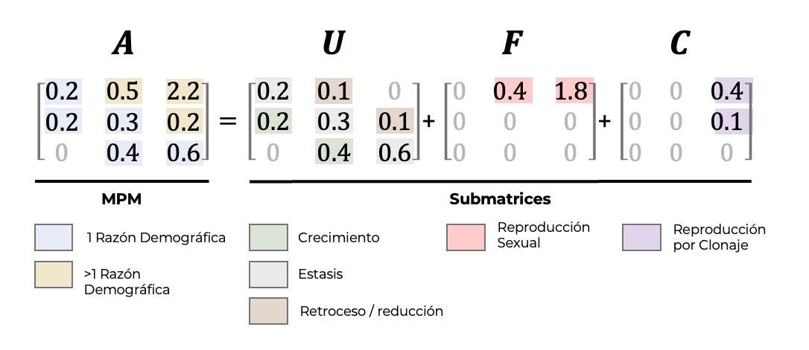

# Matrices de transición, fecundidad y reproducción clonal {#MatricesTFC}

Las matrices U, F y C descomponen la dinámica poblacional en sus componentes demográficos fundamentales: supervivencia y crecimiento, fecundidad y transiciones complementarias. Este capítulo introduce estas matrices como herramientas conceptuales y analíticas para representar explícitamente los procesos que estructuran la dinámica poblacional.

Raymond L. Tremblay

## Descomposición matricial de la dinámica poblacional

En los modelos de proyección poblacional estructurados, la matriz de proyección puede descomponerse en componentes que representan procesos demográficos distintos. Las matrices **U**, **F** y **C** permiten separar la dinámica poblacional en supervivencia y crecimiento (U), fecundidad (F) y otras transiciones complementarias (C), facilitando la interpretación biológica y analítica del modelo.

En este capítulo se presenta la lógica conceptual de esta descomposición, mostrando cómo cada matriz captura un conjunto específico de procesos del ciclo de vida. La matriz **U** describe las transiciones no reproductivas entre estadios, incluyendo estasis y crecimiento. La matriz **F** representa la contribución reproductiva a los estadios iniciales, integrando producción reproductiva y supervivencia temprana. En casos particulares, la matriz **C** permite incorporar transiciones adicionales que no encajan directamente en U o F, ampliando la flexibilidad del modelo.

La descomposición en U, F y C constituye un paso intermedio clave entre la definición de transiciones individuales y el análisis de propiedades poblacionales. Este enfoque permite evaluar separadamente el papel de cada proceso demográfico en el crecimiento poblacional y sirve como base para análisis posteriores de elasticidad, sensibilidad, LTRE y simulaciones. A diferencia de capítulos previos, este capítulo se enfoca en la representación estructural explícita de los procesos demográficos dentro de la matriz, proporcionando un puente entre la biología del ciclo de vida y las herramientas analíticas desarrolladas más adelante.

#### Librerías de R requeridas para el siguiente módulo

```{r, message=FALSE, warning=FALSE}
#| label: fig-matA
#| fig-cap: "Carga de paquetes y funciones auxiliares para la generación de figuras del capítulo."

library(DiagrammeR)
library(Rage)
library(Rcompadre)
library(dplyr)
library(purrr)
library(flextable)
source("R/figuras_helpers.R") # plc_save(), grviz_save(), save_plot_png()
```

## Construcción y cálculo de las matrices U, F y C

A continuación se describe cómo definir y calcular las matrices U, F y C a partir de transiciones demográficas y datos empíricos.

## Tres tipos de matrices

Para facilitar los análisis e interpretaciones es necesario tener claro el ciclo de vida de la especie y el origen de los parámetros de transiciones, fecundidades y clonaje. Para lo cual, hay que recordar que la matriz A (matA), para evaluar varios de los parámetros del crecimiento poblacional, es el resultado de la suma de las submatrices de transición, de fecundidad y de clonación. Un ejemplo de por qué es necesario crear submatrices es que, para calcular la supervivencia promedia y sus intervalos de confianza, se necesita la matriz de transiciones **matU** separado de la matriz de fecundidad, mientras que para calcular la tasa de crecimiento poblacional, se necesita **matA**. En adición si uno quiere un estimado de la endogamia es importante reconocer la importancia de la clonación en la dinámica poblacional, se necesita incluir **matC**. Por consecuencia, es importante tener claro el ciclo de vida y la forma de reproducción de la especie que se está estudiando. La definición de las matrices U, F y C se basa directamente en los procesos de transición descritos en el capítulo sobre transiciones demográficas. La combinación de las matrices U, F y C permite derivar la tasa de crecimiento poblacional discutida en el capítulo sobre crecimiento poblacional.

Definiciones de las matrices

- MatU = Matriz de Transiciones
- MatF = Matriz de Fecundidad
- MatC = Matriz de Clonación
- MatA = MatU + MatF + MatC

::: callout-note
**Cada submatriz sirve análisis diferentes.**

- `matU` se usa para calcular **supervivencia, esperanza de vida y trayectorias por estadios** (no incluye la creación de nuevos individuos).
- `matF` y `matC` se usan para evaluar **contribución reproductiva** (sexual o clonal) por separado.
- `matA = matU + matF + matC` se usa para calcular **λ** y proyecciones poblacionales completas.

Mantenerlas separadas es la convención de bases de datos como COMPADRE y permite recombinarlas según el análisis.
:::

{#fig-matrices-a-u-f-c width="90%"}

------------------------------------------------------------------------

## MatU: Matriz de transiciones

La matriz de transiciones **matU** contiene únicamente entradas que representan cambios entre estados vitales: **crecimiento**, **permanencia (estasis)** y **retrogresión (decrecimiento)**. Por lo tanto, toda la información relacionada con **reproducción** y **clonación** está excluida de esta matriz.

Como ejemplo, consideremos un modelo con tres etapas de vida: **plántulas**, **juveniles** y **adultos**, donde se observan todas las transiciones posibles. En este modelo, los juveniles **no pueden regresar a ser plántulas**, ya que fisiológicamente las plántulas presentan características distintas a individuos que ya han desarrollado raíces y hojas.\

Recuerde que los individuos incluidos en un mismo estadio deben tener **probabilidades similares de crecimiento, supervivencia y fecundidad**.

En cambio, los adultos **sí pueden regresar a la etapa juvenil** (al menos como individuos no reproductivos), posiblemente como consecuencia de **daño por herbivoría**, que reduce su tamaño.

```{r}
#| label: fig-matA1
#| fig-cap: "Ciclo de vida generado a partir de la matriz de supervivencia y crecimiento `matU` con los estadios plántulas, juvenil y adulto."

matU <- rbind(
  c(0.1, 0.0, 0.0),
  c(0.5, 0.3, 0.05),
  c(0.001, 0.4, 0.8)
)
stages <- c("Plántulas", "Juvenil", "Adulto")
plc_save(matU, stages = stages, png = "images/matU_matA1.png")
```

------------------------------------------------------------------------

## MatF: Matriz de fecundidad

La matriz F se construye a partir de los parámetros de fecundidad calculados en el capítulo sobre cálculo de fecundidad. Al analizar la figura siguiente, se observa que algunos individuos en la segunda etapa pueden producir plántulas. Por ello, sería más apropiado cambiar el nombre de esta etapa de “juvenil” a “adultos pequeños”, ya que el término juvenil podría interpretarse como individuos no reproductivos.

En el ciclo de vida se aprecia que las plántulas provienen tanto de adultos pequeños como de adultos grandes. Esta separación en categorías de adultos es recomendable cuando las probabilidades de fecundidad difieren significativamente entre clases de tamaño.

Por ejemplo, en el estudio de la demografía de *Guarianthe aurantiaca* [@mondragon2009population], se definieron dos categorías reproductivas:

- adultos pequeños (r1): pseudobulbos entre 7 y 15 cm
- adultos grandes (r2): pseudobulbos \> 15 cm

Los resultados mostraron una gran diferencia en la producción de plántulas:

- r1: 0.007
- r2: 0.121.

```{r}
#| label: fig-matA2
#| fig-cap: "Ciclo de vida generado a partir de la matriz de fecundidad `matF` con los estadios plántulas, adultos pequeños y grandes."

matF <- rbind(
  c(0.0, 0.007, 0.121),
  c(0.0, 0.0, 0.0),
  c(0.0, 0.0, 0.0)
)
stages <- c("Plántulas", "Adultos Pequeños", "Adultos Grandes")
plc_save(matF, stages = stages, png = "images/matU_matA2.png")
```

------------------------------------------------------------------------

## MatC = Matriz de clonación

Esta matriz representa la contribución de la reproducción asexual en la dinámica poblacional. Es fundamental comprender que la propagación vegetativa origina un ramet, un individuo ecológicamente independiente, aunque genéticamente idéntico al progenitor (genet) [@cook1983clonal].

Por ejemplo:

- En *Epidendrum*, la producción de nuevos tallos no se considera reproducción, ya que permanecen unidos y conectados, funcionando más como crecimiento que como reproducción. El destino demográfico de cada tallo depende del resto, similar a las ramas de un árbol.
- En *Artorima erubescens*, las cadenas de pseudobulbos pueden fragmentarse, y cada sección tiene un destino demográfico independiente. En este caso, sí hablamos de reproducción vegetativa [@garciasoriano2003demografia].
- En especies que producen keikis, cada keiki se convierte en un nuevo individuo ecológico al separarse de la planta madre, con crecimiento, supervivencia y fecundidad independientes.

**¿Por qué no incluir ramets en la matriz de fecundidad (matF)?**

Los individuos generados por propagación vegetativa difieren radicalmente de las plántulas:

- Las plántulas provienen de semillas, mientras que los ramets surgen de meristemos.
- Los ramets suelen tener tasas mucho mayores de crecimiento y supervivencia, ya que reciben recursos de la planta madre mientras permanecen conectados.

Por ello, su incorporación en la matriz ocurre generalmente en estadios superiores. El aporte se hace a la categoría de juveniles. Esto puede provocar que en la matriz **matA** las entradas superen el rango típico (0–1), ya que se suman transiciones y fecundidad vía ramets.

::: callout-note
**Las entradas de `matA` pueden superar 1 cuando hay clonaje.** En matrices puramente de transiciones (`matU`), cada columna suma a lo sumo 1 (incluyendo la mortalidad implícita). Pero al sumar `matU + matF + matC`, las entradas individuales pueden superar 1 porque un mismo individuo puede contribuir simultáneamente a varios destinos: sobrevivir y crecer (`matU`), producir plántulas sexuales (`matF`), y aportar *ramets* (`matC`). Una entrada \> 1 en `matA` no es un error — refleja que la columna ya no es una distribución de probabilidades de destino, sino una contabilidad de transiciones más reclutas.
:::

------------------------------------------------------------------------

### Clonación: Diferencia entre ramet y genet

::: callout-important
**Genet versus *ramet*.**

- **Genet:** la unidad genética — todos los individuos que descienden de una misma semilla y comparten el genoma original.
- ***Ramet*****:** la unidad ecológica — cada módulo o tallo que puede sobrevivir, crecer y reproducirse de forma independiente.

Una orquídea con varios pseudobulbos puede ser un genet con muchos *ramets*. Los modelos demográficos típicamente cuentan *ramets* (porque cada uno es un individuo ecológicamente independiente), no genets — pero esta convención afecta directamente cómo se interpretan tasas de "supervivencia" y "fecundidad".
:::

Al estudiar especies con reproducción clonal, es esencial diferenciar entre ramet y genet:

- Genet: conjunto de todos los ramets que comparten la misma identidad genética.
- Ramet: cada unidad individual dentro del genet, ecológicamente independiente pero genéticamente idéntica.

En orquídeas, cada seudobulbo puede considerarse un ramet, mientras que la suma de todos los seudobulbos conforma el genet. Existen enfoques para incorporar esta distinción en las matrices demográficas y, por ende, integrar el concepto de clonación en los estimados de adecuación [@mcgraw1996estimation].

### Ejemplo de matriz de clonación

A continuación, se muestra un ejemplo de matriz de clonación. En la base de datos COMPADRE, el único caso registrado corresponde a *Cypripedium calceolus* [@garcia2010living]. Este ejemplo también permite ilustrar cómo extraer matrices con características específicas desde la base de datos COMPADRE.

------------------------------------------------------------------------

### Descargar la base de datos de COMPADRE

```{r mat4, message=FALSE}
compadre <- readRDS("data/COMPADRE_2026.rds")
```

------------------------------------------------------------------------

## Extraer MPP con matriz de clonaje

En el siguiente script se calcula la suma de todos los valores de la matriz de clonación (**matC**). Cualquier especie que presente un valor mayor a 0 en esta matriz se considera que posee clonación en al menos una etapa de su ciclo de vida.

Del análisis se observa que 8,304 especies no tienen información registrada en **matC**. Por otro lado, una población cuya suma en matC sea superior a cero (por ejemplo, ≥ 0.001) se clasifica como una especie con clonación.

```{r mat5}
compadre <- readRDS("data/COMPADRE_2026.rds")

# Encontrar MPP con matC clonaje no cero
compadre$clonality <- 0


compadre$clonality <- sapply(compadre$mat, function(m) sum(m@matC))

# table(compadre$clonality) # Remover el "#" para ver todos los resultados,

as.data.frame(head(table(compadre$clonality))) |> flextable() # Se observa la suma de las matrices de clonaje, hay 8304 especies que no tiene información en matC, una población con un matC que su suma es 0.001, etc.

summary(compadre$clonality[compadre$clonality > 0], ) # Resumen estadístico de la clonación en la base de datos de las especies que tienen clonación

# crear un histograma de las especies que tienen clonación (excluir las especies que no tiene clonación)

# hist(compadre$clonality[compadre$clonality > 0], breaks = 50, main = "Histogram of #Clonality in COMPADRE", xlab = "Clonality (sum of matC)", ylab = "Frequency")
```

------------------------------------------------------------------------

### Control de calidad de las matrices

Es fundamental aplicar controles de calidad a la base de datos, por ejemplo, para detectar entradas faltantes en la matriz principal (**matA**).

En el capítulo COMPADRE y las orquídeas se utiliza esta base de datos y se describen diversas estrategias para limpieza y selección de matrices con características específicas, garantizando que los análisis se realicen sobre datos completos y confiables.

```{r mat6}

compadre_flagged <- cdb_flag(compadre, checks = "check_NA_A") # Evaluar que la matA no es nula (no suma a zero)
```

------------------------------------------------------------------------

## Orquídeas con clonaje

Ahora filtrar para orquídeas solamente y para aquellos con **matC** no nulo (clonality \>0). Se observa que solamente dos poblaciones tienen información de clonación.

```{r mat7}
orchid_clonal <- compadre_flagged %>%
  filter(Family == "Orchidaceae") %>% # filtrar para orquídeas
  filter(clonality > 0) # filtrar para aquellos con matC no nulo

# Visualizar la base de datos de orquídea, se observa solamente dos matrices de clonaje

unique(orchid_clonal$SpeciesAuthor) # hay dos poblaciones solamente en toda la base de datos
```

------------------------------------------------------------------------

### El estudio de *Cypripedium calceolus*

Seleccionamos solamente un ejemplo, la Matriz de *Cypripedium calceolus* #242624 [@garcia2010living], que es la matriz promedio de la tercera población (SpeciesAuthor == Cypripedium_calceolus_3).

```{r mat8}

Cyp_cal_2 <- orchid_clonal %>%
  filter(MatrixID == 242624)

# Cyp_cal_2
```

------------------------------------------------------------------------

#### Buscar la población que tiene **matC** máxima.

En esta código, se evaluá todas las orquídeas donde tiene una matriz de clonaje y se filtra para la que tiene la suma de matC máxima. En este caso, es la misma población que se seleccionó en el script anterior.

```{r mat9}

# Reemplace el bucle for de mat5 con esto:
compadre$clonality <- sapply(compadre$mat, function(m) sum(m@matC))

Orchid_clonal_max <- orchid_clonal %>%
  filter(clonality == max(clonality)) # filtrar para la suma de matC máximo

as.data.frame(Orchid_clonal_max) |> flextable() |> ft_wide()
```

------------------------------------------------------------------------

#### El estudio de *Cypripedium calceolus*

Seleccionamos como ejemplo la matriz correspondiente a *Cypripedium calceolus* (ID #242624) [@garcia2010living]. Este estudio tuvo como objetivo evaluar la hipótesis del modelo central-marginal, que plantea que las poblaciones situadas en los márgenes de su distribución son más susceptibles que aquellas ubicadas en el centro. La especie fue modelada con base en 6 etapas, "muy pequeñas", "pequeñas", "intermedias", "grandes", "muy grandes" y "extra grandes", más una etapa de "latencia". García et al. [@garcia2010living] señalan que en *Cypripedium calceolus* es difícil diferenciar entre reclutamiento sexual y asexual, y que la percepción de reclutamiento asexual probablemente sea mucho más común que la sexual [@garcia2010living; @kull1995genet].

```{r mat10}

Cyp_cal_2 <- orchid_clonal %>%
  filter(MatrixID == 242624)

as.data.frame(Cyp_cal_2) |> flextable() |> ft_wide()
```

------------------------------------------------------------------------

#### Las etapas del ciclo de vida de *Cypripedium calceolus* son:

Aquí visualizamos las etapas del ciclo de vida de *Cypripedium calceolus* y la matriz de transición, fecundidad y clonación.

```{r mat11}

Cyp_cal_2$mat[[1]] # [[1]] ver las etapas del ciclo de vida de esta población con las tres matrices
```

------------------------------------------------------------------------

#### Visualizar la transición de las diferentes etapas por clonación solamente

Podemos visualizar las transiciones de las diferentes etapas por clonación. Usa la función `plot_life_cycle` de la librería **Rage** para visualizar el ciclo de vida. En este caso, las etapas son "Dormant", "Smallest", "Small", "Inter", "Large", "ExtraLarge" y la matriz de clonación es la **matC**. Si se reemplaza la matriz de clonación por la matriz **matA** se puede ver el ciclo de vida con todas las transiciones, fecundidad y clonación.

```{r}
#| label: fig-mat13
#| fig-cap: "Ciclo de vida generado a partir de la matriz de clonación `matC` extraída de *Cypripedium calceolus* con seis estadios."

# remotes::install_github("jonesor/Rage") # Instalar de Github para la más reciente versión
library(Rage)

matC <- matC(Cyp_cal_2) # extraemos la matriz de clonación de este especie/población

plc_save(
  matC[[1]], # Note aqui se seleciona solamente la matriz de clonaje
  stages = c("Dormant", "Smallest", "Small", "Inter", "Large", "ExtraLarge"),
  node_order = c(2, 1, 3, 4, 5, 6),
  png = "images/matU_mat13_Cyp_cal_clon.png"
)
```

------------------------------------------------------------------------

### Ejemplo de inclusión de matC en otras familias

```{r mat14, eval=FALSE}

# Buscando MPP con matrix de clonación
compadre$clonality <- 0

# Reemplace el bucle for de mat5 con esto:
compadre$clonality <- sapply(compadre$mat, function(m) sum(m@matC))
```

------------------------------------------------------------------------

### Clonación en otras especies

Ver la lista de especies que incluyen la matriz de clonación, **matC**. En esta lista vemos 825 filas, donde esto incluye las poblaciones muestreadas donde matC \> 0. Hay 108 especies únicas donde la **matC** está incluida en la dinámica de la población.

```{r mat15}

Clonal_Species <- compadre %>%
  filter(clonality > 0) %>% # filtrar para aquellos con matC no nulo
  select(mat, SpeciesAuthor, Family, clonality) %>% # seleccionar las columnas de interes
  arrange(desc(clonality)) # ordenar por la columna de clonación

head(Clonal_Species) |>
  as.data.frame() |>          # quitar la clase CompadreDB que exige mantener `mat`
  dplyr::select(-mat) |>
  flextable() |> ft_wide() # ver las primeras 6 poblaciones
```

------------------------------------------------------------------------

### Cuantas familias de plantas incluyeron matriz de clonación en sus modelos

Hay 44 familias de plantas donde la **matC** está incluida en la dinámica.

```{r mat16}

# Ver la lista de familias únicas con clonación
Families <- (as.data.frame(sort(unique(Clonal_Species$Family))))

head(Families) |> flextable() # ver las primeras 6 familias
```

------------------------------------------------------------------------

### Clonación en las Bromeliaceae

```{r mat17}

Bromeliaceae <- Clonal_Species %>%
  filter(Family == "Bromeliaceae") %>% # para la familia de bromelias
  select(mat, SpeciesAuthor, Family, clonality) %>% # seleccionar las columnas de interés
  arrange(desc(clonality)) # ordenar por la columna de clonación

as.data.frame(Bromeliaceae) |> flextable() |> ft_wide()
```

Seleccionamos una especie de bromelia, *Aechmea nudicaulis* [@sampaio2005ramet], que tiene una matriz de clonación. En este caso, la matriz de clonación es la **matC** y la matriz de transición es la **matU**. La matriz de fecundidad no está incluida en este modelo. Visualizamos la matriz de clonación y la matriz de transición. En este caso, la matriz de clonación es la **matC** y la matriz de transición es la **matU**. La matriz de fecundidad no está incluida en este modelo.

```{r}
#| label: fig-mat18
#| fig-cap: "Ciclo de vida generado a partir de la matriz de clonación `matC` extraída de *Aechmea nudicaulis* con tres estadios de rametes."

Aechmea <- compadre %>%
  filter(clonality > 0) %>% # filtrar para aquellos con matC no nulo
  filter(SpeciesAuthor == "Aechmea_nudicaulis") %>% # para
  arrange(desc(clonality))

Aechmea <- Aechmea %>%
  filter(clonality == max(clonality)) # filtrar para la suma de matC máximo

Ae_matC <- matC(Aechmea)

plc_save(
  Ae_matC[[1]],
  stages = c("rametes joven", "rametes vegetativo", "rametes con flores"),
  node_order = c(1, 2, 3),
  png = "images/matU_mat18_Aechmea_clon.png"
)
```

La dinámica de crecimiento clonal en la bromelia *Aechmea nudicaulis* [@sampaio2005ramet] difiere de la observada en *Cypripedium calceolus*. En *Aechmea nudicaulis*, la clonación ocurre mediante la producción de hijuelos (offsets) que se separan de la planta madre y se convierten en nuevos individuos. En cambio, en *Cypripedium calceolus*, la clonación se produce a través de rizomas que permanecen conectados a la planta madre.

Sin embargo, en ambos casos surge la pregunta: **¿Cuándo hablamos de crecimiento vegetativo y cuándo de clonación?**

En *Cypripedium calceolus*, el aumento en tamaño y número de tallos mediante rizomas no se considera clonación mientras permanezcan conectados a la planta madre; solo se considera clonación cuando se separan y se vuelven independientes. De manera similar, en *Aechmea nudicaulis*, la producción de hijuelos representa crecimiento vegetativo hasta que estos se desprenden y se convierten en individuos autónomos.

Una revisión exhaustiva sobre este tema se encuentra en Cook [@cook1983clonal] y Vallejo et al. [@vallejo2010ecological].

::: callout-tip
**Regla práctica para distinguir crecimiento vegetativo de clonaje.** Mientras los nuevos módulos (pseudobulbos, hijuelos, brotes de rizoma) **permanezcan conectados** a la planta madre y compartan recursos, se contabilizan como **crecimiento vegetativo** (van a `matU` como permanencia o crecimiento entre estadios). Sólo cuando se **separan físicamente** y se vuelven ecológicamente independientes pasan a contabilizarse como **clonaje** (van a `matC`). El criterio operativo es: ¿este módulo tiene un destino demográfico independiente del resto?
:::

### Importancia de incluir clonación en modelos poblacionales

::: callout-warning
**La mayoría de los modelos poblacionales de especies clonales omiten `matC`.** Janovsky et al. [@janovsky2017accounting] muestran que en COMPADRE la mayoría de las especies con reproducción clonal documentada **no** reportan una matriz `matC`, y muchos artículos que reconocen el clonaje como un proceso importante tampoco lo incorporan formalmente al modelo. Esta omisión sesga las estimaciones de λ, oculta el efecto del clonaje sobre la diversidad genética, y limita análisis posteriores de selección y deriva.
:::

Janovsky et al. [@janovsky2017accounting] destacan la relevancia de la clonación en el crecimiento y la dinámica poblacional. Al analizar la base de datos COMPADRE, encontraron que la mayoría de las especies con clonación no incluyen una matriz matC, y que muchos estudios que reconocen la clonación como factor importante tampoco la incorporan en sus modelos.

Esta omisión es preocupante, ya que la clonación puede:

- Alterar la estructura genética de las poblaciones.
- Reducir la diversidad genética.
- Influir en la adaptación a cambios ambientales.

Por lo tanto, es crucial integrar la clonación en los modelos de dinámica poblacional y en estudios evolutivos cuando esté presente.
