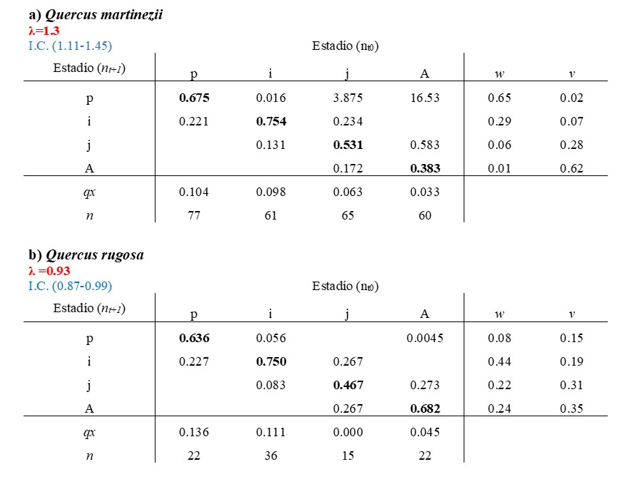

# Experimento de Respuesta de Tabla de Vida {#ERTV}

Los análisis LTRE (Life Table Response Experiments) permiten descomponer las diferencias observadas en el crecimiento poblacional entre poblaciones, tratamientos o periodos de tiempo en contribuciones demográficas específicas. Este capítulo introduce el enfoque LTRE como una herramienta retrospectiva para identificar los procesos vitales responsables de cambios en la dinámica poblacional.

Por: Adriana Ramírez-Martínez y Demetria Mondragón

## Experimentos de respuesta de tablas de vida: un enfoque retrospectivo

Los Life Table Response Experiments (LTRE) constituyen un marco analítico diseñado para explicar **por qué** dos o más poblaciones, tratamientos o escenarios difieren en su tasa de crecimiento poblacional. A diferencia de los análisis prospectivos de sensibilidad y elasticidad, que evalúan la importancia potencial de cambios hipotéticos en las tasas vitales, los LTRE son análisis retrospectivos que cuantifican la contribución real de las diferencias observadas en los parámetros demográficos.

En este capítulo se presenta el fundamento conceptual de los LTRE, mostrando cómo las diferencias en matrices de proyección pueden descomponerse en contribuciones asociadas a transiciones específicas del ciclo de vida. Se discute la lógica de comparar matrices observadas con una matriz de referencia y cómo esta elección influye en la interpretación biológica de los resultados.

Asimismo, se analiza cómo los LTRE permiten identificar qué procesos demográficos —como supervivencia, crecimiento o fecundidad— explican cambios en el crecimiento poblacional entre condiciones contrastantes. Este capítulo se diferencia de los anteriores porque desplaza el enfoque desde la predicción de efectos potenciales hacia la explicación causal de patrones observados, proporcionando una herramienta clave para interpretar respuestas poblacionales a variación ambiental, manejo o perturbaciones. Los LTRE constituyen un puente conceptual entre la teoría de la dinámica poblacional y su aplicación empírica en estudios comparativos.

#### Librerías de R requeridas para el siguiente módulo

```{r, message=FALSE, warning=FALSE}
#| docx_fit: true
#| label: fig-ltre-setup
#| fig-cap: "Carga de paquetes (tidyverse, Rage, DiagrammeR, popbio, popdemo, latex2exp) y de los ayudantes de figuras para el análisis LTRE."

library(tidyverse)
library(Rage)
library(DiagrammeR)
library(popbio)
library(popdemo)
library(latex2exp)
library(flextable)
source("R/figuras_helpers.R") # plc_save(), grviz_save(), save_plot_png()
```

```{r LTRE1_A, echo=FALSE}

rlt_theme <- theme(
  text = element_text(family = "Libertinus Serif"),
  axis.title.y = element_text(colour = "grey20", size = 10, face = "bold"),
  axis.text.x = element_text(colour = "grey20", size = 10, face = "bold"),
  axis.text.y = element_text(colour = "grey20", size = 15, face = "bold"),
  axis.title.x = element_text(colour = "grey20", size = 15, face = "bold")
) +
  theme(
    # Remover los bordes
    panel.border = element_blank(),
    # Remover las líneas
    panel.grid.major = element_blank(),
    panel.grid.minor = element_blank(),
    # Remover el fondo del panel
    panel.background = element_blank(),
    # añadir lineas más gruesas
    axis.line.x = element_line(colour = "black", linewidth = 1),
    axis.line.y = element_line(colour = "black", linewidth = 1)
  )

diverging <- c("#009392", "#CF597E", "#E9E29C", "#39B185", "#EEB479", "#9CCB86", "#662E9B", "#E5A0D2", "#A5AA99", "#1D6996", "#DBE6E2", "#4D4D4D")

# --- 2. Combinarlos en un objeto de tipo lista ---
# Esta lista se puede añadir al gráfico con un solo '+'
rlt_style_fill <- function() {
  list(
    rlt_theme,
    scale_fill_manual(values = diverging)
  )
}

rlt_style_colour <- function() {
  list(
    rlt_theme,
    scale_colour_manual(values = diverging)
  )
}
```

```{r setup-graphics, include=FALSE}

# Usar un dispositivo UTF-8 al construir el PDF (sin efecto en HTML)
if (!knitr::is_html_output()) {
  # Opción 1: PNG de alta calidad vía Cairo (muy robusto)
  knitr::opts_chunk$set(
    dev = "png",
    dev.args = list(type = "cairo"),
    dpi = 300
  )
  # Opción 2: ragg (también excelente); descomente si prefiere ragg
  # knitr::opts_chunk$set(dev = "ragg_png", dpi = 300)
}
```

## Introducción a **Experimento de Respuesta de Tabla de Vida**

La variación en los valores estimados de los parámetros de la matriz son inherentes a la biología. Esa variación puede ser consecuencia de múltiples factores individuales y/o de combinaciones, incluyendo efectos de tiempo, espaciales, genéticos, de tamaño de muestra y por supuesto, suerte [@hernandez2024natural]. La variación en los parámetros de la historia de vida de una especie se pueden evaluar a diferentes niveles: genético, demográfico, espacial o temporal. En ecología la variación es la norma ¿Cuál es esta variación? ¿en otra palabras qué es lo que varía? y ¿cómo los individuos responden a las variables bióticas y abióticas? son aspectos importantes para determinar la ecología, evolución y conservación de las especies. La causa de la variación en una población se puede resumir en tres componentes principales: la genética, el efecto del ambiente y la interacción entre ambiente y genética (plasticidad fenotípica) [@hastings2021effects; @sun2019multivariate]. En general se asume que el tamaño de muestra es lo suficientemente grande para no ser la causa de la variación, pero dentro de un contexto de dinámica poblacional las condiciones en las que se encuentran los individuos en las poblaciones varían, ya sea durante tratamientos manipulados, entre localidades o periodos de tiempo, y por consecuencia los datos que colectamos con diferencias en espacio/tiempo también varían y pudieran tener efecto sobre la matriz de proyección poblacional $matA$. Por tanto, las entradas (los parámetros) de esa matriz **A** variarán en tiempo/espacio o experimento y esto tendría un impacto sobre la tasa de crecimiento poblacional $\lambda$ y en los estimados de dispersión (Intervalo de confianza o credibilidad); [@caswell2000matrix; @caswell2010life].

Tomando en cuenta lo anterior un Experimento de Respuesta de Tabla de Vida (**ERTV**) conocido también como *Life Table Response Experiment* (LTRE, por sus siglas en inglés) descompone la diferencia o varianza en *λ* entre múltiples poblaciones o tiempo dentro de las contribuciones de los elementos de la matriz y sus interacciones [@caswell1989analysis]. Entonces al realizar este análisis podemos tener una apreciación de cómo los cambios en la matriz de datos recolectados en diferentes tiempos y espacio impactan las tasas vitales y a su vez que causan cambios en el crecimiento intrínseco $\lambda$ y otros parámetros poblacionales [@caswell1989analysis; @caswell2010life].

Desde la aplicación del primer ERTV por [@birch1953experimental] en su estudio sobre el efecto de la temperatura, humedad y el alimento sobre tres especies de escarabajos de harina, las aplicaciones de estos análisis han sido variadas con diversos fines en las últimas dos décadas [@caswell1989analysis; @caswell2010life]. Tanto en diseños fijos en los que se manipulan uno o más factores, como en diseños aleatorios en los que se analizan parámetros demográficos en condiciones naturales no manipuladas a lo largo del tiempo o del espacio [@horvitz1997relative; @teitel2016assessing]. Los diseños fijos se han utilizado en poblaciones de animales para investigar las consecuencias demográficas de la exposición a contaminantes, la manipulación del alimento o la manipulación de la densidad poblacional [@hansen1999multiannual; @levin1996demographic; @oli2001effect]. En plantas, los análisis ERTV se han utilizado para evaluar las consecuencias demográficas de la disponibilidad de polinizadores o de la herbívora, competencia, efectos en intensidades de cosecha y de fenómenos naturales e inducidos por el humano [@davison2010demographic; @gaoue2010effects; @garcia2002reproductive; @hart2021simulated; @jacquemyn2012stochastic; @miriti2001effects; @mondragon2009population; @nordbakken2004demography; @schmidt2011matrix].

Los métodos para calcular los ERTV están constantemente actualizándose y de acuerdo con [@hernandez2023exact] existen 186 análisis de ERTV para 75 especies de animales y 1487 para 200 especies de plantas. Aunque en este trabajo no utilizamos la metodología expuesta por dichos autores mostramos una forma práctica de la aplicación de este análisis.

### ¿Cómo se diferencia la elasticidad de ERTV?

A diferencia de la elasticidad, la cual es un tipo de análisis de perturbación que examina cuánto cambiaría el crecimiento de la población si se cambiaran una de las entradas de la matriz comparando múltiples matrices, el análisis ERTV examina cuánto cambio hay en $\lambda$ en función de la variación observada en las entradas de la matriz [@caswell2000matrix; @caswell2010life; @horvitz1997relative]; y por consecuencia es un análisis que toma en cuenta el cambio de las variaciones individualmente registradas en matrices en diferentes poblaciones/ tiempo / experimentos, etc. [@caswell2010life]. Nota que ERTV es una herramienta suplementaria para evaluar el efecto de perturbaciones como los de elasticidad [@caswell1989analysis], dinámica de transiciones [@stott2011framework] y funciones de transferencias [@stott2012beyond] y no un reemplazo. Cada una de estas herramientas tiene un propósito y una interpretación diferente con sus supuestos.

::: callout-important
**Dos preguntas distintas, dos herramientas distintas.**

- **Elasticidad (prospectiva):** ¿Qué pasaría con λ si modificáramos hipotéticamente una entrada de la matriz?
- **LTRE (retrospectivo):** Dadas las diferencias observadas entre dos matrices, ¿cuáles entradas explican la diferencia en λ?

LTRE es **complementario**, no sustituto, de elasticidad. Cuando la elasticidad de un parámetro es alta pero la varianza observada es baja, ese parámetro contribuye poco al LTRE. Cuando la elasticidad es modesta pero la varianza es grande, ese parámetro puede dominar el LTRE. Las dos métricas pueden señalar resultados distintos, y ambos son útiles.
:::

## Formulación y cálculo de los LTRE

A continuación se describe la formulación matemática de los LTRE y su implementación computacional para descomponer diferencias en el crecimiento poblacional. A diferencia del análisis de elasticidad poblacional, los LTRE explican diferencias observadas en lugar de evaluar cambios hipotéticos en los parámetros demográficos. Las contribuciones LTRE pueden descomponerse en términos de matrices **U** y **F**, introducidas en el capítulo de [Matrices U, F y C](107-matU_matF_matC.qmd).

------------------------------------------------------------------------

## Métodos

### Ejemplo práctico de ERTV

Para ejemplificar el cálculo de los ERTV utilizaremos los datos recabados por Ramírez-Martínez colectados de 2017 a 2018 para la orquídea epífita *Oncidium brachyandrum* Lindl. en un bosque de encino estacional en Oaxaca, México [@ramirez2021host]. La pregunta principal del estudio era saber qué tasas vitales estaban ligadas a las variaciones en los valores de λ de poblaciones de *O. brachyandrum* creciendo sobre dos hospederos *Quercus martinezii* C.H.Mull. y *Q. rugosa* Née. Usando el método ERTV se pudo evaluar el efecto que tiene la variación observada en los parámetros de las matrices en función de las especies de hospedero en los que se encontraban creciendo.

Como el ERTV es una forma de análisis retrospectivo y es análogo al ANOVA (porque cuantifica los efectos observados de los elementos individuales de matriz sobre la variación observada en *λ*, en contraposición a los efectos esperados) se requiere de un valor de referencia para realizar las comparaciones, por lo que se toma la matriz con el valor más alto de *λ* como valor de referencia [@caswell2010life; @timsina2021six].

::: callout-tip
**Cómo elegir la matriz de referencia.**

El método de Caswell descompone la diferencia $\lambda^{(i)} - \lambda^{(\text{ref})}$ usando sensibilidades evaluadas en la **matriz promedio** entre la condición $i$ y la condición de referencia. Hay tres opciones comunes para la matriz de referencia:

- **Matriz con λ más alto:** útil cuando se quiere identificar qué procesos *limitan* el crecimiento en las otras condiciones (esta es la opción usada en este ejemplo).
- **Matriz control:** apropiado en diseños experimentales con tratamientos vs. control.
- **Matriz promedio:** útil cuando no hay un escenario "mejor" obvio y se quiere descomponer la varianza simétricamente.

La elección de referencia afecta el signo de las contribuciones (no su magnitud relativa), así que conviene declararla explícitamente al reportar resultados.
:::

A continuación, se muestran dos matrices de tipo Lefkovitch (matrices construidas con base en estadíos) para las poblaciones de *O. brachyandrum* y sus valores respectivos de λ en los dos hospederos, A) *Q. martinezii* (λ=1.3; IC: 1.11-1.45) y B) *Q. rugosa* (λ=0.98; IC: 0.87-0.99). El valor de λ fue mayor en *Q. martinezii* por lo que la matriz de esta especie fue la matriz de referencia para calcular los ERTV.

**A)**

|          | Plántula | Infantil | Juvenil | Adulto |
|----------|----------|----------|---------|--------|
| Plántula | 0.68     | 0.02     | 3.88    | 16.53  |
| Infantil | 0.23     | 0.75     | 0.23    | 0      |
| Juvenil  | 0        | 0.13     | 0.53    | 0.58   |
| Adulto   | 0        | 0        | 0.17    | 0.38   |

**B)**

|          | Plántula | Infantil | Juvenil | Adulto |
|----------|----------|----------|---------|--------|
| Plántula | 0.64     | 0.06     | 0       | 0.005  |
| Infantil | 0.23     | 0.75     | 0.27    | 0      |
| Juvenil  | 0        | 0.08     | 0.47    | 0.27   |
| Adulto   | 0        | 0        | 0.27    | 0.68   |

------------------------------------------------------------------------

### Matrices de proyecciones y ciclo de vida por especie de hospedero

Cuadro 1. Matrices de proyección poblaciones de dos poblaciones de *Oncidiun brachyandrum* creciendo sobre *Quercus martinezii* y *Q. rugosa*. Los valores de λ (intervalos de confianza ± 95%) son mostrados en la parte superior izquierda de cada matriz, *qx*, mortalidad por estadío; *w*, categorías estables de tamaño por estadío; valor reproductivo por estadío, *n* = el tamaño de muestra en el tiempo cero (el primer muestreo). p: plántula, i: infantil, j: juvenil, A; adulto [@ramirez2021host]. Los valores en negritas son los valores que representan la proporción de individuos que se queda en ese estadio.

{#fig-imagen1 fig-alt="Tabla comparativa con dos matrices de transición poblacional de Oncidium brachyandrum sobre dos especies de roble; cada matriz muestra tasas de transición entre estadios plántula, infantil, juvenil y adulto, junto con sus parámetros derivados (lambda, mortalidad, estructura estable, valor reproductivo, tamaño de muestra)"}

------------------------------------------------------------------------

### Diagrama del ciclo de vida

### Diagrama para *Quercus martinezii*

Primeramente se creó el ciclo de vida por especie de hospedero utilizando el siguiente código:

```{r LTRE1_Q_martinezii, echo=TRUE}

matmart <- rbind(
  c(0.68, 0.02, 3.88, 16.53),
  c(0.22, 0.76, 0.23, 0.0),
  c(0.0, 0.13, 0.53, 0.58),
  c(0.0, 0.0, 0.17, 0.38)
)

colSums(matmart) # sumar las filas de la matriz
stages <- c("plántula", "infantil", "juvenil", "adulto") # asignar los nombres de los estadíos
title <- NULL # título del diagrama ninguno
graph <- expand.grid(to = stages, from = stages) # crear un data frame con los estadíos
graph$trans <- round(c(matmart), 4) # redondear los valores de la matriz a 4 decimales
graph <- graph[graph$trans > 0, ] # seleccionar solo los valores mayores a 0
nodes <- paste(paste0("'", stages, "'"), collapse = "; ") # crear los nodos
graph$min_len <- (as.numeric(graph$to) - as.numeric(graph$from)) * 4 # calcular la longitud de las flechas
```

```{r}
#| docx_fit: true
#| label: fig-LTRE2
#| fig-cap: "Diagrama dirigido del ciclo de vida con nodos por etapa y flechas coloreadas etiquetadas con las transiciones de la matriz."

graph$col <- c(
  "steelblue4", "PaleGreen4", "MediumOrchid4", "steelblue4", "PaleGreen4", "Goldenrod1",
  "MediumOrchid4", "steelblue4", "PaleGreen4", "Goldenrod1", "MediumOrchid4", "steelblue4"
) # asignar colores a las flechas
edges <- paste0("'", graph$from, "'", " -> ", "'", graph$to, "'", # crear las flechas
  "[minlen=", graph$min_len, # longitud de las flechas
  ",fontsize=", 10, # tamaño del texto
  ",color=", graph$col, # color de las flechas
  ",xlabel=", paste("\"", graph$trans), # texto de las flechas
  "\"]\n", # fin de la flecha
  collapse = "" # unir las flechas
)
grviz_save(
  paste(
    "
digraph {
  {
    graph[overlap=false];
    rank=same;
    node [shape=", "egg", ", fontsize=", 12, "];",
    nodes, "
  }",
    "ordering=out
  x [style=invis]
  x -> {", nodes, "} [style=invis]", edges,
    "labelloc=\"t\";
  label=\"", title, "\"
}"
  ),
  png = "images/LTRE2_Oncidium_brachyandrum_Quercus_martinezii.png"
)
```

\vspace{-5truemm}

El ciclo de vida de *Oncidium brachyandrum* creciendo sobre *Quercus martinezii*. Las flechas representan las transiciones entre estadíos, estasis y fecundidades, y los números son las tasas vitales de fecundidad, supervivencia y crecimiento. El color \text{\textcolor[HTML]{FFC125}{amarillo}} para fecundidad, \text{\textcolor[HTML]{36648B}{azul}} para supervivencia, \text{\textcolor[HTML]{548B54}{verde}} para crecimiento, \text{\textcolor[HTML]{7A378B}{violeta}} para retroceso y \text{\textcolor[HTML]{36648B}{azul oscuro}} para permanencia.

------------------------------------------------------------------------

### Diagrama para *Quercus rugosa*

```{r, echo=TRUE}
#| docx_fit: true
#| label: fig-LTRE3_Quercus_rugosa
#| fig-cap: "Diagrama dirigido del ciclo de vida de *Oncidium brachyandrum* localizados sobre *Quercus rugosa*. Los estados son plántula, infantil, juvenil y adulto y flechas etiquetadas con las transiciones de la matriz."

matrug <- rbind(
  c(0.64, 0.06, 0, 0.0045),
  c(0.27, 0.75, 0.27, 0.0),
  c(0.0, 0.08, 0.47, 0.28),
  c(0.0, 0.0, 0.27, 0.68)
)

stages <- c("plántula", "infantil", "juvenil", "adulto")
title <- NULL
graph <- expand.grid(to = stages, from = stages)
graph$trans <- round(c(matrug), 4)
graph <- graph[graph$trans > 0, ]
nodes <- paste(paste0("'", stages, "'"), collapse = "; ")
graph$min_len <- (as.numeric(graph$to) - as.numeric(graph$from)) * 4
graph$col <- c(
  "steelblue4", "PaleGreen4", "MediumOrchid4", "steelblue4", "PaleGreen4", "MediumOrchid4", "steelblue4", "PaleGreen4", "Goldenrod1", "MediumOrchid4", "steelblue4"
)
edges <- paste0("'", graph$from, "'", " -> ", "'", graph$to, "'",
  "[minlen=", graph$min_len,
  ",fontsize=", 10,
  ",color=", graph$col,
  ",xlabel=", paste("\"", graph$trans),
  "\"]\n",
  collapse = ""
)
grviz_save(
  paste(
    "
digraph {
  {
    graph[overlap=false];
    rank=same;
    node [shape=", "egg", ", fontsize=", 12, "];",
    nodes, "
  }",
    "ordering=out
  x [style=invis]
  x -> {", nodes, "} [style=invis]", edges,
    "labelloc=\"t\";
  label=\"", title, "\"
}"
  ),
  png = "images/LTRE3_Oncidium_brachyandrum_Quercus_rugosa.png"
)
```

El ciclo de vida de *Oncidium brachyandrum* creciendo sobre *Quercus rugosa*. Las flechas representan las transiciones entre estadíos, estasis y fecundidades, y los números son las tasas vitales de fecundidad, supervivencia y crecimiento. El color [amarillo]{.fecundidad} para fecundidad, [azul]{.supervivencia} para supervivencia, [verde]{.crecimiento} para crecimiento, [violeta]{.retroceso} para retroceso y [azul oscuro]{.permanencia} para permanencia.

------------------------------------------------------------------------

## Procedimiento para ERTV en Excel

Para facilitar el entendimiento de cómo se calcula ERTV se creó la matriz con los términos de referencia (Cuadro 1).

| Estadío | Plántulas (1) | Infantiles (2) | Juveniles (3) | Adultos (4) |
|----|----|----|----|----|
| Plántulas (1) | p~11~ (permanencia de plántulas) | g~21~ (retroceso de infantiles a plántulas) | f~31~ (plántulas generadas)<br>g~31~ (retroceso de juveniles a plántulas) | f~41~ (plántulas generadas) |
| Infantiles (2) | g~12~ (crecimiento de plántulas a infantiles) | p~22~ (permanencia de infantiles) | g~32~ (retroceso de juveniles a infantiles) | g~42~ (retroceso de adultos a infantiles) |
| Juveniles (3) | g~13~ (crecimiento de plántulas a juveniles) | g~23~ (crecimiento de infantiles a juveniles) | p~33~ (permanencia de juveniles) | g~43~ (retroceso de adultos a juveniles) |
| Adultos (4) | g~14~ (crecimiento de plántulas a adultos) | g~24~ (crecimiento de infantiles a adultos) | g~34~ (crecimiento de juveniles a adultos) | p~44~ (permanencia de adultos) |
| Supervivencia | s~1~ (de plántulas) | s~2~ (de infantiles) | s~3~ (de juveniles) | s~4~ (de adultos) |

**Cuadro 1.** Matriz de términos para el entendimiento de los ERTV. Donde: f= fecundidad, g= crecimiento o retrogresión, p= permanencia y s=supervivencia. Los subíndices se refieren a las transiciones entre estadíos.Nota que los parámetros de juvenil que retrogresan a plántula y esa etapa produciendo plántulas se suman.

En la sección **Apéndice C** se encuentra una hoja de Excel para poder realizar los cálculos de ERTV. En esta sección se explica cómo se construye la matriz de términos y cómo se calculan las tasas vitales para cada una de las especies de hospedero.

Una vez colocadas las matrices en la hoja de trabajo el primer paso será sumar las columnas para cada estadio, esto significará la supervivencia (s) por estadío (s~1~, s~2~, s~3~, s~4~); para el caso de *Q. martinezii* en plántulas sería s~1~= 0.68+0.22= 0.90 (Figura 3). Después se tienen que calcular las transiciones con respecto a la supervivencia; por lo que para el caso de la transición g~12~ para la matriz de *Q. martinezii* tenemos g~12~= 0.22/0.90=0.25; este cálculo se realiza para todas las transiciones. Los valores de fecundidad (f) se tomarán tal cual de la matriz de fecundidad $matF$. Una vez obtenido esto se procederá a realizar los cálculos con las ecuaciones que se muestran del lado derecho para cada una de las celdas y, además, esto nos sirve para verificar que hayamos calculado bien cada una de las tasas vitales. Por ejemplo, observamos que una proporción de plántulas en *Q. martinezii* se mantuvo (0.67) este valor se obtiene de multiplicar la supervivencia de plántulas (s~1~) por la sustracción de 1 menos el crecimiento de plántulas a infantiles 0.89 (1-0.25) = 0.68 (ecuación s~1~\* (1-g~12~)).

------------------------------------------------------------------------

### Método usando Excel

En un archivo nuevo de Excel se arma la base, con la columna de vital_rate al principio, seguido por las especies de hospederos (tratamientos) poniendo primeramente el control y después la columna de matrix. Esta base contendrá las ecuaciones de la matriz de referencia. Como la matriz de *Q. martinezii* tuvo los valores más altos de lambda está se colocará primero en nuestra base que utilizaremos para correr el análisis ERTV.

```{r LTRE4}
#| docx_hide_code: true

Oncidium <- tribble(
  ~"names.vitalrate", ~"martinezzi", ~"rugosa", ~"matrix",
  "lambda", 1.30, 0.93, "",
  "s1", 0.8961, 0.8636, "s1*(1-g12)",
  "g12", 0.24637681, 0.263157896, "s1*g12",
  "s2", 0.90163934, 0.88888889, "0",
  "g21", 0.018181815, 0.062500005, "0",
  "g23", 0.1454545, 0.0937499, "s2*g21",
  "s3", 0.9375, 0.99999, "s2*(1-g23-g21)",
  "g32", 0.2500, 0.266667, "s2*g23",
  "g34", 0.183333, 0.266667, "0",
  "s4", 0.966667, 0.95454545, "f31",
  "g43", 0.603448, 0.285714, "s3*g32",
  "f31", 3.875, 0.0001, "s3*(1-g34-g32)",
  "f41", 16.53, 0.0045, "s3*g34",
  NA, NA, NA, "f41",
  NA, NA, NA, "0",
  NA, NA, NA, "s4*g43",
  NA, NA, NA, "s4*(1-g43)"
)

flextable(Oncidium)
```

**Cuadro 2.** Ejemplo de base para poder calcular los ERTV.

Es importante colocar en la segunda fila la palabra lambda en la primera columna y después los valores según corresponda a cada tratamiento. Debido a que en *Q. rugosa* no hubo producción de plántulas (f~31~) pero en *Q. martinezii* si hubo se coloca una cantidad muy pequeña pero mayor a cero (e.g. 0.00001) para que se pueda correr el análisis, para las otras transiciones en valor puede ser 0. Una vez culminada la base se guarda el archivo en formato de texto, para continuar en R. Es importante comenzar a colocar las ecuaciones a partir de la segunda fila en la columna matrix.

::: callout-warning
**Una tasa vital observada en cero requiere un manejo especial.** El método LTRE asume que las tasas vitales están definidas y son comparables entre matrices. Si una tasa es 0 en una condición pero positiva en otra (e.g., en el ejemplo *Q. rugosa* no produjo plántulas), el cálculo numérico puede fallar o producir contribuciones engañosas. Una solución práctica es reemplazar el 0 por un valor muy pequeño (e.g., 0.00001), pero hay que reconocer que esto introduce sesgo. Una alternativa más robusta es estimar la tasa vital con métodos bayesianos (ver capítulo de [Acercamiento bayesiano](108-Bayesian_PPM.qmd)), que evitan ceros exactos y producen distribuciones posteriores apropiadas para LTRE.
:::

------------------------------------------------------------------------

## Procedimiento en R

Subir la base de datos de la carpeta de trabajo y cargarla en R.

- Nota que debería observar la base de datos en la consola de R para verificar que se haya cargado correctamente con los mismos valores que en la hoja de Excel.

```{r LTRE5, echo=TRUE}
# Asegurarse de tener instalado y cargado el paquete 'popbio' package

# oncidium<-read.table("data/vitalratesoncidium.txt", sep="\t", header=TRUE, stringsAsFactors=FALSE, fill=TRUE)
# Aqui la alternativa si tiene los datos en una hoja de Excel

# oncidium

Oncidium
```

Debido a que la columna de matriz contiene más filas con datos nos aparecerá la leyenda NA en las otras columnas esto se refiere a que no hay valores disponibles para esas filas

Para extraer los nombres de las tasas vitales (de la fila 2 a la 13), sin incluir el valor de $\lambda$ el cual está en la primera

```{r LTRE6}

razonvital <- Oncidium$names.vitalrate[2:13]

razonvital # mostrar los nombres del objeto razón vital
```

------------------------------------------------------------------------

### Tasa vital sobre *Q. martinezii*

Extraer tasas vitales de la orquídea *Oncidium brachyandrum* que crecen sobre *Q. martinezii* y dejar a lambda a un lado

```{r LTRE7}

Martinezzi <- Oncidium$martinezzi[2:13] # [2:13] se refiere a la fila 2 hasta la 13.
names(Martinezzi) <- razonvital # asignar los nombres de las tasas vitales
Martinezzi
```

------------------------------------------------------------------------

### Tasa vital sobre *Q. rugosa*

Extraer tasas vitales de la orquídea *Oncidium brachyandrum* que crecen sobre *Q. rugosa* y dejar a lambda a un lado.

```{r LTRE8}

Rugosa <- Oncidium$rugosa[2:13]
names(Rugosa) <- razonvital # asignar los nombres de las tasas vitales
Rugosa
```

### Extraer los elementos de matriz utilizando los nombres de las tasas vitales

```{r LTRE9}

matrix.el <- as.expression(parse(text = Oncidium$matrix))
matrix.el

expression(
  s1 * (1 - g12), s1 * g12, 0, 0,
  s2 * g21, s2 * (1 - g23 - g21), s2 * g23, 0,
  f31, s3 * g32, s3 * (1 - g34 - g32), s3 * g34,
  f41, 0, s4 * g43, s4 * (1 - g43)
)
```

### Calcular las sensibilidades y elasticidades del ERTV para cada una de las matrices de *Oncidium brachyandrum*

Nota que usando la función vitalsens se pueden calcular las sensibilidades y elasticidades de las tasas vitales de las matrices de *Oncidium brachyandrum* creciendo sobre *Q. martinezii* y *Q. rugosa* en un mismo objeto.

#### *Quercus matinezzi*

```{r LTRE10}

Martinezzi.se <- vitalsens(matrix.el, Martinezzi)

Martinezzi.se # observar los resultados
```

#### *Quercus rugosa*

```{r chap12_9}
elas(matrug)
```

```{r LTRE12_9a}
Rugosa.se <- vitalsens(matrix.el, Rugosa)
Rugosa.se
```

### Calcular las diferencias en tasas vitales entre las especies de hospederos

En esta parte se calculará la diferencia entre las tasas vitales de *Oncidium brachyandrum* creciendo sobre *Q. martinezii* y *Q. rugosa*. ¿Como se interpreta estos resultados?

```{r LTRE11}

vr.dif.Martinezzi.Rugosa <- Rugosa - Martinezzi
vr.dif.Martinezzi.Rugosa
```

### Calcular las tasas vitales para la matriz media

En este paso se calculará la tasa vital media para *Oncidium brachyandrum* creciendo sobre *Q. martinezii* y *Q. rugosa*. La tasa vital media se calcula sumando las tasas vitales de las dos matrices y dividiendo entre 2.

```{r LTRE12}
vr.promedia.Martinezzi.Rugosa <- ((Rugosa + Martinezzi) / 2) # calcular la tazas vitales parta la matrix promedia

# Nota: si se tuvieran 3 matrices se sumarían las tasas vitales de las tres dividido por 3.

vr.promedia.Martinezzi.Rugosa
```

### Calcular las tasas sensibilidades y elasticidades para la matriz media

En este paso se calculará las sensibilidades y elasticidades para la matriz promedia de *Oncidium brachyandrum* creciendo sobre *Q. martinezii* y *Q. rugosa*.

```{r LTRE13}

media.sens.Martinezzi.Rugosa <- vitalsens(
  matrix.el,
  vr.promedia.Martinezzi.Rugosa
)
media.sens.Martinezzi.Rugosa
```

### Calcular las contribuciones de ERTV y ver los resultados

```{r chap12_13}

LTRE.contrib.Martinezzi.Rugosa <- vr.dif.Martinezzi.Rugosa *
  media.sens.Martinezzi.Rugosa$sensitivity
LTRE.contrib.Martinezzi.Rugosa
```

### Resultados de ERTV

En esta sección se une todos los resultados en un solo objeto para poder observarlos de manera conjunta.

```{r LTRE14}

LTRE.resultados.Martinezzi.Rugosa <- data.frame(
  razonvital = razonvital,
  rug.vr = Rugosa,
  mart.vr = Martinezzi,
  vr.differencia = vr.dif.Martinezzi.Rugosa,
  media.sens = media.sens.Martinezzi.Rugosa$sensitivity,
  contribucion = LTRE.contrib.Martinezzi.Rugosa
)

flextable(LTRE.resultados.Martinezzi.Rugosa)
```

------------------------------------------------------------------------

### Graficar los resultados de ERTV

Se puede crear un gráfico de la contribución de cada tasa vital sobre la historia de vida de la especie, comparando las dos matrices.

```{r}
#| label: fig-LTRE15
#| fig-cap: "Barras de la contribución LTRE en función de la tasa vital, rellenadas por razón vital, con línea horizontal punteada en cero."

ggplot(
  LTRE.resultados.Martinezzi.Rugosa,
  aes(y = contribucion, x = razonvital, fill = razonvital)
) +
  geom_bar(stat = "identity") +
  rlt_style_fill() +
  theme(axis.text.x = element_text(angle = 90, hjust = 1)) +
  labs(
    title = "Oncidium vital rate contribución a la diferencia en lambda",
    x = "razonvital",
    y = "contribución"
  ) +
  geom_hline(yintercept = 0, linetype = "dashed", color = "red") +
  xlab("Tasa vitales")
```

Figure 5. Resultados de un Experimento de Respuesta de la Tabla de Vida (ERTV) llevado a cabo para evaluar las contribuciones de las entradas de la matriz a la variación observada en *λ*.

::: callout-tip
**Lectura del gráfico de contribuciones.**

- **Barras positivas:** la diferencia observada en esa entrada **incrementa** $\lambda$ en la condición $i$ relativa a la referencia.
- **Barras negativas:** la diferencia observada **reduce** $\lambda$.
- **Magnitud de la barra:** producto de (i) cuánto cambió la entrada y (ii) cuán sensible es $\lambda$ a esa entrada en la matriz promedio.

Una contribución pequeña no significa "esta tasa vital no importa biológicamente" — sólo significa que su variación entre las condiciones comparadas no movió mucho a $\lambda$. Para evaluar importancia biológica intrínseca, conviene complementar con elasticidad.
:::

De acuerdo con el análisis de elasticidad para cada una de las poblaciones de *O. brachyandrum*, tanto en *Q. martinezii* como en *Q. rugosa* la permanencia de individuos infantiles es la que tiene un mayor impacto sobre los valores de la tasa de crecimiento poblacional (Figura 6). De acuerdo al ERTV, el cual toma en cuenta las diferencias en las tasas vitales y la sensibilidad de lambda que es una función no linear de esas tasas vitales, podemos observar que la fecundidad ($f_{sa}$) y el crecimiento de plántulas a juveniles ($g_{sj}$), de juveniles a adultos ($g_{ja}$) y el retroceso de adultos a juveniles ($g_{aj}$) tiene las mayores contribuciones a las diferencias en lambda entre *Q. martinezii* y *Q. rugosa* que la permanencia de plántulas.

Figure 6. Resultados de los análisis de elasticidad, para dos poblaciones de *Oncidium brachyandrum* creciendo sobre *Quercus martinezii* y *Q. rugosa*. Por proceso demográfico (a) y por estadío (b).

```{r}
#| label: fig-LTRE16
#| fig-cap: "Barras del promedio de la sensitividad en función de la tasa vital, rellenadas por razón vital, con línea horizontal punteada en cero."

ggplot(
  LTRE.resultados.Martinezzi.Rugosa,
  aes(y = media.sens, x = razonvital, fill = razonvital)
) +
  geom_bar(stat = "identity") +
  rlt_style_fill() +
  theme(axis.text.x = element_text(angle = 90, hjust = 1)) +
  labs(
    title = "Promedio de la Sensitividad",
    x = "razonvital",
    y = "contribución"
  ) +
  geom_hline(yintercept = 0, linetype = "dashed", color = "red") +
  xlab("Tasa vitales")
```

------------------------------------------------------------------------

## Análisis con R

Ahora enseñar como hacer estos análisis sin tener que usar Excel, aquí un set de script para aplicar a *Oncidium brachyandrum*.

------------------------------------------------------------------------

En esta sección se muestra cómo hacer los análisis de ERTV sin tener que usar Excel, utilizando directamente R. Esto es útil para evitar los pasos intermedios y realizar el análisis de manera más eficiente.

Calcular la matriz promedio

```{r LTRE17}
mat.promedio <- (matmart + matrug) / 2

mat.promedio
```

## Convertir las matrices en un vectores

```{r LTRE18}
mat.promedio.vector <- as.vector(mat.promedio)

mat.promedio.vector

mat_rug.vector <- as.vector(matrug) # vector para O. rugosa
mat_mart.vector <- as.vector(matmart) # vector para O. martinezii
```

```{r ltre-mat-rug-vector}
mat_rug.vector
matrug
```

Unir los vectores de las matrices *O. rugosa* y *O. martinezii*

```{r LTRE19}

Unido <- rbind(mat_rug.vector, mat_mart.vector)

Unido
```

Añadir los nombres a las columnas de la matriz promedio

```{r LTRE20}
colnames(Unido) <- expression(
  a11, a12, a13, a14, # nota que el orden es por columnas no filas
  a21, a22, a23, a24,
  a31, a32, a33, a34,
  a41, a42, a34, a44
)

Unido <- as.data.frame(Unido)
Unido$Site <- c("Q. rugosa", "Q. martinezii")

Unido
```

Extraer los elementos del data frame y convertirlos en una lista de matrices

```{r LTRE21}
Ob_Atrt <- lapply(
  split(as.matrix(Unido[, 1:16]), 1:2),
  matrix,
  ncol = 4,
  byrow = FALSE
)

names(Ob_Atrt) <- Unido$Site

Ob_Atrt
```

## Análisis de ERTV para *Oncidium brachyandrum*

Gráfico de contribución de ERTV para la matriz promedio de *Oncidium brachyandrum* creciendo sobre *Quercus martinezii* y *Q. rugosa*.

```{r LTRE23}
Ob <- LTRE(Ob_Atrt, mat.promedio)
Ob
```

## Analisis de ERTV para *Oncidium brachyandrum* por hospedero

Convertir los resultados de ERTV en un data frame para facilitar la visualización y manipulación de los datos para usar con ggplot2

```{r LTRE24,  echo=TRUE}

Ob <- LTRE(Ob_Atrt, mat.promedio) # Realizar el análisis de ERTV usando la matriz promedio

Ob_df_mart <- as.data.frame(t(Ob$`Q. martinezii`)) # Convertir los resultados de *Q. martinezii* en un data frame
Ob_df_rug <- as.data.frame(t(Ob$`Q. rugosa`)) # Convertir los resultados de *Q. rugosa* en un data frame

Ob_df <- rbind(Ob_df_mart, Ob_df_rug)

Ob_df$Species <- c( # Asignar nombres de especies, una asignación de nombre por cada fila
  "Q. martinezii",
  "Q. martinezii",
  "Q. martinezii",
  "Q. martinezii",
  "Q. rugosa",
  "Q. rugosa",
  "Q. rugosa",
  "Q. rugosa"
)

colnames(Ob_df) <- c("a1i", "a2i", "a3i", "a4i", "Species") # Asignar nombres a las columnas
Ob_df$t_1 <- c("ai1", "ai2", "ai3", "ai4", "ai1", "ai2", "ai3", "ai4") # Asignar nombres a las filas

pivot_long <- tidyr::pivot_longer( # Convertir a formato largo para ggplot2
  Ob_df, # datos de entrada
  cols = c("a1i", "a2i", "a3i", "a4i"), # columnas a pivotar
  names_to = "Transition", # nombre de la nueva columna para las variables
  values_to = "Contribution" # nombre de la nueva columna para los valores
)
pivot_long$Transitions2 <- c(
  "a11", "a12", "a13", "a14", # Asignar nombres a las transiciones
  "a21", "a22", "a23", "a24",
  "a31", "a32", "a33", "a34",
  "a41", "a42", "a43", "a44",
  "a11", "a12", "a13", "a14",
  "a21", "a22", "a23", "a24",
  "a31", "a32", "a33", "a34",
  "a41", "a42", "a43", "a44"
)

# head(pivot_long)
```

Creación de unos gráficos para ver la contribución de las tasas vitales sobre la variación en *λ* para cada una de las especies de hospedero.

```{r}
#| label: fig-LRE25
#| fig-cap: "Barras agrupadas (dodge) de la contribución a λ en función de las transiciones, coloreadas por especie, con línea horizontal punteada en cero."
library(ggplot2)

ggplot(pivot_long, aes(x = Transitions2, y = Contribution, fill = Species)) +
  geom_bar(stat = "identity", position = "dodge") +
  labs(
    title = "Contribución de la variación en las transiciones sobre lambda",
    x = "Transiciones",
    y = "Contribuciones a λ"
  ) +
  rlt_style_fill() +
  # facet_wrap(~Species) +
  theme(axis.text.x = element_text(angle = 45, hjust = 1)) +
  geom_hline(yintercept = 0, linetype = "dashed", color = "red") +
  theme(legend.position = "none")
```

## Alternativa de grafico

```{r}
#| label: fig-LRE26
#| fig-cap: "Barras agrupadas (dodge) de la contribución a λ en función de las transiciones, coloreadas por especie y facetadas por especie, con referencia en cero."
ggplot(pivot_long, aes(x = Transitions2, y = Contribution, fill = Species)) +
  geom_bar(stat = "identity", position = "dodge") +
  labs(
    title = "Contribución de la variación en las transiciones sobre lambda",
    x = "Transiciones",
    y = "Contribuciones a λ"
  ) +
  rlt_style_fill() +
  facet_wrap(~Species) +
  theme(axis.text.x = element_text(angle = 45, hjust = 1)) +
  geom_hline(yintercept = 0, linetype = "dashed", color = "red") +
  theme(legend.position = "none")
```

Aquí se observa el efecto de las transiciones de las tasas vitales sobre la variación en *λ* para las dos especies de hospedero. Las barras positivas indican contribuciones positivas a la variación en $\lambda$, mientras que las barras negativas indican contribuciones negativas sobre $\lambda$. El efecto de las transiciones de las tasas vitales sobre la variación en *λ* es diferente para cada especie de hospedero, no solamente el efecto sobre las tasa vitales son diferentes pero entre hospedero pero los cambios relativos. Lo que indica que las dinámicas poblacionales de *Oncidium brachyandrum* son influenciadas por el hospedero en el que crece. Este patrón de cambios de tasa vitales y su importancia relativa en la variación de *λ* necesita ser estudiado en más especies de orquídeas epífitas para entender si es un patrón generalizado o no. Por consecuencia el proximo paso es evaluar cual son la características de las especies de hospedero que influyen en la dinámica poblacional de las orquídeas epífitas.

Enlace sobre ERTV https://bookdown.org/cdorm/lefko3gentle/ltre.html
