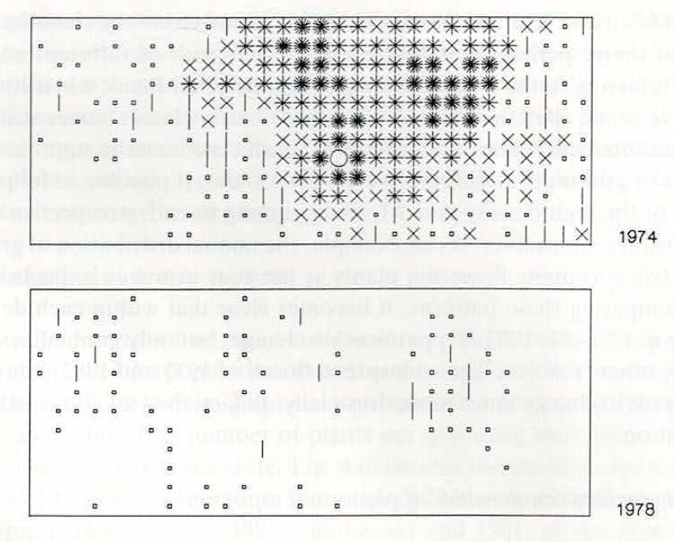

# Historia breve de los MPP en orquídeas {#HistoriaBreve}

La historia de la dinámica poblacional proporciona el contexto conceptual necesario para comprender el desarrollo de los modelos y enfoques utilizados actualmente. Este capítulo presenta una síntesis histórica de las ideas, métodos y figuras clave que han dado forma al estudio moderno de la dinámica poblacional.

Por: Raymond L. Tremblay

## Orígenes y evolución del pensamiento en dinámica poblacional

El estudio de la dinámica poblacional ha evolucionado a lo largo del tiempo como respuesta a preguntas fundamentales sobre crecimiento, regulación y persistencia de las poblaciones. Desde los primeros modelos de crecimiento exponencial y logístico hasta el desarrollo de modelos estructurados por estadios, la historia de esta disciplina refleja una integración progresiva entre teoría matemática, observaciones empíricas y necesidades aplicadas.

En este capítulo se revisan los principales hitos históricos que han contribuido a la formulación de los modelos poblacionales contemporáneos, destacando cómo avances conceptuales y metodológicos permitieron pasar de descripciones simplificadas a representaciones explícitas del ciclo de vida. Se analizan las contribuciones tempranas al entendimiento del crecimiento poblacional, así como el surgimiento de enfoques matriciales que incorporan estructura demográfica y procesos vitales diferenciados.

A diferencia de los capítulos técnicos del libro, este capítulo se centra en el **desarrollo histórico de las ideas** que sustentan la dinámica poblacional moderna. Comprender este contexto histórico permite interpretar mejor los supuestos, alcances y limitaciones de los modelos actuales, y proporciona una perspectiva crítica sobre cómo y por qué se han adoptado determinadas herramientas analíticas en ecología y biología de la conservación.

&nbsp;

::: callout-tip
**Por qué importa la historia.** Los métodos analíticos que usamos hoy —matrices Lefkovitch, descomposición LTRE, métodos bayesianos— no surgieron de la nada. Cada uno responde a una limitación práctica que enfrentaron los demógrafos de orquídeas anteriores. Conocer esta historia clarifica los **supuestos implícitos** de cada herramienta y ayuda a reconocer cuándo una herramienta moderna está resolviendo un problema viejo (y cuándo está creando uno nuevo).
:::

## Principales hitos históricos y contribuciones

A continuación se presentan algunos de los eventos, autores y desarrollos clave que marcaron la evolución de la dinámica poblacional. El desarrollo de los modelos matriciales, discutidos en los capítulos sobre transiciones demográficas y matrices U, F y C, representa un punto de inflexión clave en esta historia.

#### Librerías de R requeridas para el siguiente módulo

```{r Hist1, message=FALSE, warning=FALSE}
library(Rcompadre) # Paquete para trabajar con la base de datos de COMPADRE y COMADRE
library(tidyverse) # Paquete para activar múltiples paquetes
library(flextable) # para renderizar tablas (usado vía mat_to_ft / pretty)
source("R/figuras_helpers.R") # mat_to_ft(), compmat_to_ft(), pretty()
```

### Estudios realizados

La cantidad de estudios demográficos usando MPP es bastante impresionante y, al momento de la publicación del libro, incluye 138 familias de plantas, 509 géneros y 792 especies en la base de datos de COMPADRE (octubre 3, 2024). La familia *Orchidaceae* (\>46 especies) se encuentra entre las familias con más especies evaluadas, después de *Asteraceae* (\>65 especies) y *Fabaceae* (\>55 especies), pero la gran mayoría de las familias tienen 3 (mediana) o menos especies evaluadas. En la tabla del [Apéndice A](Appendix_A_Species_List.html) se presentan los estudios de dinámica poblacional en orquídeas que usaron MPP y que están incluidos en la base de COMPADRE. Se incluyen en la tabla algunas de las preguntas o conceptos principales que los autores evaluaron. En la gran mayoría de los trabajos se consideran múltiples hipótesis/ideas sobre la dinámica poblacional de las orquídeas. Para información específica sobre la metodología usada en cada estudio se recomienda revisar los trabajos originales.

### Los primeros estudios con Orquídeas

En esta sección se hará una revisión breve de los primeros estudios de dinámica poblacional en orquídeas que usaron MPP. Se presentarán algunos de estudios en orden cronológico y se resumirán las preguntas principales que los autores intentaron responder. Antes de los estudios mencionados abajo, Carl Olaf Tamm [@tamm1948observations] publicó en 1948 un artículo sobre la dinámica poblacional de *Orchis mascula* y *Orchis sambucina* en Suecia. Estos trabajos son anteriores al desarrollo de las metodologías mencionadas en este libro. Vea el [capítulo sobre Tamm](118-Carl_Olaf_Tamm.qmd) para conocer un poco sobre sus trabajos.

&nbsp;

::: callout-note
**Carl Olaf Tamm como punto de partida.** El estudio demográfico moderno de orquídeas comienza con Tamm (1948), décadas antes del desarrollo de las matrices de proyección. Tamm marcó individuos en el campo y los siguió por décadas, generando las primeras series temporales largas de orquídeas terrestres. Aunque sus análisis no usaron MPP, sus datos hicieron posible —y necesaria— la maquinaria matricial posterior. Para una semblanza completa de su trabajo, ver el [capítulo dedicado a Tamm](118-Carl_Olaf_Tamm.qmd).
:::

Uno de los primeros esfuerzos de integrar y unir estudios de demografía en orquídeas fue el libro *Population Ecology of Terrestrial Orchids* editado por Wells y Willems [@wells1991population]. Ese libro es el resultado de una reunión de especialistas en orquídeas en 1990 en South Limburg, Holanda. En el libro se presentan estudios de demografía de orquídeas de diferentes partes de Europa, Norteamérica y Australia y se discuten los métodos y resultados de los estudios. Los temas principales de los artículos incluyen la dinámica de poblaciones y el manejo, la dinámica de producción de flores y frutos, la fenología del crecimiento y la partición de recursos a las diferentes partes de la planta y la dinámica de población usando matrices. En esta última sección Katherine Gregg presenta la variación en la dinámica de cuatro poblaciones de *Cleistes divaricata* [-@gregg1991variation] distribuidas entre West Virginia, Florida y North Carolina, USA. En ese trabajo se enseña claramente el problema de estimar latencia (dormancy) y la variación entre poblaciones de los parámetros del ciclo de vida. La latencia es un tema recurrente en los estudios de orquídeas y en general en estudios de demografía de plantas perennes. En el trabajo de Waite y Hutchings [-@waite1991effects], los autores presentan sus estudios sobre *Ophrys sphegodes* y evalúan el impacto de la herbivoría por vacas y ovejas en la dinámica de la población. Los autores señalan que es importante tomar en cuenta el momento en que ocurre la herbivoría, ya que impacta el crecimiento de *O. sphegodes* de forma diferencial. Además demuestran que el consumo por vacas de las plantas competidoras de la orquídea no es suficiente para reducir la competencia entre especies, lo que reduce la viabilidad de la orquídea en comparación con la herbivoría por ovejas. El libro es una buena introducción a los estudios de demografía de orquídeas y a los problemas que se enfrentan en esos estudios.

En una reunión posterior a la de Holanda, hubo otra en Ceske Budejovice, República Checa, en 2001 que también resultó en un libro editado por Kindlmann, Willems y Whigham [@kindlmann2002trends]. El libro está dividido en cuatro secciones: la demográfica y dinámica de poblaciones; la biología de florecer y producción de frutos; micorriza y germinación de semillas; y el manejo y conservación. Solamente un trabajo usa MPP para los análisis, evaluando la dinámica de *Orchis ustulata* en Estonia por Kadri Tali [@tali2002dynamics]. Los otros trabajos en este libro no usaron MPP, pero se observan múltiples avances en conceptos y metodología para ampliar el estudio de la dinámica poblacional de orquídeas, específicamente la importancia de la micorriza en la germinación de semillas.

Estos dos libros se enfocan en especies terrestres y ninguno tiene ejemplos de especies tropicales y epífitas. El primer trabajo con especies epífitas es de @hernandez1992dinamica con *Laelia speciosa*, evaluando el impacto de la cosecha sobre el potencial de supervivencia. En este trabajo de tesis de pregrado se evalúa el impacto de la cosecha de flores en la dinámica de la población de *L. speciosa* en México. El interés de Mariana Hernández era evaluar el impacto de la remoción de flores sobre la supervivencia de las poblaciones. Hasta el momento no hay un libro o un conjunto de publicaciones en el mismo volumen, similar a los dos libros mencionados anteriormente, que se enfoque en orquídeas epífitas o tropicales.

### Latencia en Orquídeas

&nbsp;

::: callout-warning
**La latencia distorsiona dos parámetros simultáneamente.** Cuando un individuo no emerge en un año, podría estar muerto **o** latente —y los datos de campo no distinguen estos casos. Asumir que toda no-emergencia es muerte:

- **Subestima la supervivencia** (la mortalidad parece más alta de lo que es).
- **Sobreestima la fecundidad realizada** (cualquier individuo que reaparece se cuenta como recluta nuevo).

Estos dos sesgos se compensan parcialmente, pero no se cancelan: la matriz resultante tiene una estructura cualitativamente distinta a la realidad biológica. Por eso el problema de la latencia ha generado toda una sub-literatura metodológica (Cormack-Jolly-Seber, métodos bayesianos), tratada en este capítulo y en el [capítulo de Acercamiento bayesiano](108-Bayesian_PPM.qmd).
:::

El problema de latencia y de estimar los parámetros relevantes a esa etapa del ciclo de vida en la matriz de transición es un tema recurrente en los estudios de orquídeas terrestres. No es claro si la latencia es algo común en la mayoría de las orquídeas terrestres o si es un componente de la historia de vida que está mayormente limitado a cierta área geográfica o a grupos taxonómicos. De los *xx* estudios de orquídeas terrestres que usaron MPP, *xx* mencionan el problema de latencia en la estimación de los parámetros y *xx* son estudios dedicados exclusivamente a estimar latencia o a considerar métodos alternos para calcular los parámetros relevantes a esta etapa de vida. ¿Por qué es tan importante estimar la etapa de latencia? La dificultad es realmente determinar la supervivencia de los individuos: si los individuos pueden estar latentes por varios años, entonces la supervivencia de los individuos no es observada y por lo tanto no se puede estimar. Un individuo que no emerge en un año puede ser un individuo que ha muerto o un individuo que está latente. Por consecuencia, considerar un individuo muerto cuando está latente tiene impacto sobre la estimación de la supervivencia de los individuos. En los estudios evolutivos, la falta de considerar esa etapa correctamente pudiese sesgar los estimados de esfuerzo reproductivo.

### Métodos alternos para estimar la latencia

Uno de los científicos que ha dedicado mucho de su carrera a considerar la latencia es Richard P. Shefferson, quien ha desarrollado múltiples métodos para incluir la latencia en la dinámica de las especies [@shefferson2001estimating; @shefferson2002dormancy; @shefferson2007dormancy; @shefferson2017predicting]. Shefferson ha demostrado que hay un costo a la latencia [@shefferson2012linking] y que individuos que son latentes múltiples años tienen una probabilidad de sobrevivir menor que individuos que no son latentes.

Marc Kéry y Katherine Gregg [-@kery2004demographic] presentan un método probabilístico para estimar la latencia y la supervivencia en orquídeas terrestres dentro de un contexto de presencia y ausencia de los individuos, aplicando el modelo de Cormack-Jolly-Seber [@lebreton1992modeling]. Detectaron episodios de latencia de 1 a 4 años en *Cypripedium reginae* y entre 2% y 12% de los *ramets* eran latentes en las poblaciones, y que la supervivencia, aunque era similar entre años, variaba más en una de las poblaciones.

Tremblay et al. [-@tremblay2009dormancy] evaluaron la latencia en nueve especies de *Caladenia* con diferentes cantidades de individuos muestreados y años de datos usando un acercamiento bayesiano. Encontraron que la latencia en el género *Caladenia* se modela mejor cuando se asume que cada especie tiene su propia supervivencia y probabilidad de emerger entre años. Uno habría asumido que, como todas las especies son del mismo género, la latencia sería más similar entre especies, pero los autores encontraron que la latencia varía entre especies. Claramente, si esto se confirma en otros géneros de orquídeas, la latencia es un problema que se tiene que considerar individualmente por cada especie, y que especies del mismo género no necesariamente se comportan de forma igual. La ventaja de usar un acercamiento bayesiano es que se puede estimar la latencia y la supervivencia de múltiples especies simultáneamente, aprovechando la información de todas las especies para estimar los parámetros y comparar varios modelos. En muchas ocasiones los estudios de orquídeas se enfocan en una sola especie y no se considera la variación entre especies; además, el tamaño de muestra de una especie en particular puede ser limitado y no se puede estimar la latencia de forma confiable con métodos tradicionales.

### Perspectiva Histórica de la Dinámica Poblacional en Orquídeas

Los primeros trabajos de dinámica poblacional usando MPP, publicados en revistas revisadas por pares, libros o tesis enfocadas en orquídeas, comienzan en los años 1990. La lista de trabajos de orquídeas que usaron MPP incluye:

- *Cleistes divaricata* [@gregg1991variation]
- *Cypripedium acaule* [@cochran1992simple]
- *Laelia speciosa* [@hernandez1992dinamica] tesis de pregrado
- *Tolumnia variegata* [@calvo1993evolutionary]
- *Platanthera praeclara* [@sieg1995influence]
- *Lepanthes caritensis* [@tremblay1997lepanthes]
- *Herminium monorchis* [@wells1998flowering]
- *Himantoglossum hircinum* [@wells1998flowering; @carey1998modelling]

Es interesante que en estos primeros años hay 3 trabajos con especies tropicales de los 8 trabajos realizados. Curiosamente, hoy hay más estudios de MPP en orquídeas tropicales (n = 35) que de especies templadas (n = 31).

La cantidad de publicaciones por autor varía mucho, con la mayoría de los autores con solamente un artículo (tesis o capítulo) usando MPP con orquídeas. Los autores con más de un artículo incluyen a Tremblay, Raventos, Shefferson, González-Hernández, Gregg y Hutchings, entre otros (en orden de frecuencia). Es importante notar que muchos de estos autores pueden haber publicado más trabajos con orquídeas pero no usaron MPP (estos no están contabilizados).

## Publicaciones sin MPP

Las publicaciones de dinámica poblacional sin el uso de MPP son múltiples y deberían ser consideradas en una revisión más amplia de la literatura. Esos trabajos traen una perspectiva variada y muchas veces innovadora para tratar de entender los cambios en la cantidad de individuos en el tiempo. Aquí veremos algunos de estos estudios que no usaron MPP. Una lista parcial se encuentra en el [Apéndice A](Appendix_A_Species_List.html).

Leo E.M. Vanhecke [-@vanhecke1991population] demuestra el cambio de densidad en el tiempo y el espacio en la especie *Dactylorhiza praetermissa* entre 1974 y 1985. Aquí vemos dos de estos gráficos para visualizar el cambio en la densidad de la población. En el primer gráfico se observa que la densidad de la población es mayor en el año 1974 y en el segundo gráfico se observa que la densidad de la población es mayor en el año 1978. Es claro que en pocos años la densidad de plantas emergentes en una parcela puede cambiar mucho. En el trabajo, el autor demuestra el cambio en densidad en los siguientes años: 1974 y 1978-1985.

::: img-float
{#fig-vanhecke-figure style="float: right; margin: 5px;width: 50% ; "}
:::

Willems y Bik [-@willems1991population] siguieron una población de *Orchis simia* por 22 años, desde 1968 a 1990, y contabilizan la cantidad de individuos en cada estado de desarrollo, categorizando estos como nuevas plantas, plantas fallecidas, con flores, latentes y la cantidad de plantas totales. Presentan una figura demostrando la cantidad de individuos en cada estado de desarrollo en el tiempo y estimando la cantidad de individuos faltantes y muertos.

## Evidencia de Google Scholar

Haciendo una búsqueda en Google Scholar para `"orchid" "population dynamics"`, se encontró un total de 3,510 artículos. La mayoría de los artículos son revisiones o estudios que no usan MPP. Miramos los primeros artículos encontrados:

1940-1950

- Carl Olaf Tamm publica el primer artículo sobre dinámica de orquídeas en *Botaniska Notiser* [@tamm1948observations]. Esta publicación tiene datos de *Orchis mascula* y *Orchis sambucina*, entre otras especies de plantas en Suecia. Vea el capítulo de Tamm para más información.

1950-1960 - ninguno

1960-1970 - ninguno

1970-1980

- Margaret Bradshaw [-@bradshaw1978plant] hace un resumen de los valores de estudios de demografía incluyendo orquídeas y menciona los trabajos de Tamm [-@tamm1948observations; -@tamm1972survival].

- Carl Olaf Tamm [-@tamm1972survival] revisó sus análisis de dinámica poblacional de *Dactylorhiza sambucina*, *D. incarnata*, *Orchis mascula* y *Listera ovata*. Estos muestreos comenzaron en los años 1940 y se publicaron por primera vez en 1948 [@tamm1948observations].

1980-1990

- Loyal A. Mehrhoff [-@mehrhoff1989dynamics] evaluó la dinámica de *Isotria medeoloides* en cinco poblaciones distribuidas entre Georgia (n=2), North Carolina (n=2) y South Carolina (n=1), siguiéndolas por seis años consecutivos. El autor encontró que la supervivencia de las plantas varía entre poblaciones y que las poblaciones tienden a no persistir: tres de las cinco habían desaparecido o se habían reducido dramáticamente en el periodo de seis años.

- Clare Alexander [-@alexander1984seasonal] comparó el patrón de fenología, número de rosetas y supervivencia en *Goodyera repens* en tres poblaciones en Inglaterra durante dos años. La autora evaluó la longevidad de las rosetas de los individuos y estimó un promedio de 4.3 ± 1.1 años. Además encontró que la supervivencia de las rosetas varía con la densidad: a mayor densidad, menor longevidad. Este trabajo pudiese ser el primero que apoya la idea de que la densidad influye sobre la supervivencia individual en orquídeas.

- Michael J. Hutchings [-@hutchings1987population] evaluó el efecto del tiempo desde la primera vez que una planta emerge sobre su probabilidad de florecer en *Ophrys sphegodes* en Inglaterra. Demostró que las plantas con mayor edad (tiempo desde el primer avistamiento) florecen más, acercándose al 100% cuando no son latentes. Al contrario, las plantas de mayor edad (8 años o más) muestran una reducción en la altura de la inflorescencia, el número de hojas y la cantidad de flores, apoyando la idea de senescencia. Además, demostró que las plantas más robustas (con mayor promedio de flores por año) están correlacionadas con la longevidad (*lifespan*). Más allá de este estudio fundacional, Hutchings extendió su mirada demográfica hacia la conservación práctica de las orquídeas, mostrando el valor del censo riguroso y de los estudios demográficos a largo plazo como herramientas de conservación [@hutchings1989population; @hutchings1989conservation; @hutchings1990role; @hutchings1991monitoring], y documentando poblaciones marginales como una población atípica de *Orchis militaris* en Inglaterra [@hutchings1998demographic]. Junto con Tiiu Kull comparó el declive de las áreas de distribución de orquídeas entre Estonia y el Reino Unido y coordinó un número especial dedicado a la biología de la conservación de orquídeas [@kull2006comparative; @kull2006conservation]. Su enfoque demográfico se complementó además con estudios de genética poblacional en la orquídea fragante *Gymnadenia conopsea* [@campbell2002isolation; @campbell2007genetic].

- Katherine Gregg [-@gregg1989reproductive] estudió la dinámica poblacional de *Cleistes divaricata* en tres poblaciones en el este de los Estados Unidos. En este trabajo se presenta una revisión de la literatura sobre la dinámica poblacional de orquídeas y se discuten los métodos usados para estimar la dinámica poblacional. Se presenta un análisis de la dinámica poblacional usando MPP y se discute el impacto de la latencia en la estimación de los parámetros demográficos.

- Ricardo Calvo y Carol C. Horvitz [-@calvo1990pollinator] estudian la dinámica poblacional de *Tolumnia variegata* en Puerto Rico. Se presenta un análisis usando MPP y se discute el impacto de la variación en transiciones sobre la adecuación demográfica, específicamente sobre el efecto de las limitaciones de polinizadores sobre la producción de frutos.

------------------------------------------------------------------------

## COMPADRE, Orquídea y MPP

La base de datos de COMPADRE contiene múltiples estudios de dinámica poblacional en orquídeas y es una buena fuente de información para estudiar la dinámica poblacional de orquídeas.

```{r Hist_2, message=FALSE, warning=FALSE, eval=FALSE}

compadre <- readRDS("data/COMPADRE_2026.rds") # Usar este código para bajar los datos del repositorio de COMPADRE. Tiene que haber activado la librería de Rcompadre.
```

------------------------------------------------------------------------

Cantidad de Familias de plantas en la base de datos de COMPADRE

```{r Hist3, message=FALSE, warning=FALSE, eval=FALSE}

Familia <- (as.data.frame(sort(unique(compadre$Family))))
count(Familia)
```

------------------------------------------------------------------------

La cantidad de géneros en la base de datos de COMPADRE

```{r Hist2, message=FALSE, warning=FALSE, eval=FALSE}

Genera <- (as.data.frame(sort(unique(compadre$Genus))))

count(Genera)
```

------------------------------------------------------------------------

La cantidad de especies en la base de datos de COMPADRE

```{r Hist4, message=FALSE, warning=FALSE, eval=FALSE}
Especies <- as.data.frame(sort(unique(compadre$SpeciesAccepted)))

count(Especies)
```

------------------------------------------------------------------------

### Filtrar para la familia *Orchidaceae*

Aquí enseñamos cómo filtrar la base de datos de COMPADRE para obtener solamente las especies de la familia *Orchidaceae*. En este caso se usa el paquete `dplyr` para filtrar y contar las especies únicas de orquídeas.

```{r Hist5, message=FALSE, warning=FALSE, eval=FALSE}

Lista_Orquidea <- compadre %>% filter(Family %in% c("Orchidaceae"))

Lista_O <- as.data.frame(sort(unique(Lista_Orquidea$SpeciesAccepted)))

count(Lista_O)
```

------------------------------------------------------------------------

```{r Hist6, message=FALSE, warning=FALSE, eval=FALSE}

SPECIES_Number <- Lista_Orquidea %>%
  select(Family, StudyStart, StudyEnd, SpeciesAccepted, YearPublication, Authors, DOI_ISBN, OrganismType, MatrixPopulation, mat) %>%
  group_by(Family) %>%
  summarize(n_species = length(unique(SpeciesAccepted))) %>%
  arrange(desc(n_species))

pretty(summary(SPECIES_Number))
```
