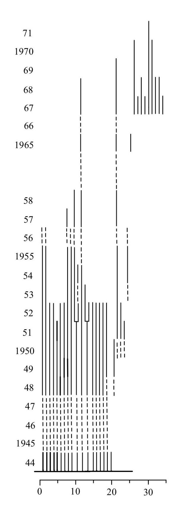
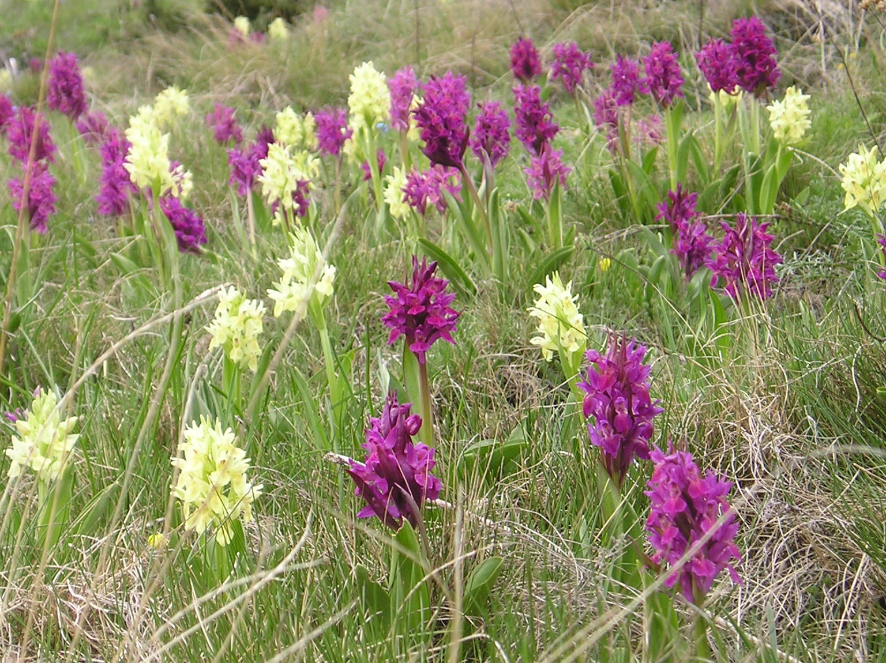
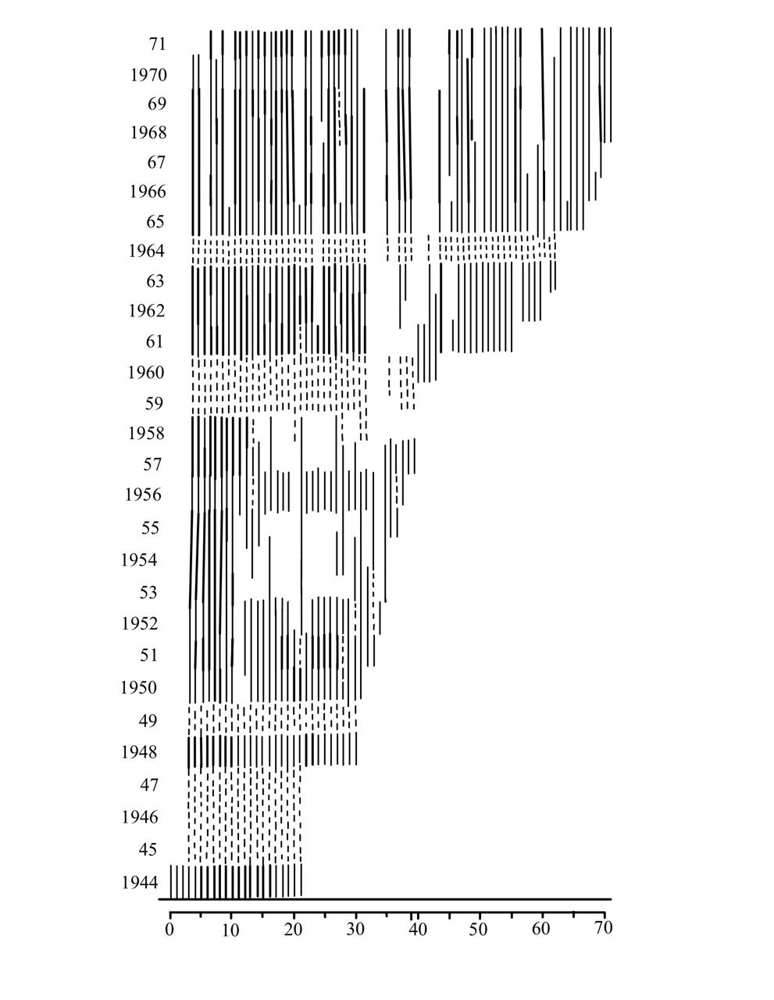
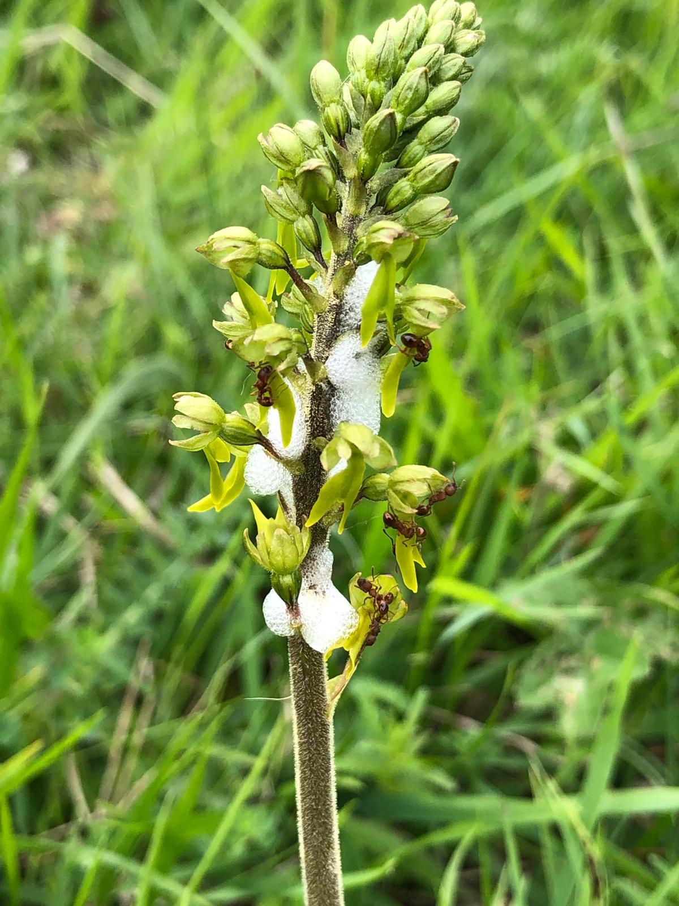
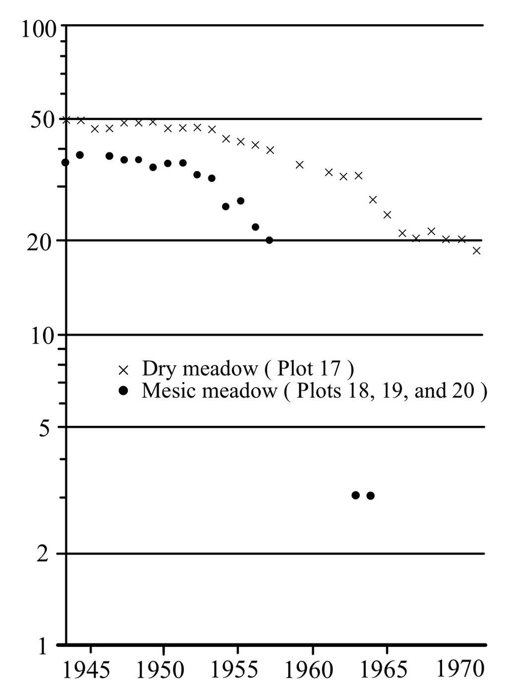

# Carl Olaf Tamm {#OTamm}

Carl Olaf Tamm fue una figura clave en el desarrollo temprano de la ecología poblacional y del estudio demográfico de plantas. Este capítulo presenta su contribución científica en el contexto del surgimiento de enfoques modernos para comprender la dinámica poblacional en sistemas naturales.

Por: Raymond L. Tremblay

## Carl Olaf Tamm y el estudio demográfico de poblaciones naturales

Carl Olaf Tamm desempeñó un papel fundamental en la consolidación de enfoques demográficos aplicados al estudio de poblaciones vegetales, particularmente en sistemas naturales de larga duración. Su trabajo se distinguió por la integración rigurosa de observaciones de campo a largo plazo con preguntas conceptuales sobre crecimiento, persistencia y estructura poblacional.

En este capítulo se examinan las principales contribuciones de Tamm al desarrollo de la ecología poblacional, destacando cómo sus estudios empíricos proporcionaron una base sólida para enfoques cuantitativos posteriores. Su énfasis en el seguimiento individual, la variabilidad interanual y la interpretación biológica de los patrones poblacionales influyó profundamente en la manera en que se conceptualizan hoy los procesos demográficos.

A diferencia de los capítulos analíticos del libro, este capítulo se centra en un **caso histórico concreto** que ilustra cómo las ideas y métodos de la dinámica poblacional emergieron a partir de datos reales y observaciones prolongadas en el tiempo. El trabajo de Tamm sirve como puente entre la historia del pensamiento ecológico y las herramientas modernas de análisis matricial, elasticidad y simulación desarrolladas en capítulos anteriores, mostrando el valor perdurable de los estudios de campo de largo plazo en la ecología poblacional. El énfasis de Tamm en el seguimiento empírico prolongado se relaciona directamente con los principios de recopilación de datos en el campo. Las observaciones de Tamm anticipan conceptos centrales desarrollados en los capítulos sobre transiciones demográficas y dinámica de transiciones.

## Contexto histórico y principales aportes científicos

A continuación se presentan los principales aspectos de la trayectoria científica de Carl Olaf Tamm y su impacto en el desarrollo de la ecología poblacional.

#### Librerías de R requeridas para el siguiente módulo

```{r, eval= TRUE, message=FALSE}
#| docx_fit: true
#| label: fig-OCTamm_1
#| fig-cap: "Carga de paquetes (tidyverse, popbio, Rage, DiagrammeR, raretrans, entre otros) y definición del tema rlt_theme y la paleta divergente."

if (!require("pacman")) install.packages("pacman")
pacman::p_load(janitor, tidyverse, popbio, knitr, flextable)

library(tidyverse)
library(janitor)
library(popbio)
library(knitr)
library(tidyverse)
library(readxl)
library(Rage)
library(DiagrammeR)
library(raretrans) # disponible en CRAN: install.packages("raretrans")
source("R/figuras_helpers.R") # plc_save(), grviz_save(), save_plot_png()

# Mi tema de formato de las gráficas de ggplot2 personal

rlt_theme <- theme(
  text = element_text(family = "Libertinus Serif"),
  axis.title.y = element_text(colour = "grey20", size = 10, face = "bold"),
  axis.text.x = element_text(colour = "grey20", size = 10, face = "bold"),
  axis.text.y = element_text(colour = "grey20", size = 15, face = "bold"),
  axis.title.x = element_text(colour = "grey20", size = 15, face = "bold")
) +
  theme(
    # Remover los bordes
    panel.border = element_blank(),
    # Remover las líneas
    panel.grid.major = element_blank(),
    panel.grid.minor = element_blank(),
    # Remover el fondo del panel
    panel.background = element_blank(),
    # añadir lineas más gruesas
    axis.line.x = element_line(colour = "black", linewidth = 1),
    axis.line.y = element_line(colour = "black", linewidth = 1)
  )

diverging <- c("#009392", "#CF597E", "#E9E29C", "#39B185", "#EEB479", "#9CCB86")

# --- 2. Combinarlos en un objeto de tipo lista ---
# Esta lista se puede añadir al gráfico con un solo '+'
rlt_style_fill <- function() {
  list(
    rlt_theme,
    scale_fill_manual(values = diverging)
  )
}

rlt_style_colour <- function() {
  list(
    rlt_theme,
    scale_colour_manual(values = diverging)
  )
}
```

## El padre de la ecología de poblaciones en orquídeas

Carl Olaf Tamm (1919–2007) fue un biólogo sueco que enseñó en la Royal College of Forestry de Estocolmo, donde ocupó la cátedra de Soil Science (Ciencia del Suelo) entre 1957 y 1962, y posteriormente fue el primer profesor de **Ecología de Bosques** de dicha institución, cargo que mantuvo hasta 1985. Los trabajos de Tamm son reconocidos por proyectos a largo plazo, de múltiples años y décadas, donde él enfatizó la importancia de la variabilidad temporal y espacial en los ecosistemas, así como los eventos raros en la dinámica de especies. Tamm desarrolló protocolos de muestreo de plantas y suelos en bosques, con recolección de datos anual y continua. Algunos de estos trabajos hoy en día son conocidos como clásicos en ecología de poblaciones y comunidades. Tres de estos trabajos relevantes a la dinámica poblacional son los siguientes:

- Observation on reproduction and survival of some perennial herbs [@tamm1948observations].

- Further observations on the survival and flowering of some perennial herbs, I [@tamm1956further].

- Survival and flowering of some perennial herbs. II. The behaviour of some orchids on permanent plots [@tamm1972survival].

En la descripción de la dinámica de los individuos muestreados a través del tiempo, Tamm pudo observar la variabilidad temporal en la reproducción y supervivencia de las plantas, basándose en su presencia o ausencia, su estado reproductivo, el reclutamiento, la existencia de individuos clonales y si las plantas eran latentes. Él utilizó un sistema de presentación de la dinámica de los individuos usando una línea por individuo e identificando en qué etapa estaba en cada año.

------------------------------------------------------------------------

Representación visual de los datos de Tamm

Los datos de Tamm fueron compartidos de forma visual usando gráficos. En la figura cada línea vertical representa un individuo

- línea gruesa, individuo reproductivo
- línea fina, individuo vegetativo
- línea entrecortada: individuo no muestreado
- línea bifurcada: individuos que se clonan

::: callout-tip
**El método visual de Tamm sigue vigente.** El diagrama de líneas verticales —una por individuo, con grosor codificando estado reproductivo y discontinuidades indicando años no muestreados— es esencialmente una representación cruda de un *capture-recapture history*. Mucho antes de que existieran los modelos formales de Cormack-Jolly-Seber, Tamm intuyó que la unidad básica del análisis demográfico es la **historia de cada individuo**, no el conteo agregado. Los métodos bayesianos modernos para estimar latencia (capítulo de [Acercamiento bayesiano](108-Bayesian_PPM.qmd)) son la formalización estadística de lo que Tamm ya hacía visualmente.
:::

```{r OCTamm_2, echo=FALSE, out.width= "50%", out.extra='style="float:right; padding:10px"', fig.cap="Reproducción de Tamm: 1972, Dactylorhiza incarnata, dibujo por Alondra Martinez Martinez"}


```

Tamm estableció en el campo parcelas de 0.5 m × 0.5 m o de 1.0 m × 1.0 m y muestreó todos los individuos en cada parcela en años consecutivos (las líneas entrecortadas son años no muestreados). Por ejemplo, entre 1945 y 1947 no se muestreó esta parcela a causa de la Segunda Guerra Mundial. Tamm estaba interesado en la dinámica de las orquídeas porque había notado que los individuos no florecen todos los años, y que la floración era un evento relativamente raro. En *Orchis sambucina* (ahora *Dactylorhiza sambucina*) notó que en 1942 solamente 7 plantas florecieron, mientras que en 1945 había 40 con flores [@tamm1948observations]. Tamm sugirió que la poca cantidad de nuevos individuos podría estar correlacionada con la competencia por recursos (nutrientes, luz y agua), y que la capacidad de las plantas de sobrevivir eventos difíciles está parcialmente correlacionada con su edad: las plantas de mayor edad podrían tener una menor probabilidad de supervivencia [@tamm1948observations]. Tamm sugirió, además, que las plantas tienen un límite de años que pueden sobrevivir, es decir que existe senescencia en plantas perennes. Aunque ese concepto estaba bien establecido en animales, no se había considerado seriamente en plantas perennes hasta entonces.

::: callout-note
**Senescencia en plantas perennes: una idea que tardó en aceptarse.** Tamm propuso que las orquídeas terrestres muestran senescencia —la probabilidad de morir aumenta con la edad— una idea que en la década de 1940 era controvertida. Muchos botánicos asumían que las plantas perennes podían vivir indefinidamente bajo condiciones favorables. Estudios posteriores con orquídeas y otras plantas perennes han confirmado el patrón en algunas especies, pero también han mostrado que la longevidad puede variar enormemente entre especies, lo cual hace difícil generalizar (ver [@tremblay2000plant] para *Lepanthes*).
:::

::: img-float
{#fig-dactylorhiza-sambucina-james-d-ackerman style="float: left; margin: 10px;width: 50% ; "}
:::

------------------------------------------------------------------------

En la siguiente figura se muestra la dinámica de los individuos de *Listera ovata* muestreados por Tamm desde 1944 a 1971 [@tamm1972survival]. En esta figura se puede ver la variabilidad temporal en la reproducción y supervivencia de las plantas, según su presencia o ausencia, si eran reproductivas o no, el reclutamiento, los individuos que se clonan y si las plantas estaban latentes. Él utilizó un sistema de presentación de la dinámica de los individuos usando una línea por individuo e identificando en qué etapa estaba en cada año. El sitio (plot 48) es bosque mésico con un dosel casi cerrado.

```{r OCTamm_3, echo=FALSE, out.width= "50%", out.extra='style="float:right; padding:10px"', fig.cap="Dinámica del plot 48: Listera ovata, dibujo por Alondra Martínez Martínez"}


```

------------------------------------------------------------------------

En la publicación de 1972 [@tamm1972survival], Tamm describe la dinámica de múltiples especies de orquídeas, y algunas especies en múltiples sitios.

```{r OCTamm_4, message=FALSE}

Tamm <- tribble(
  ~Especies, ~"Núm de la Población", ~"Año del primer muestreo", ~"Año del último muestreo",
  "Dactylorhiza incarnata", 46, 1944, 1971,
  "Dactylorhiza sambucina", 17, 1942, 1971,
  "Dactylorhiza sambucina", 18, 1943, 1964,
  "Dactylorhiza sambucina", 19, 1943, 1957,
  "Dactylorhiza sambucina", 20, 1943, 1957,
  "Dactylorhiza sambucina", 21, 1943, 1957,
  "Dactylorhiza sambucina", 22, 1943, 1957,
  "Orchis mascula", 24, 1943, 1956,
  "Listera ovata", 48, 1944, 1971
)

Tamm |>
  flextable()
```

En la publicación de 1972, Tamm describió la dinámica de cuatro especies de orquídeas. Esta información no está disponible en COMPADRE al momento. En *Dactylorhiza incarnata* se observa que múltiples individuos desaparecen de un año a otro, y que después de 1951 la población es mayormente vegetativa (sin flores). Usando las figuras, Tamm trató de ver si había un patrón en la dinámica basado en el cambio de las comunidades, por ejemplo la presencia de un árbol de pino que se estableció cerca de la población de *D. sambucina*. La población de *D. sambucina* disminuyó un poco entre 1942 y 1963, pero fue balanceada por el reclutamiento de una cantidad similar de individuos en el mismo periodo. Después de revisar sus datos, Tamm sugirió que lo que parecen ser nuevos individuos por clonaje pudieran ser en realidad individuos independientes, simplemente establecidos muy cerca de un individuo previo. La dificultad de muestrear con confianza los individuos en su ambiente es un reto persistente en la interpretación de los datos de plantas perennes.

::: img-float
{#fig-dactylorhiza-maculata-james-d-ackerman style="float: right; margin: 10px;width: 40% ; "}
:::

En *Orchis maculata* (ahora *Dactylorhiza maculata*) Tamm observó claramente que las plantas florecen de forma irregular, con patrones entre años: algunos años favorecen la presencia de inflorescencias y otros no. En *Listera ovata*, Tamm observó que la población creció con mucho reclutamiento entre 1944 y 1971, con un incremento de más de 200% comparado con el primer año de muestreo. Además, demuestra que hay individuos que pueden vivir por muchos años. La edad de algunos individuos que él muestreó fue de 30 años para *D. sambucina*, 28 años para *L. ovata*, 25 años para *D. incarnata* y 14 años para *O. mascula*, demostrando el alto potencial de longevidad de las orquídeas.

Una de las hipótesis de Tamm es que hay senescencia en las orquídeas. En otras palabras, la probabilidad de sobrevivir disminuye con la edad. Él evaluó el patrón de supervivencia en cuatro especies: *Dactylorhiza incarnata*, *Dactylorhiza sambucina*, *Listera ovata* y *Orchis mascula*. Usó figuras de supervivencia para evaluar la probabilidad de sobrevivir de un año a otro en una escala logarítmica. Tamm predijo que si la supervivencia no está ligada a la edad, la curva de supervivencia debería seguir una línea recta en escala logarítmica (mortalidad constante por año) [@tamm1972survival].

```{r OCTamm_5, echo=FALSE, out.width= "65%", out.extra='style="float:right; padding:10px"', fig.cap="Supervivencia de Dactylorhiza sambucina"}


```

En la figura siguiente se enseña la grafica de supervivencia de *Dactylorhiza sambucina* muestreado por Tamm desde 1944 a 1971 (re-dibujado por Alondra Martínez Martínez).

------------------------------------------------------------------------

## Re-evaluación de los datos de Tamm

::: callout-warning
**Cuidados al re-analizar datos demográficos antiguos.** Re-aplicar métodos modernos a datos históricos es valioso pero tiene limitaciones:

- **Definiciones de estadios pueden haber cambiado** (lo que Tamm consideraba "vegetativo" puede no coincidir exactamente con definiciones actuales).
- **Los datos faltantes** (años no muestreados, individuos perdidos) introducen sesgo si se asume que ausencia = muerte.
- **Los priors deben venir de especies emparentadas o del mismo sistema**, no de cualquier especie disponible. Aquí usamos *Dactylorhiza lapponica* porque está en COMPADRE, pero las dinámicas pueden diferir.

Los resultados deben interpretarse como una **aproximación coherente**, no como un análisis sustituto del que Tamm hubiera hecho con métodos modernos.
:::

En la próxima sección se re-evaluarán los datos de Tamm con métodos recientes.

Primero se estará digitalizando los datos, seguido de construcción de matriz y un análisis sencillo de viabilidad de poblaciones y otras métricas de dinámica de poblaciones.

## Instalación de raretrans

El paquete **raretrans** está disponible en CRAN y se instala con `install.packages()`. Solo es necesario ejecutar esta línea una vez en la computadora.

```{r OCTamm_6, message=FALSE, warning=FALSE}
#| eval: false

install.packages("raretrans") # instalar desde CRAN (ejecutar solo una vez)
```

Subir los datos de Tamm

Se puede tener acceso a los datos de Tamm en el archivo "Tamm_1972.xlsx" en la carpeta "data" en Github, de este libro.

Estos datos están limitados a la especie *Dactylorhiza incarnata* y contienen información de los 35 individuos monitoreados desde 1944 hasta 1971.

```{r OCTamm_7}

Tamm_1972_column <- read_excel("data/Tamm_1972.xlsx",
  sheet = "D_incarnata_by_column"
)

Tamm_1972_column %>%
  head() |>
  flextable()
```

El primer paso es encontrar una matriz de valores *prior* para añadir al modelo de construcción de los parámetros de la matriz. Como no podemos discutir estos valores con Tamm, usamos valores de la literatura. Hay dos especies de *Dactylorhiza* con matrices en COMPADRE; tomamos como *prior* la que más se parece a los datos de Tamm: *Dactylorhiza lapponica* [@sletvold2010long]. Se modificó la matriz porque solo podemos clasificar a un individuo como fallecido cuando lleva varios años sin emerger; antes de eso, podría estar latente. Entonces la suma de probabilidades de vegetativo y reproductivo suma a 1.0, mientras que la columna de latentes no suma a 1.0 (la diferencia corresponde a los fallecidos).

```{r OCTamm_8}

Dacty_apriori <- matrix(
  c(
    0.637, 0.571, 0.740,
    0.273, 0.271, 0.049,
    0.090, 0.158, 0.059,
    0, 0, 0.152
  ),
  nrow = 4, ncol = 3,
  byrow = TRUE
) # la última fila es la proporción de individuos en esta etapa que fallece.

Dacty_apriori
```

## Construcción de la matriz de transición

- Las etapas en el modelo son Vegetativo (sin flores), Floreciendo (con flores) y Latente (sin avistamiento en un año particular), más la categoría de individuos fallecidos.

- La matriz de transiciones es una matriz de 3 x 3, donde las filas son las etapas futuras (tiempo t+1) y las columnas son las etapas actuales (tiempo t).

- Debido a la poca cantidad de datos se hará una sola matriz con todos los datos juntos; no se considerará la variación interanual. Sin embargo, los datos están disponibles por año en la hoja de Excel, y si desean pueden evaluar la variación interanual.

- Se usarán las columnas "stage" etapa en el tiempo $t$ y "next_stage" etapa en el tiempo $t_{+1}$.

- Supuestos del modelo:

  - Que los individuos no pueden ser latentes más de dos años consecutivos. Todo individuo que no es visto después de dos años es considerado fallecido. Ese supuesto proviene de haber evaluado la figura de Tamm y ver que no hay individuos que sean vistos después de dos años consecutivos de ser latentes.
  - Naturalmente el supuesto más significativo aquí es que el tamaño de muestra es suficiente para capturar los eventos raros (por ejemplos los individuos que sean latentes más de dos años consecutivos).
  - Un individuo fallecido no puede regresar en un estado en el futuro (una condición lógica).

```{r OCTamm_9}

Tmat_D <- Tamm_1972_column %>%
  dplyr::select(Year, stage, next_stage, Fertility) %>%
  mutate(
    stage = factor(stage, levels = c("V", "F", "D", "m")),
    fate = factor(next_stage, levels = c("V", "F", "D", "m"))
  ) %>%
  drop_na(stage, fate) %>%
  as.data.frame() %>%
  xtabs(~ fate + stage, data = .) %>%
  as.matrix()

Tmat_D # se contabiliza la cantidad de individuos que pasan de una etapa a otra para todos los años (no se consideró la variación interanual).

Tmat2 <- Tmat_D[, -4] # remover la columna para transiciones de la muerte (es imposible pasar de fallecido a otra etapas)
Tmat2

N2_D <- colSums(Tmat2) # obtener el número total de una etapa.
N2_D
Tmat <- sweep(Tmat2[-4, ], 2, N2_D, "/") # normalizar las transiciones, nota que el "2" es para decir que haga los cálculos por columna (en este caso división por la cantidad total de individuos en la etapa)
Tmat # la matriz de transición final normalizada con los datos del campo
```

## Apreciación de la matriz

- La mayoría de los individuos en la población de *Dactylorhiza incarnata* son vegetativos (sin flores) y están en estado vegetativo (sin flores) y siguen en dicho estado el próximo periodo.
- La mayoría de los individuos que florecen en un año particular no florecen en el año siguiente.
- Solamente 16% de los individuos latentes pasan a ser vegetativos al año siguiente, y ninguno florece directamente desde la latencia.

------------------------------------------------------------------------

## Construcción de la matriz de fertilidad

Para tomar en cuenta la fecundidad, se necesita una matriz de fertilidad. En este caso los datos son muy limitados: la cantidad de eventos reproductivos observados es 5 en 1944, 1 en 1948, 2 en 1949 y 1 en 1951 (total 9 eventos; solamente el individuo #5 se reprodujo dos veces). Asumimos que todos los nuevos individuos en la población provienen de estos eventos reproductivos y que ningún reclutamiento proviene de fuentes externas. De 9 eventos reproductivos surgieron 15 nuevos individuos vegetativos entre 1949 y 1967, lo que equivale a una fecundidad observada de $15/9 \approx 1.67$ nuevos individuos por evento reproductivo. Nota que no se trata de la cantidad de semillas producidas, ya que no tenemos información sobre la cantidad de semillas que germinan y se establecen. Lo que tenemos es la cantidad de individuos que florecen y, por consecuencia, producen nuevos individuos vegetativos. El otro supuesto implícito es que las semillas pueden permanecer latentes durante múltiples años, o pueden germinar pero no producir individuos vegetativos o con flores inmediatamente; este periodo de latencia tras la germinación es una etapa no observada y no está en el modelo.

- La latencia de las semillas de orquídeas es un supuesto que no se puede evaluar con los datos de Tamm, pero es un supuesto razonable si uno toma en cuenta los trabajos de Whigham et al. [@whigham2006seed].

## Crear la matriz de fecundidad

```{r OCTamm_10}

Fmat <- matrix(0, nrow = 3, ncol = 3) # crear una matriz de ceros.
Fmat[1, 2] <- 15 / 9 # contar 9 adultos reproductivos en el tiempo t y 15 nuevos individuos en el tiempo t+1 en la población. Añadir el valor en la posición correcta de la matriz de fertilidad (nota: es la primera fila, segunda columna).

TF2 <- list(Tmat = Tmat, Fmat = Fmat) # crear una lista con las matrices de transiciones y de fertilidad.
TF2
```

------------------------------------------------------------------------

¿Como se ve el ciclo de vida de esa especie en estos años?

- rojo: individuos que se quedan en la misma etapa
- verde: individuos que pasan de una etapa a otra (excluyendo latente)
- azul: individuos que pasan de una etapa a latente
- amarillo: individuos que producen nuevos individuos en la población

```{r, echo=FALSE, message=FALSE, warning=FALSE}
#| docx_fit: true
#| label: fig-OCTamm_11
#| fig-cap: "Diagrama dirigido del ciclo de vida de *Dactylorhiza* con nodos Vegetativo, Florecido y Latente y flechas etiquetadas con las transiciones de la matriz A = T + F."

matA <- TF2$Tmat + TF2$Fmat

etapas <- c("Vegetativo", "Florecido", "Latente")
title <- NULL
graph <- expand.grid(to = etapas, from = etapas)
graph$trans <- round(c(matA), 3)
graph <- graph[graph$trans > 0, ]
nodes <- paste(paste0("'", etapas, "'"), collapse = "; ")
graph$min_len <- (as.numeric(graph$to) - as.numeric(graph$from)) * 3
graph$col <- c(
  "red2", "PaleGreen4", "blue",
  "goldenrod1", "blue",
  "PaleGreen4", "red2"
)
edges <- paste0("'", graph$from, "'", " -> ", "'", graph$to, "'",
  "[minlen=", graph$min_len,
  ",fontsize=", 8,
  ",color=", graph$col,
  ",xlabel=", paste("\"", graph$trans),
  "\"]\n",
  collapse = ""
)
grviz_save(
  paste(
    "
digraph {
  {
    graph[overlap=false];
    rank=same;
    node [shape=", "egg", ", fontsize=", 12, "];",
    nodes, "
  }",
    "ordering=out
  x [style=invis]
  x -> {", nodes, "} [style=invis]", edges,
    "labelloc=\"t\";
  label=\"", title, "\"
}"
  ),
  png = "images/OCTamm_11_Dactylorhiza.png"
)
```

------------------------------------------------------------------------

## Análisis de viabilidad de poblaciones

Ahora usamos la información de las matrices de transiciones, fertilidades y sus valores de prior para calcular los parámetros de la especie

Antes de seguir, comparamos la matriz original con los valores de la matriz posterior. Para calcular la matriz de transición y de fecundidad posterior se usa la función "priorweight" para reducir o aumentar la confianza que uno tiene sobre los valores prior. Nota que como estos valores provienen de otra especies es buena idea reducir la confianza que uno tiene sobre estos valores de "priors" en los análisis usando un **priorweight** pequeño.

El valor de 0.01, es que se usa 1% de los valores prior y 99% de los valores del campo. Por consecuencia dominará los valores del campo. Nota que en la matriz posterior se observa valores en parámetros que originalmente eran cero (ejemplo: plantas con flores que se queden con flores, valores que no se observaron del campo). Nota ahora tenemos un valor de 2% de individuos que florecen en un año particular que se quedan con flores en el año siguiente. Eso no fue un valor observado en los datos de campo, pero es un valor que se puede calcular con los datos que tenemos, y es probable que sea realista ya que ocurre en otras especies de orquídeas del mismo género. Nota también que hay una pequeña probabilidad que una planta latente sea fértil en el año siguiente (0.004).

```{r OCTamm_12, warning=FALSE, message=FALSE}

TF2$Tmat

TF3 <- fill_transitions(TF2, N2_D, P = Dacty_apriori, priorweight = 0.1)

TF3 # la matriz de transiciones posterior
```

El estimado de $\lambda$

Como es esperado, la población de *Dactylorhiza incarnata* disminuye en el tiempo y el índice de crecimiento es menor que 1.0. El valor de crecimiento intrínseco es de 0.84, lo que sugiere una disminución de la población de aproximadamente 16% por año. Era de esperar que el crecimiento poblacional sea menor que 1.0, ya que la mayoría de los individuos en la población son vegetativos y que la mayoría de los individuos que florecen en un año particular no florecen en el año siguiente, hay poco reclutamiento y el nivel de mortandad es alta.

```{r OCTamm_13}

popbio::lambda(TF3)
```

## Simulando el crecimiento poblacional

Uno de los retos en los análisis de viabilidad de población es la construcción de intervalos de confianza. El valor anterior de lambda es un valor puntual, pero no nos dice nada sobre la variabilidad de los datos. Para calcular el intervalo de confianza se puede hacer una simulación de Monte Carlo. En este caso se simula el crecimiento poblacional de *Dactylorhiza incarnata* muestreada por Tamm desde 1944 a 1971. Pero esta vez se usará información para hacer un modelo completamente bayesiano. La ventaja es que los valores de credibilidad de los parámetros son más informativos y se basan en la incertidumbre de las transiciones.

Para estimar los intervalos de credibilidad se simula la matriz, tomando en consideración el tamaño de muestra (N2_d), las matrices de los valores del campo (TF2), la matriz de los valores prior (Dacty_apriori), el peso de los valores prior (priorweight), los priors de fertilidad y la cantidad de simulaciones (samples = 5000) que queremos generar (para determinar la cantidad de simulaciones se puede correr el análisis múltiples veces y evaluar si aumentar las simulaciones impacta los intervalos de credibilidad). Con esta simulación podemos calcular el intervalo de credibilidad del crecimiento poblacional de *Dactylorhiza incarnata* muestreada por Tamm desde 1944 a 1971.

Las matrices alpha2 y beta2, representan los parámetros de la distribución gamma con media alpha/beta. En este caso se usa valores muy pequeños para los valores alpha y beta, para que la distribución gamma no sea informativa (non-informative priors) y que los valores de lambda sean muy dispersos. En otras palabras no ponemos mucho peso en los valores prior de la fertilidad, y dejamos que los valores del campo dominen los análisis.

```{r OCTamm_14, eval=TRUE}

alpha2 <- matrix(
  c(
    NA_real_, 1e-5, NA_real_,
    NA_real_, NA_real_, NA_real_,
    NA_real_, NA_real_, NA_real_
  ),
  nrow = 3, ncol = 3,
  byrow = TRUE
) # la matriz de los valores alpha
beta2 <- matrix(
  c(
    NA_real_, 1e-5, NA_real_,
    NA_real_, NA_real_, NA_real_,
    NA_real_, NA_real_, NA_real_
  ),
  nrow = 3, ncol = 3,
  byrow = TRUE
) # la matriz de los valores beta
```

Ahora unimos todos los valores, para simular el crecimiento poblacional de *Dactylorhiza incarnata* con la función **sim_transitions** muestreado por Tamm desde 1944 a 1971.

- **TF2** es la matriz de transiciones y de fertilidades
- **N2_D** es el vector de la cantidad de individuos en cada etapa
- **Dacty_apriori** es la matriz de los valores prior
- **alpha2** y **beta2** son los valores de los parámetros de la distribución gamma para la fertilidad
- **priorweight** es el peso de los valores prior
- **samples** es la cantidad de simulaciones que queremos generar.

```{r OCTamm_15, eval=TRUE, echo=TRUE, warning=FALSE, message=FALSE}

Dacty_0.1 <- sim_transitions(
  TF2,
  N2_D,
  P = Dacty_apriori,
  alpha = alpha2,
  beta = beta2,
  priorweight = 0.1,
  samples = 5000
) # generar 5000 matrices basado en las previas de transiciones y de fertilidades, el tamaño de muestra, en adición de los datos
```

Se convierte el objeto "Dacty_0.1" en un tibble para poder visualizar la distribución de los lambda que proviene de la simulación.

```{r OCTamm_16, eval=TRUE, echo=TRUE}

Dacty_0.1b <- tibble(lposterior = map_dbl(Dacty_0.1, lambda))
```

## Visualización de las distribuciones de los lambda.

Se nota claramente que la población de *Dactylorhiza incarnata* muestreada por Tamm desde 1944 a 1971 tiene un crecimiento poblacional menor que 1.0. Nota que esta simulación considera variación demográfica en los datos.

```{r, message=FALSE, warning=FALSE}
#| label: fig-OCTamm_17
#| fig-cap: "Histograma (binwidth 0.01) de la distribución posterior de λ en Dacty_0.1b, con línea vertical de referencia en 1."

ggplot(data = Dacty_0.1b, mapping = aes(x = lposterior)) +
  geom_histogram(binwidth = 0.01, colour = "white") +
  rlt_style_colour() +
  geom_vline(xintercept = 1, color = "#009392", size = 1.5)
```

Para concluir, la población de *Dactylorhiza incarnata* muestreada por Tamm desde 1944 a 1971 tiene un crecimiento poblacional menor que 1.0 (lambda promedio de 0.84), con un intervalo de credibilidad de 0.79 a 0.89. Esto indica que la población se está reduciendo en el tiempo por aproximadamente 16%, aunque la reducción real podría estar entre el 11% y el 21%. La columna `pincrease` reporta la probabilidad posterior de que $\lambda > 1$ (es decir, de que la población esté creciendo). En este caso el valor es \<0.001, lo que indica que la población está decreciendo con muy alta certeza.

```{r OCTamm_18, eval=T}

Dacty_0.1bdf <- as.data.frame(Dacty_0.1b)
Dacty_0.1_summary <- dplyr::summarize(
  Dacty_0.1bdf,
  medianL = median(lposterior),
  meanL = mean(lposterior),
  lcl = quantile(lposterior, probs = 0.025),
  ucl = quantile(lposterior, probs = 0.975),
  pincrease = sum(lposterior > 1.) / n()
)
```

```{r OCTamm_19, eval=T}

flextable(signif(Dacty_0.1_summary, digits = 3))
```
