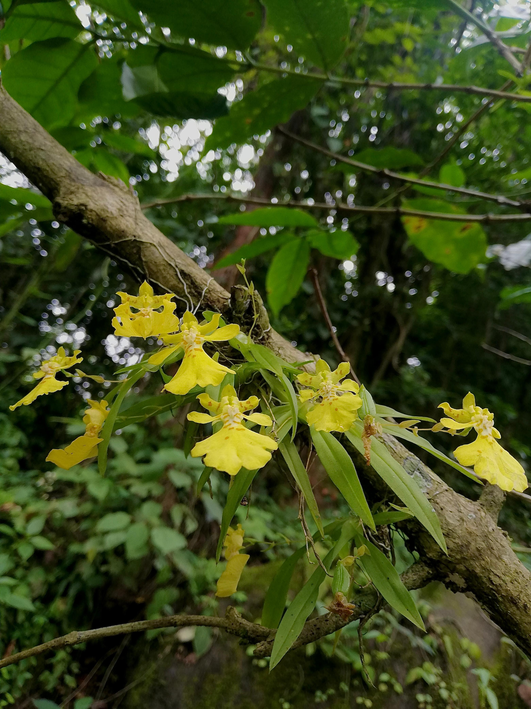

# Impactos de datos sin sentido biológicos {#ImpactosSinSentido}

Por: Raymond L. Tremblay

#### Librerías de R requeridas para el siguiente módulo

```{r, sin_sentido_1, message=FALSE, warning=FALSE}
#| error: true

#devtools::install_github("rich-iannone/DiagrammeR") # Instalar directamente de github para tener la versión más reciente
if (!require("pacman")) {
  install.packages("pacman")
}
pacman::p_load(
  "DiagrammeR",
  "Rage",
  "popdemo",
  "popbio",
  "interpretCI",
  "MCMCpack",
  "ggplot2",
  "plyr",
  "reshape"
)

library(DiagrammeR)
library(Rage)
library(popdemo)
library(popbio)
library(tidyverse)
library(flextable)
library(ftExtra)
library(interpretCI)
library(MCMCpack)
library(plyr)
library(reshape2)

```

```{r}
#| error: true

rlt_theme <- theme(
  axis.title.y = element_text(colour = "grey20", size = 10, face = "bold"),
  axis.text.x = element_text(colour = "grey20", size = 10, face = "bold"),
  axis.text.y = element_text(colour = "grey20", size = 15, face = "bold"),
  axis.title.x = element_text(colour = "grey20", size = 15, face = "bold")
) +
  theme(
    # Remover los border
    panel.border = element_blank(),
    # Remover las lineas
    panel.grid.major = element_blank(),
    panel.grid.minor = element_blank(),
    # Remove el fondo del panel
    panel.background = element_blank(),
    # añadir lineas más gruesas
    axis.line.x = element_line(colour = "black", linewidth = 1),
    axis.line.y = element_line(colour = "black", linewidth = 1)
  )

diverging= c("#009392","#CF597E","#E9E29C", "#39B185","#EEB479" , "#9CCB86" )

# --- 2. Combine them into a list object ---
# This list can be added to the plot with a single '+'
rlt_style_fill <- function() {
  list(
    rlt_theme,
    scale_fill_manual(values = diverging)
  )
}

rlt_style_colour <- function() {
  list(
    rlt_theme,
    scale_colour_manual(values = diverging)
  )
}

```

El valor principal de los estudios científicos radica en el supuesto de que los datos obtenidos representan una versión suficientemente cercana de la realidad y cuanto a la biología de campo que pueden ser utilizados para inferir sobre la ecología y conservación de las especies de interés. Este supuesto de que los datos representan realmente a la realidad es un mito, ya que solamente son una muestra, que esperamos que se acerque lo suficiente para tener confianza en los resultados. En ningún estudio ecológico se podrán obtener **TODOS** los datos para evaluar todas las relaciones bióticas y abióticas que mantiene un organismo y sus interacciones. Dicho modelo sería demasiado complejo e irreal dentro del concepto de lo que se puede lograr en un trabajo científico. Es por ello que, el objetivo de estos trabajos es tener una apreciación de los parámetros más importantes para definir patrones e interacciones suficientemente cercanas a la realidad para ser útiles. Por consiguiente, la base de estos estudios está sostenida en las unidades de muestreo y en la recolección de datos. Si los datos no representan la realidad, las interpretaciones de los análisis pueden ser erróneas. La matemática, con sus ecuaciones y sus modelos, no hará que la biología se aproxime más a la realidad, si desde el principio los datos y el método de recolección de datos son erróneos.

Es por ello que en esta sección evaluaremos diferentes aspectos de los análisis matriciales poblacionales de proyección (MPP) y diferentes aspectos de la recolección de datos que pudiesen ser problemáticos cuando uno considera la biología de una especie. La lista de *Impactos* no pretende incluir todos los posibles efectos de datos sin sentido; sino más bien, brindar algunos ejemplos de que pasa cuando uno no considera estos problemas y cómo pueden distorsionar las interpretaciones. Por lo tanto, se les extiende una advertencia a todos los biólogos de poblaciones, para que estén conscientes de estos temas y siempre evalúen críticamente sus datos desde la forma de recolección, su análisis e interpretaciones de sus resultados y aceptar que son solamente un modelo (una caricatura) de muchos posibles modelos.

------------------------------------------------------------------------

## Tamaño de muestra pequeñas o eventos raros

Sin duda, el tema principal para el uso de MPP ha sido evaluar la proyección de población de especies raras o en peligro de extinción [@caswell2000matrix; @gascoigne2023standard]. En consecuencia, las especies raras o en peligro de extinción son naturalmente pequeñas y el tamaño de la muestra del estudio o de algunas de las etapas/edades del ciclo de vida son frecuentemente pequeños. Estos tamaños de muestra reducidos suelen provocar estimaciones sesgadas de los parámetros y, a menudo, resultados sin sentido biológico. Algunos de los problemas incluyen no haber observado eventos raros (transiciones pocos comunes), como la muerte de un adulto o la germinación de una semilla. En estos casos, la probabilidad de supervivencia o transición pudiese ser de cero, lo que pudiese resultar en una matriz reducible o no irreducible.

------------------------------------------------------------------------

### Supervivencia Perfecta

Muestreos en donde no se observa mortalidad, que equivaldrían a una supervivencia perfecta, son problemáticos. Esto se presenta generalmente se pudiese observar en especies longevas, en donde la mortalidad de los individuos, en especial de los individuos adultos es rara, pero la probabilidades existe. Considere una especie donde se recopilan datos de la especies **Sp1** y se crea una matriz de transición **Sp1matU** y una matriz de fertilidad **Sp1matF**. Note que ninguno de los individuos adultos muestreados murió, por lo que el valor de la permanencia es de 1 (supervivencia perfecta). En consecuencia, el tamaño de la población nunca disminuye. Sin embargo, esto es completamente irreal. Así, bajo todos los modelos biológicamente realistas, esperaríamos que el tamaño de la población comience a disminuir si una población no tiene reproducción. Sin embargo, en nuestro ejemplo, a pesar de que la fecundidad es cero, nuestra población se mantiene ya que los individuos adultos presentan una supervivencia perfecta, lo cual es biológicamente imposible.

```{r, sin_sentido_2,message=FALSE}
#| error: true

Sp1matU <- rbind(
  c(0.0, 0.0, 0.0),
  c(0.5, 0.3, 0.0),
  c(0.0, 0.4, 1.0)
) # transition matrix

Sp1matF <- rbind(
  c(0.0, 0.0, 0.0),
  c(0.0, 0.0, 0.0),
  c(0.0, 0.0, 0.0)
) # fertility matrix

Sp1matA = Sp1matU + Sp1matF # TF matrix

lambda(Sp1matA) # lambda es 1, lo que indica que la población no cambia

stages <- c("plantula", "juvenil", "adulto")

plot_life_cycle(Sp1matA, stages = stages, fontsize = 0)
```

Si analizamos **Sp1matU**, asumimos que ninguno de los individuos muestreados en etapa adulta muere, en ningún momento!!! Claramente esto no es realista. Para cualquier especie, la probabilidad de muerte en cualquier etapa nunca es cero (aunque podría ser muy pequeña) y, por lo tanto, nuestra matriz no tiene sentido biológico. Considere una especie de árbol, como los árboles de *Sequoia*, en donde es muy probable que la supervivencia de los árboles grandes sea muy alta entre un año y otro y por lo tanto la **supervivencia observada** sea del 100%, pero, este 100% no es realista a largo plazo. Hay que diferenciar entre lo que se observa en un periodo de muestreo y las probabilidades a largo plazo. Es posible que en el sitio de estudio NO se observó mortalidad de los árboles grandes entre los dos periodos de muestreo, lo que resultaría en una mortalidad de cero, sin embargo, este valor no es real a largo plazo. Ese estimado de campo puede ser un resultado de un tamaño de muestra insuficiente o de eventos son raros (aun con tamaño de muestra grandes).

En el siguente *script* mostramos que la población no cambia después de 7-8 periodos/años y se mantiene cercana a uno (usamos la matriz de transición sin fecundidad). Si no hay reclutas (matriz de fertilidad), el tamaño de la población debería reducirse con el tiempo. Todos los modelos de transiciones que no incluyan a la matriz de fertilidad (solamente la matU), deberían resultar en reducción de tamaño poblacional en el tiempo, debido a la no incorporación de nuevos individuos (fecundidad), de la perdida de individuos muestreados (mortalidad).

```{r, sin_sentido_3}
#| error: true

n = c(50, 50, 50)

truelambda(Sp1matU) # despues de unos periodos de tiempo vemos que el crecimiento poblacional es 1
pop.projection(Sp1matU, n = n)$pop.changes # lista del cambio poblacional en 19 años
```

------------------------------------------------------------------------

#### Un cambio pequeño en la mortalidad.

El efecto de aumentar el tamaño de muestra impacta directamente los posibles valores en la matriz. Considere la siguiente situación. ¿Si tenemos solamente cinco individuos en la etapa uno, ¿cuáles son los posibles valores de mortalidad? Esto dependería del número de individuos que mueran, que pudiera ser ninguno,1, 2,...o todos. Entonces las probabilidades que pudieran entrar en la matriz dependiendo el número de individuos muertos serían: 0, 0.2, 0.4, 0.6, 0.8, 1.0. Note que los valores intermedios no pueden existir en la matriz. Por lo tanto, si uno tiene un tamaño de muestra pequeño, es probable que los valores en la matriz no representen la realidad biológica, pero si representan lo observado en el muestreo de campo.

Si consideramos la matriz del script 3 y observamos el valor de la permanencia (sobrevivencia) de los individuos adultos podemos deducir que se muestrearon 1000 individuos y que 995 sobrevivieron. Así con el tamaños muestrales superiores, por ejemplo 1000, además de conferir una mayor confianza en el parámetro, permite la existencia de valores intermedios. Tenga en cuenta que en este nuevo modelo de la especie *SP1*, aunque la tasa de supervivencia es muy cercana a 100% (0,995), existe mortalidad y por tanto existiría una disminución de la población en cada período de tiempo (aunque solo sea en una pequeña fracción), si los valores de la de fecundidad fueran de cero. Siempre hay que considerar si esta tasa de mortalidad es biológicamente real o es un resultado del tamaño de la muestra.

```{r, sin_sentido_4}
#| error: true

Sp1matU_2 <- rbind(
  c(0.0, 0.0, 0.0),
  c(0.5, 0.3, 0.0),
  c(0.0, 0.4, 0.995)
) # transition matrix

Sp1matF <- rbind(
  c(0.0, 0.0, 1.0),
  c(0.0, 0.0, 0.0),
  c(0.0, 0.0, 0.0)
) # fertility matrix

Sp1matA_2 = Sp1matU_2 + Sp1matF

lambda(Sp1matA_2) # lambda es 0.995, lo que indica que la población disminuye

pop.projection(Sp1matU_2, n = n)$pop.changes # lista del cambio poblacional en 19 años

```

::: img-float
{style="float: left; margin: 10px;width: 40% ; "}
:::

En la mayoría de las investigaciones el tamaño de muestra es limitado. Por lo tanto, es importante considerar si la tasa/transición de mortalidad es realista y si el tamaño de la muestra es suficiente para estimar la tasa/transición de mortalidad es de confianza. Si la tasa de mortalidad es muy baja cerca de cero o 100%, es probable que el tamaño de la muestra sea demasiado pequeño para estimar la tasa de mortalidad con precisión. En consecuencia, la tasa de mortalidad estimada puede estar lejos de la realidad si hubiese tenido un estimado basado en un *N* más grande.

------------------------------------------------------------------------

<br>

<br>

<br>

<br>

## Cual son los tamaños de muestra típica en los estudios de orquídeas?

Usando el artículo de Ticktin 2020, vemos algunos de los tamaños de muestra de los estudios de orquídeas usando MPP. Esta tabla representa solamente parte de los datos en la publicación. El objetivo es demostrar el tamaño de muestra en algunos de los estudios de orquídeas. Note que en algunos estudios el tamaño por etapa es muy pequeño, lo que puede resultar en estimaciones sesgadas de los parámetros y, a menudo, resultados sin sentido biológicos.

```{r, sin_sentido5, message=FALSE, echo=FALSE}
#| error: true

N_PPM=tribble(~Especie, ~"Población", ~Etapas,~"Tamaño de Muestrea", ~Referencia,
              "*Erycina crista-galli*", "Pop_1", "Plantulas", 41, "@mondragon2007life",
              "", "", "Juveniles", 50, "",
              "", "", "Adultos 1", 221, "",
              "", "", "Adultos 2", 226, "",
              "*Erycina crista-galli*", "Pop_2", "Plantulas", 4, "@mondragon2007life",
              "", "", "Juveniles", 32, "",
              "", "", "Adultos 1", 25, "",
              "", "", "Adultos 2", 531, "",
              "*Euchile karwinskii*", "Sin cosecha", "Plantulas", 20, "@elliott2014demography",
              "", "", "Juveniles 1", 74, "",
              "",  "", "Juveniles 2", 91, "",
              "",  "", "Adultos", 44, "",
              "*Euchile karwinskii*", "Con cosecha", "Plantulas", 3, "@elliott2014demography",
              "",  "", "Juveniles 1", 26, "",
              "",  "", "Juveniles 2", 47, "",
              "",  "", "Adultos", 20, "",
              "*Lepanthes caritensis*", "Carite", "Plantulas", 4, "@tremblay1997lepanthes",
              "",  "", "Juveniles", 54, "",
              "",  "", "Adulto no reproductivo", 24, "",
              "",  "", "Adultos", 12, "",
              "*Oncidium poikilostalix*", "Sin cosecha", "Etapa 1", 284, "@garcia2017impact",
              "",  "", "Etapa 2", 194, "",
              "",  "", "Etapa 3", 270, "",
              "",  "", "Etapa 4", 338, "")

list_fl = N_PPM %>%
  flextable()

list_fl

```

------------------------------------------------------------------------

### Irreductibilidad: cuando falta transiciones entre etapas

La *irreductibilidad* es un concepto importante en los análisis de matrices poblacionales. Como lo muestra [@caswell2000matrix] y más recientemente por [@stott2010reducibility], las matrices deben de ser *irreducibles*. El concepto de *irreductibilidad* está asociado con el ciclo de vida de la especie y la matriz debe incluir las transiciones de todas las etapas a todas las demás etapas. En la figura del ciclo de vida siguiente, faltan dos componentes importantes en la historia de vida de la especie, ningún juvenil crece para convertirse en adulto y ninguno de los adultos produce plántulas (semillas que crecen hasta convertirse en plántulas).

Por tal motivo, la matriz sugiere que los juveniles no crecen para convertirse en adultos, y todos los juveniles siguen siendo juveniles o mueren, ya que no hay una flecha que conecte a los juveniles con los adultos. En tanto que en el caso de los adultos no existe una flecha que los conecte con las plántulas, lo que sugiere que no hay producción de nuevas plántulas por parte de los adultos.

```{r, sin_sentido_6}
#| error: true

Sp1matU_NT <- rbind(
  c(0.0, 0.0, 0.0),
  c(0.5, 0.7, 0.0),
  c(0.0, 0.0, 0.995)
) # transition matrix

Sp1matF <- rbind(
  c(0.0, 0.0, 0.0),
  c(0.0, 0.0, 0.0),
  c(0.0, 0.0, 0.0)
) # fertility matrix

Sp1matA_NT = Sp1matU_NT + Sp1matF # TF matrix

stages <- c("plantula", "juvenil", "adulto")

plot_life_cycle(Sp1matA_NT, stages = stages, fontsize = 0)
```

#### Función para evaluar si una matriz es irreducible

Una manera fácil de determinar si la matriz es irreducible es correr el siguiente scriptt *isIrreducible* en el paquete **popdemo**. Tenga en cuenta en que, en este caso, el resultado es *FALSE* para la matriz anterior. Para comparar si tenemos evaluamos la matriz **Sp1matA_2** el resultado es **TRUE** ya que todas las etapas pueden llegar a todas las demás etapas. En este caso, la matriz es irreducible y por tanto cumple con los requisitos necesarios para muchos de los análisis de matrices poblacionales.

```{r, sin_sentido_7}
#| error: true

isIrreducible(Sp1matU_NT) # para la matriz de transición, faltando una etapa de transición y fertilidad
isIrreducible(Sp1matA_NT) # para la matriz TF, falta una etapa de transición

# Ahora considerando Sp1matA_2
# En esta matriz que incluye todas las transiciones y la fertilidad el resultado es "TRUE"
Sp1matA_2
isIrreducible(Sp1matA_2)
```

------------------------------------------------------------------------

### Ninguna supervivencia

La mortalidad es uno de los estadios del ciclo de vida de cada especie, pero raramente se añade al diagrama del ciclo de vida, porque es implícito en los cálculos ya que si restamos 1 a la suma de la columna de transición de un estadio dado, el resultado será la mortalidad de dicho estadio. A menudo se observa que la supervivencia de los individuos más pequeños o la primera etapa del ciclo de vida de una especie es muy reducida, por lo que la probabilidad de supervivencia es muy baja. Por ejemplo, la mayoría de las semillas no sobreviven para germinar. Esta es la norma en las orquídeas donde la producción de semillas es muy alta, a veces millones de semillas en una cápsula [@arditti2000numerical], pero los porcentajes de germinación en el campo suelen ser menores. Al momento no conocemos trabajos sistemáticos evaluando la probabilidad de germinación en orquídeas. Sin embargo, esto no se limita a las orquídeas, en los árboles se puede observar el mismo patrón, por ejemplo, en *Nothofagus pumilio* el reclutamiento de plántulas fue inferior al 1,5 % [@torres2015seed]. En general los patrones de germinación *In Situ* varia por grupos taxonómicos, distribución y condiciones ecológica [@iralu2019ecology].

Como es bien conocido en el campo, la germinación de semillas en las orquídeas no es sencilla ya que depende de la disponibilidad de micorrizas [@rasmussen1995terrestrial]. Si bien existe controversia, hay especificidad de las orquídeas por ciertas especies de hongos micorrizicos, ya que hay evidencias de que ciertas especies de orquídeas presentan dicha especificad [@balducci2024narrow], en tanto que otras no la presentan [@petrolli2022spatial], es indiscutible que para la germinación de las semillas de las orquídeas, las cuales carecen de endospermo la asociación con un hongo micorrízico es indispensable para su germinación [@rasmussen2015germination]. Pero la germinación no sólo depende de esta asociación ya que muchas variables pueden influir incluyendo las condiciones bióticas y abióticas [@callaway2002epiphyte; @rasmussen2015germination; @gonzalez2024host].

En el siguiente gráfico del ciclo de vida emergido, se puede observar que ninguna de las plántulas sobrevive o crece a la siguiente etapa. Tenga en cuenta que en la primera columna de la matriz de transición todos los valores son cero. La población puede haber comenzado con muchas (incluso miles o cientos de miles) de plántulas, pero ninguna creció hasta convertirse en un juvenil o permaneció como plántula antes del siguiente muestreo. Esto da como resultado una matriz que es reducible *isIrreducible* = *FALSE* y por consecuencia no cumple con los requisitos necesarios para muchos de los análisis de matrices poblacionales.

```{r, sin_sentido_8}
#| error: true

Sp1matU_NS <- rbind(
  c(0.0, 0.0, 0.0),
  c(0.0, 0.7, 0.0),
  c(0.0, 0.25, 0.995)
) # transition matrix

Sp1matF <- rbind(
  c(0.0, 0.0, 1.0),
  c(0.0, 0.0, 0.0),
  c(0.0, 0.0, 0.0)
) # fertility matrix

Sp1matA_NS = Sp1matU_NS + Sp1matF # TF matrix

stages <- c("plantula", "juvenil", "adulto")

plot_life_cycle(Sp1matU_NS, stages = stages, fontsize = 0)

isIrreducible(Sp1matU_NS)
```

------------------------------------------------------------------------

## Redondeo excesivo de valores

Uno de los error más comunes en la construcción de los elementos de la matriz es el error de redondeo excesivo u otras estimaciones que dan como resultado valores de supervivencia superiores a 100%. Una estimación de supervivencia mayor a 1.00, genera que de manera artificial (por un milagro matemático) aumente la cantidad de individuos, ya que su origen no es debido a la reproducción (sexual u asexual), si no a un artificio matemático. El estimado de supervivencia de una etapa siempre tiene que ser menor o igual a 1. Tomemos el ejemplo el análisis de *Serapia cordigera* [@pellegrino2014effects] en donde los autores evaluaron las transiciones entre latencia, plántulas, roseta vegetativa y floración, en este ejemplo podemos observar que al sumar los valores de transición de la columna de plántulas de la matriz SerapiaU, obtenemos un valor de 1.01, lo que significa que no solamente las plántulas presentan una sobrevivencia perfecta, que ya vimos que es biológicamente imposible, si no que además están apareciendo plántulas de la nada (ya que las plántulas son incapaces de reproducirse sexual o asexualmente y por tanto su entrada en la matriz de fecundidad-SerapiaF- es cero), que provocan que la población de plántulas aumente en un 1% en cada período. Estos valores de sobrevivencia superiores a 1 son el resultado de errores en la recolección de datos y/o en el cálculo de la supervivencia de la etapa, pero más frecuentemente por el redondeo excesivo de los valores de sobrevivencia calculada al momento de incorporarlos a la matriz, en donde generalmente sólo se utilizan entre dos y tres decimales.

```{r, sin_sentido_9}
#| error: true

SerapiaU <- rbind(
  c(0.668, 0.122, 0.294, 0.401),
  c(0.128, 0.000, 0.000, 0.000),
  c(0.000, 0.302, 0.453, 0.366),
  c(0.214, 0.364, 0.185, 0.207)
) # transition matrix

colSums(SerapiaU) # la suma de las columnas, nota que la primera columna es mayor de 100%. 

SerapiaF <- rbind(
  c(0.0, 0.0, 0.0, 0.0),
  c(0.0, 0.0, 0.0, 0.0),
  c(0.0, 0.0, 0.0, 0.0),
  c(0.0, 0.0, 0.0, 0.0)
) # fertility matrix

SerapiaA = SerapiaU + SerapiaF # TF matrix

stages <- c("latente", "plantulas", "vegetativa", "adulto")

plot_life_cycle(SerapiaA, stages = stages)

# Tenga en cuenta que la suma de supervivencia para la etapa inicial es mayor de 1, igual a 1.01

```

------------------------------------------------------------------------

## Estimaciones de fertilidad y ciclo de vida

La fertilidad influye considerablemente los resultados de los modelos. Es por ello que cometer errores en la incorporación de valores, tanto en el ciclo de vida como en las matrices, puede dar lugar a interpretaciones sin sentido biológico. Por esa razón en esta sección mostramos algunos ejemplos de errores al incorporar la fecundidad en el ciclo de vida y la matriz y que dan como resultado problemas de causa. Vea el capítulo \@ref(Fertilidad) para más detalle.

### Ciclo de vida y etapa de fertilidad incorrectos

Suponga que tiene una especie en la que modela el ciclo de vida con los siguientes estadíos: plántula, juvenil y adulto, en donde la fecundidad se calcula con base en el número de semillas producidas por un adulto (número medio de semillas por adulto). Después de analizar los datos y calcular los valores de transición (Sp1matU), se determinó que el número medio de semillas producida por adulto es 1100, a partir del cual se construyó la matriz de fecundidad (Sp1matF). Si agregamos a la matriz de transición la matriz de fertilidad, y a continuación evaluamos el valor de lambda y graficamos el crecimiento de la población con la función *proyect*, tenemos un valor de lambda de 4.93 y después de tan solo 5 períodos de tiempo, el número de adultos supera los 250,000 individuos!!! Por consecuencia, la estimación de la tasa de crecimiento de la población sería incorrecta y engañosa, donde 30% de 11,000 semillas llegan a ser plántulas, un total de 3,300 plántulas!!!

Este error es el resultado del calculo de la fecundidad, que debiera ser estimada con base en la primera etapa de la matriz, en este caso la etapa de plántula. Por lo tanto, la esquina superior derecha de la matriz de fertilidad no debe ser la **cantidad media de semillas** por planta, sino la **cantidad media de semillas que transitan a plántulas** producidas por una planta adulta. Recuerde que el número de semillas que llegan a plántula, son el resultado de múltiples factores; por ejemplo el porcentaje de viabilidad de las semillas por adulto, el porcentaje de semillas que arriban a un micro nicho propicio, el porcentaje de semillas que germinan y el porcentaje de sobrevivencia de las plántulas hasta el momento del muestreo, en donde se contabiliza el número de nuevas plántulas reclutadas. Por consecuencia el valor de esfuerzo reproductivo que entra en la matriz es condicional a todas estas condiciones.

```{r, sin_sentido_10}
#| error: true

Sp1matU_Fert <- rbind(
  c(0.0, 0.0, 0.0),
  c(0.3, 0.7, 0.0),
  c(0.0, 0.25, 0.995)
) # matriz de transición

Sp1matF <- rbind(
  c(0.0, 0.0, 1100.0),
  c(0.0, 0.0, 0.0),
  c(0.0, 0.0, 0.0)
) # matriz de fertilidad

Sp1matA_Fert = Sp1matU_Fert + Sp1matF # TF matriz combinada: matA = matU + matF

stages <- c("plantula", "juvenil", "adulto")

lambda(Sp1matA_Fert)

# El cambio de tamaño de la población en 5 periodos de tiempo
n
pr <- project(Sp1matA_Fert, vector = "n", time = 5)
plot(pr) # Nota que después de solamente 5 años ya la población aumentó a 250,000 individuos
```

------------------------------------------------------------------------

### Añadir una etapa de semillas

Si deseamos agregar una etapa de semilla a nuestro modelo, debemos incluir la etapa en nuestro modelo y crear una matriz con una nueva etapa *semilla*, para lo cual será necesario tener una estimación del número de semillas que germinan y se convierten en plántulas para poder calcular la transición de semillas a plántulas de nuestro modelo. En el caso de las orquídeas, dicha estimación es bastante difícil de lograr ya que las semillas de las orquídeas, debido a su tamaño minúsculo, son difíciles de seguir en la naturaleza. Aunque existen métodos para seguir la semillas como el de paquetes de malla de fitoplancton donde uno añade las semillas para monitorear esa etapa [@rasmussen1993seed; @batty2006situ; @shao2024improved] o algún método de huella genética para determinar la procedencia de las plántulas, que nos pueden ayudar a tener una estimación de esta transición, esta será incorrecta la mayoría de las veces, ya que en el caso de los paquetes de semillas se estará sobre-estimando la transición ya que no se estaría considerando la perdida de semillas por dispersión, en tanto que en el método de huella genética es muy probable que se subestima la transición ya que es muy difícil encontrar las plántulas en campo, sobre todo en orquídea epifitas. Por lo tanto, la estimación de la fertilidad en las orquídeas es un desafío y requiere un muestreo y análisis cuidadoso.

```{r, sin_sentido_11}
#| error: true

Sp1matU_Fert2 <- rbind(
  c(0.0, 0.0, 0.0, 0.0),
  c(0.0001, 0.0, 0.0, 0.0),
  c(0.0, 0.3, 0.7, 0.0),
  c(0.0, 0.0, 0.25, 0.995)
) # transition matrix

Sp1matF2 <- rbind(
  c(0.0, 0.0, 0.0, 1100.0),
  c(0.0, 0.0, 0.0, 0.0),
  c(0.0, 0.0, 0.0, 0.0),
  c(0.0, 0.0, 0.0, 0.0)
) # fertility matrix

Sp1matA_Fert2 = Sp1matU_Fert2 + Sp1matF2 # TF matrix

stages <- c("semillas", "plantula", "juvenil", "adulto")

plot_life_cycle(Sp1matA_Fert2, stages = stages)

lambda(Sp1matA_Fert2)

# show change in population size
pr <- project(Sp1matA_Fert2, vector = "n", time = 5)
plot(pr) # Note that now the number of adults did not increase to the level of the previous model
```

------------------------------------------------------------------------

### Semillas latentes

En el ejemplo anterior no hemos incluido una etapa de latencia de semillas. En otra palabra las semillas de orquideas, pueden sobrevivir en un periodo de tiempo largo? esto seria tener un banco de semillas o las semillas si no germinan el primer año de mueren? En muchas especies de plantas, las semillas pueden permanecer latentes durante uno o más años. No se sabe si las semillas de las orquídeas están inactivas durante mucho tiempo \[gale2010constraints\], excepto para algunas especies que han demostrado que las semillas aún están vivas después de varios años en el suelo usando la prueba de tinción de tetrazolio [@rasmussen1993seed y @whigham2006seed]. Es posible que las orquideas terrestre tenga un banco de semillas, pero no se ha demostrado que las orquídeas epífitas tengan un banco de semillas. Por lo tanto, si se desea incluir una etapa de latencia de semillas en el modelo, es necesario tener una estimación del número de semillas que permanecen latentes y que pueden germinar en el futuro.

------------------------------------------------------------------------

## Problemas de análisis de datos

### Estimaciones de intervalos de confianza incorrectas

Las estimaciones de dispersión en los parámetros de la matriz (supervivencia, transición, muerte y fertilidad) son útiles por múltiples razones tal como reconocer la confianza que se debería tener sobre el estimado puntual (el promedio o mediana). Por ello los parámetros con gran dispersión deben verse con precaución. El enfoque más básico es comprender la dispersión en el valor del parámetro como una función del tamaño de la muestra y el efecto espacial o temporal. Los estimados de dispersión pueden ser útiles para simulaciones y para comprender la incertidumbre en los estimados puntales y el comportamiento de la población como son lambda y la probabilidad de persistencia y extinción.

Los parámetros de supervivencia, muerte, permanencia y transición no se distribuyen normalmente ya que los sus valores van de cero a uno. Ningún valor puede ser menor de cero o mayor de uno, incluidos los intervalos de confianza (limitados por 0 y 1). Si se usa la distribución gaussiana (distribución normal) es probable que el intervalo de confianza esté fuera de los límites.

Supongamos que deseamos calcular la probabilidad de supervivencia de una etapa y sus intervalos de confianza del 95%. Primeramente se determinó que de los 20 individuos muestreados uno falleció y 19 sobrevivieron entre el primer muestreo y al segundo muestreo. Posteriomente, se estimó un intervalo de confianza del 95% de la proporción de individuos que murieron basandose en una distribución gaussiana.

Donde la proporción que murió es $\hat{p}$ y el número que murió es $n_d$ y $n$ es el tamaño de la muestra. En nuestro caso $n_d=1$ y $n=20$.

-   Construya un intervalo de confianza del 95% de la proporción de individuos que murieron basandose en una distribución gaussiana.

Donde la proporción que murió es $\hat{p}$ y el número que murió es $n_d$ y $n$ es el tamaño de la muestra

$$\hat{p}=\frac{n_d}{n}$$ con una probabilidad de muerte del 5%.

```{r, sin_sentido_12}
#| error: true

p=1/20
p
```

El IC del 95% de una proporción se calcula usando la siguiente fórmula si se asume una distribución normal

$$\hat{p}\pm Z_{0.05}*\sqrt{}(\frac{\hat{p}(1-\hat{p})}{n})$$

-   Z\_{0.05} es el valor crítico de Z para un IC del 95% = 1.955. Nota que, con ese cálculo, uno de los intervalos de confianza es negativo lo cual es ilógico, ya que es negativo.

```{r, sin_sentido_13}
#| error: true
n = 20
HCI = p + (1.96 * sqrt((p * (1 - p)) / n)) # IC alto
HCI

LCI = p - (1.96 * sqrt((p * (1 - p)) / n)) # IC bajo
LCI # Nota que el valor es sin sentido, ya que es negativo (que es una proporción negativa?)
```

Un método más fácil es usar la función R *propCI* de la **library(interceptCI)** (Script 12). La función *propCI* calcula el intervalo de confianza del 95% de una proporción binomial. La función requiere el tamaño de la muestra, el número de eventos y el nivel de significancia. En este caso, el tamaño de la muestra es 20, el número de eventos es 1 (un individuo fallecido) y el nivel de significancia es 0.05. Note que el intervalo de confianza incluye valores negativos (**irreales**). Para resolver esto hay que usar funciones estadísticas alternativas como la distribución de Dirichlet en donde no se asume una distribución normal.

```{r, sin_sentido_14}
#| error: true

resultado = propCI(n = 20, p = 0.05, alpha = 0.05)

resultado
```

------------------------------------------------------------------------

## Distribución Dirichlet de intervalo de confianza

Sin embargo, ¿cómo se calcula el IC del 95% cuando hay más de dos proporciones? Debido a que la proporción de todas las etapas depende de la proporción de las otras etapas, el análisis debe considerar la proporción y el IC del 95% debe incluir todas las etapas simultáneamente. La función requerida para esto es la función de Dirichlet multinomial (multigrupo).

La distribución de Dirichlet es una distribución de probabilidad continua multivariada que se utiliza para modelar la distribución de proporciones en un espacio de probabilidad. La distribución de Dirichlet es una generalización de la distribución beta a más de dos categorías. La distribución beta está limitada a valores de cero a uno inclusivo. La distribución de Dirichlet se utiliza comúnmente en el análisis de datos de proporciones, donde las proporciones de las categorías deben sumar uno.

En el siguiente script estimamos los intervalos de credibilidad del 95% de la transición y estasis de plántulas a plántulas (0.5), juveniles (0.2), adultos (0) y muerte (0.30). Tenga en cuenta que en el gráfico del ciclo de vida, como de costumbre, se excluyen las probabilidades de que muerte. Esta función es un acercamiento bayesiano por consecuencia es un intervalo de credibilidad (ICr) y no un intervalo de confianza (IC). La diferencia entre ambos es que el intervalo de credibilidad es una estimación bayesiana, mientras que el intervalo de confianza es una estimación frecuentista.

```{r, sin_sentido_15, message=FALSE}
#| error: true

Dirichlet <- rbind(
  c(0.5, 0.0, 0.0),
  c(0.2, 0.0, 0.0),
  c(0.0, 0.3, 0.7)
) # transition matrix

stages <- c("plantula", "juvenil", "adulto")

plot_life_cycle(Dirichlet, stages = stages)
```

Para evaluar el intervalo ICr del 95% simultáneamente de las cuatro transiciones (plántulas a plántulas, plántulas a juvenil, plántulas a adultos y plántulas a muerte), usamos la **library(MCMCpack)**, que es un paquete dedicado a realizar simulaciones de Monte Carlo de Cadenas Markovianas *Markov Chain Monte Carlo*. Para lo cual usaremos la función *MCmultinomdirichlet*. Tenga en cuenta que la primera lista son las proporciones que se muestran en la matriz para la etapa de plántula c(.50*n,.02*n,.0*n,.3*n) multiplicadas por el tamaño de la muestra n= 25. La segunda lista son los priores bayesianos c(0.5,0.2,0.0001,0.2999), en este caso asumí que la suma de los previas es igual a 1. Esto da como resultado una confianza muy baja en la percepción previa de lo que son las transiciones. Estamos dando muy poco peso a la percepción previa en los análisis. Otro tipo de previa para la transición es que sean iguales, sin embargo, podríamos haber usado c(1,1,.0001, 1), donde este previa sugiere una transición igual para todos menos las plántulas transitan hasta convertirse en adultos. IMPORTANTE: las previas deberían ser **biológicamente realistas**, usando lo conocido de la biología de los organismos que se estudian. Por experiencia y usando la literatura se puede hacer un estimado de las transiciones y usarlo como previa. El concepto de lo anterior no se puede explicar completamente aquí, consulte las siguientes referencia [@tremblay2021population; @van2021bayesian].

Los resultados en la figura muestran que hay mucha dispersión alrededor de la proporción media de las estadísticas y la transición como se esperaba debido al pequeño tamaño de la muestra.

-   Hacemos una simulación de 100,000.
-   Recolectamos los resultados en la variable **L**.
-   Convertimos esta lista en un data frame.
-   Reorganizamos el data frame para que sea más fácil de graficar con la función *stack*.
-   Añadimos una columna con el tamaño de muestra, n=25.
-   Cambiamos los nombres de las etapas de la vida para que sean más fáciles de leer en la gráfica.
-   Graficamos los resultados

```{r sin_sentido_16, message=FALSE}
#| error: true

n = 25
L = posteriorPRIORL <- MCmultinomdirichlet(
  c(.50 * n, .2 * n, .0 * n, .3 * n),
  c(.5, .2, 0.0001, .3),
  mc = 100000
)
dfL = as.data.frame(L)
t(summary(dfL))

#head(dfL)
stack_dfL = stack(dfL)
comb_dfbL = cbind(stack_dfL, T = "25")

All_Data3 = comb_dfbL
levels(All_Data3$ind)[levels(All_Data3$ind) == "pi.1"] = "Plantulas"
levels(All_Data3$ind)[levels(All_Data3$ind) == "pi.2"] = "Juvenil"
levels(All_Data3$ind)[levels(All_Data3$ind) == "pi.3"] = "Adulto"
levels(All_Data3$ind)[levels(All_Data3$ind) == "pi.4"] = "Muerto"

```

-   Graficamos los resultados

```{r, sin_sentido_17}
#| error: true

ggplot(data = All_Data3, aes(x = values, fill = ind)) +
  geom_density(alpha = .5) +
  scale_y_continuous(limit = c(0, 5.5)) +
  scale_colour_hue(l = 60) +
  facet_grid(~ind) +
  ylab(
    "La distribución de las proporciones \n de plantulas que crecen a la siguiente etapas"
  ) +
  xlab("Proporciones") +
  labs(fill = "Etapa de vida")+
  rlt_style_fill()

```

Ahora calculemos el ICr del 95% de las transiciones

Ahora que los datos estan organizado en un data frame es facil extraer los valores de las transiciones y calcular los intervalos de credibilidad del 95% de las transiciones, estasis y supervivencia. Para ello usamos la función *ddply* del paquete **plyr** para resumir los datos por la columna *ind* (etapa de vida) y calcular el promedio, desviación estándar, mediana, cuantil 5% y cuantil 95% de los valores de cada etapa.

-   Intervalos de credibilidad de transiciones, estasis y supervivencia basados en simulación y distribución de Dirichlet.

Aspectos importantes a tener en cuenta.

-   los ICr del 95% están acotados entre 0 y 1. Los valores por debajo de cero o por encima de uno en los parámetros no tendrían sentido.
-   la suma de los promedios es igual a 1.
-   la forma de la distribución no se distribuye normalmente, ver figura anterior. La forma de la distribución se llama distribución beta.

```{r, sin_sentido_18}
#| error: true

Transiciones = ddply(
  All_Data3,
  c("ind"),
  summarise,
  mean = round(mean(values), 4),
  sd = round(sd(values), 5),
  median = round(median(values), 4),
  #sem = round(sd(values)/sqrt(length(values)),6), # para calcular el error estándar de la media
  ICr5 = round(quantile(values, probs = c(0.05)), 4), # el cuantil 5
  ICr95 = round(quantile(values, probs = c(0.95)), 4), # el cuantil 95
  min = min(values),
  max = max(values)
)

Transiciones

```

Para visualizar los intervalo de credibilidad de las otras transiciones es solamente cambiar las variables la función **L** y **n**. En este caso, cambiamos el tamaño de la muestra correspondiente a esta etapa.

------------------------------------------------------------------------

### Tamaño de muestra y estimaciones de intervalos de confianza con n2=250

Para comparar con el ejemplo anterior asumimos que en lugar de tener solamente 25 plántulas teníamos 250 para las estimaciones.

Note que con los mismos estimado puntuales pero con una tamaño de muestra mayor la mediana sigue en el mismo lugar (casi) pero los ICr cambian mucho y son más reducidos los anchos de la dispersión, ya que con más datos en el muestreo existe más confianza resultado de una reducción en el ICr. Este análisis es primordial para entender la confianza que uno debería tener sobre los estimados de los parámetros de la matriz. Si se observa un ICr muy grande, se recomendaría modificar la recolección de datos en el campo para aumentar el tamaño de muestra de esa etapa específica.

```{r, sin_sentido_19}
#| error: true

n2 = 250
L = posteriorPRIORL <- MCmultinomdirichlet(
  c(.50 * n2, .2 * n2, .0 * n2, .3 * n2),
  c(.5, .2, 0.0001, .3),
  mc = 100000
)
dfL = as.data.frame(L)
t(summary(dfL))

#head(dfL)
stack_dfL = stack(dfL)
comb_dfbL = cbind(stack_dfL, T = "25")

All_Data4 = comb_dfbL
levels(All_Data4$ind)[levels(All_Data3$ind) == "pi.1"] = "Plantulas"
levels(All_Data4$ind)[levels(All_Data3$ind) == "pi.2"] = "Juvenil"
levels(All_Data4$ind)[levels(All_Data3$ind) == "pi.3"] = "Adulto"
levels(All_Data4$ind)[levels(All_Data3$ind) == "pi.4"] = "Muerto"

ggplot(data = All_Data4, aes(x = values, fill = ind)) +
  geom_density(aes(alpha = .5)) +
  scale_y_continuous(limit = c(0, 18)) +
  scale_colour_hue(l = 60) +
  facet_grid(~ind) +
  labs(fill = "Etapa de vida")+
  rlt_style_fill()

```

### Los estimados de Intervalo de camfianza con un tamaño de muestra de n=250

N0te que ahora, los intervalos de confianza son más estrechos y no son negativos o mayor de uno.

```{r, sin_sentido_20}
#| error: true

Transiciones = ddply(
  All_Data4,
  c("ind"),
  summarise,
  mean = round(mean(values), 3),
  sd = round(sd(values), 4),
  median = median(values),
  #sem = round(sd(values)/sqrt(length(values)),6),
  CI5 = quantile(values, probs = c(0.05)),
  CI95 = round(quantile(values, probs = c(0.95)), 4),
  min = min(values),
  max = max(values)
)

Transiciones

```

