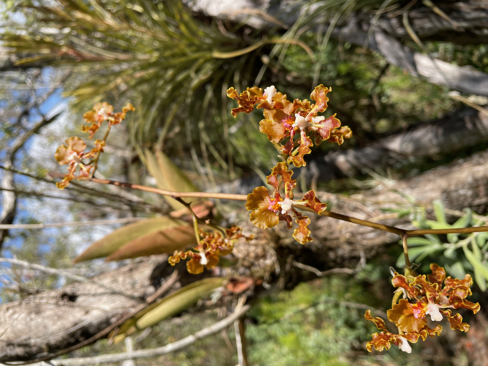
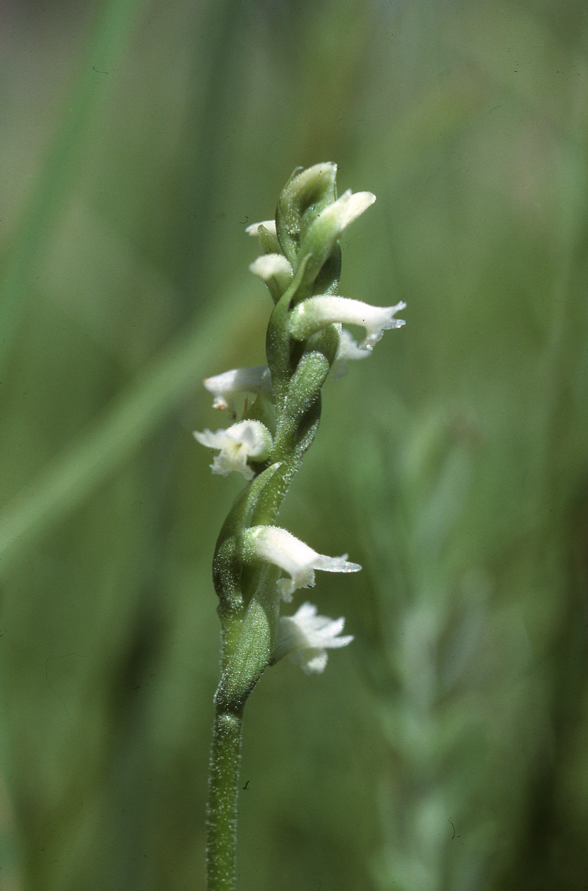

# Apéndice A {#AppendixA .unnumbered}

## Lista completa de PPM en orquídeas {.unnumbered}

En esta sección se hace una recopilación de los estudios de dinámica poblacional en orquídeas que han usado matrices de transición de estados y de edades. Se identifican algunos de los temas principales de los trabajos.

En la siguiente tabla se presentan los estudios de dinámica poblacional en orquídeas que usaron PPM y las preguntas principales que los autores intentaron responder. En la gran mayoría de los trabajos se evalúan múltiples hipótesis/ideas sobre la dinámica poblacional de las orquídeas. Para información específica sobre la metodología usada en cada estudio, se recomienda revisar los trabajos originales.

-   Clave de las variables:

    -   **Riesgo**: Si se evaluó el riesgo de extinción de la especie.
    -   **Variación espacial**: Si se evaluó la variación espacial de la especie.
    -   **Variación temporal**: Si se evaluó la variación temporal de la especie.
    -   **Latencia**: Si se evaluó la importancia de la latencia (*dormancy*) de la especie.
    -   **Métodos de estimación de parámetros**: Si se evaluaron métodos alternos de estimación de parámetros (no tradicionales).
    -   **Historia de vida**: Si se evaluó la historia de vida de la especie en un contexto evolutivo.
    -   **Otro**: Si se evaluó otra pregunta no incluida en las anteriores.
    -   **Referencia**: Referencia del estudio.

```{r lista1, message=FALSE, warning=FALSE}
#| error: true
library(readr)
library(tidyverse)
library(dplyr)
library(gt)
```

------------------------------------------------------------------------

```{r lista2, table, echo=FALSE, message=FALSE, warning=FALSE}
#| error: true

listsp <-dplyr::tribble(
  ~"Genero", ~Especies, ~Riesgo, ~"Var esp.", ~"Var temp", ~"Lat", ~"Est param", ~"Hist vida", ~Otro, ~Ref,
"*Aspasia*" , "*principissa*",  "Si" ,    "-"       ,  "Si"  ,  "-"     ,    "-"          ,   "-"       , "-"  , "@zotz2006population" ,
"*Brassavola*", "*cucullata*",  "Si"     , "Si"         , "Si"         ,  "-"   ,         "-"    ,     "-"       , "IPM, Transient Dynamics, Transfer Function"  , "@ackerman2020small",
 "*Broughtonia*", "*cubensis*" , "Si", "Si" , "Si", "-", "-", "-","Transient Dynamics",  "@raventos2021effects",
 "*Caladenia*", "*amoena*"      , "Si", "-" , "-", "Si", "Si", "Si","Selección de modelos, método para estimar latencia", "@tremblay2009population @tremblay2009dormancy; ",
 "*Caladenia*", "*argocalla*"   , "Si", "-" , "-", "Si", "Si", "Si","Selección de modelos, método para estimar latencia", "@tremblay2009population @tremblay2009dormancy",
 "*Caladenia*", "*clavigera*"  , "Si", "-" , "-", "Si", "Si", "Si","Selección de modelos, método para estimar latencia", "@tremblay2009population  @tremblay2009dormancy",
 "*Caladenia*", "*elegans*"     , "Si", "-" , "-", "Si", "Si", "Si","Selección de modelos, método para estimar latencia", "@tremblay2009population @tremblay2009dormancy",
 "*Caladenia*", "*graniticola*" , "Si", "-" , "-", "Si", "Si", "Si", "Selección de modelos, método para estimar latencia","@tremblay2009population @tremblay2009dormancy",
 "*Caladenia*", "*macroclavia*" , "Si", "-" , "-", "Si", "Si", "Si","Selección de modelos, método para estimar latencia", "@tremblay2009population @tremblay2009dormancy",
 "*Caladenia*", "*oenochila*"   , "Si", "-" , "-", "Si", "Si", "Si","Selección de modelos, método para estimar latencia", "@tremblay2009population @tremblay2009dormancy",
 "*Caladenia*", "*rosella*"   , "Si", "-" , "-", "Si", "Si", "Si","Selección de modelos, método para estimar latencia", "@tremblay2009population @tremblay2009dormancy",
 "*Caladenia*", "*valida*"   , "Si", "-" , "-", "Si", "Si", "Si","Selección de modelos, método para estimar latencia", "@tremblay2009population @tremblay2009dormancy",
"*Caladenia*", "*orientalis*"  , "Si", "Si" , "Si", "Si", "-", "-","Interacciones abiotica" ,"@coates2009demographic",
"*Cephalanthera*", "*longifolia*", "-", "-" , "-", "Si", "Si", "Si", "Interacciones abiótica y biótica","@shefferson2012linking",
"*Cleistes*", "*divaricata* var. *divaricata*"   , "Si", "Si" , "Si", "Si", "Si", "-","-" ,"@gregg1991variation",
"*Cleistes*", "*divaricata* var. *bifaria*"   , "Si", "Si" , "Si", "Si", "Si", "-","-" ,"@gregg1991variation",
"*Cleistes*", "*bifaria*", "-", "Si" , "-", "Si", "-", "-", "Estructura de tamaño y estado","@gregg2006comparison",
"*Corallorhiza*", "*trifida*", "Si", "-" , "Si", "Si", "-", "-","-" ,"@iriondo2009peligro",
"*Crepidium*", "*acuminatum*", "Si", "-" , "Si", "-", "-", "-","Efecto de cosecha" ,"@timsina2021six",

"*Cypripedium*", "*acaule*", "-", "-" , "-", "-", "Si", "-", "Edad de individuos reproductivos","@cochran1992simple",
"*Cypripedium*", "*calceolus*", "Si", "Si" , "Si", "Si", "-", "-","Selección de modelos" ,"@nicole2005population",
"*Cypripedium*", "*calceolus*", "Si", "Si" , "Si", "Si", "-", "-","Efecto de aislamiento" ,"@garcia2010living",
"*Cypripedium*", "*calceolus*", "-", "-" , "-", "-", "-", "-","Costo de latencia, Interacciones abiótica y biótica" ,"@shefferson2012linking",

"*Cypripedium*", "*fasciculatum*", "Si", "Si" , "Si", "Si", "-", "-","Selección de modelos, Interacciones abióticas" ,"@thorpe2011trends",
"*Cypripedium*", "*parviflorum*", "-", "-" , "-", "Si", "-", "Si", "-","@shefferson2014life",
"*Cypripedium*", "*reginae*", "-", "Si" , "-", "Si", "-", "Si","Selección de modelos, interacciones bióticas" ,"@kery2004demographic",
"*Cypripedium*", "*lentiginosum*", "-", "-" , "-", "-", "Si", "-","Leslie matrix" ,"@zhongjian2008correlation",
"*Dactylorhiza*", "*hatagirea*", "Si", "Si" , "Si", "Si", "-", "-","Efecto de cosecha" ,"@chapagain2021illegal",
"*Dactylorhiza*", "*lapponica*", "-", "Si" , "Si", "Si", "-", "-", "Efecto antropogénico, interacciones abióticas","@sletvold2010long; @sletvold2013climate",
"*Dendrophylax*", "*lindenii*", "Si", "-" , "Si", "-", "-", "-","Efecto de densidad, **los datos de la matriz no están disponibles**" ,"@gonzalez2009dinamica; @raventos2015population",
"*Epidendrum*", "*xanthinum*", "Si", "Si" , "-", "-", "-", "-", "Comparación de poblaciones","@farfan2008estrategias",
"*Epipactis*", "*atrorubens*", "Si", "Si" , "Si", "Si ", "-", "-","Incorporación de variable de endogamía" ,"@hens2017low",
"*Epipactis*", "*atrorubens*", "-", "-" , "-", "- ", "-", "-","" ,"@jakalaniemi2011orchids",
"*Erycina*", "*crista-galli*", "Si", "Si" , "-", "-", "-", "-","-","@mondragon2007life",
"*Erycina*", "*crista-galli*", "-", "-" , "-", "-", "-", "-","-","@maldonado2005patron",
"*Guarianthe*", "*aurantiaca*", "Si", "Si" , "-", "-", "-", "-","Efecto de cosecha","@mondragon2009population",

"*Herminium*", "*monorchis*", "Si", "-" , "Si", "Si", "-", "-","Efecto abiótico","@wells1998flowering",
"*Himantoglossum*", "*hircinum*", "Si", "-" , "Si", "-", "-", "-","Efecto abiótico: sequía","@wells1998flowering",
"*Himantoglossum*", "*hircinum*", "Si", "-" , "Si", "-", "-", "-","Modelando expansión","@carey1998modelling",
"*Himantoglossum*", "*hircinum*", "Si", "-" , "Si", "Si", "-", "-","Efecto abiótico: Precipitación y Temp del suelo", "@pfeifer2006influence",

"*Isotria*", "*medeoloides*", "Si", "-" , "Si", "-", "-", "-","Tratamiento del dosel","@dibble2019demography",
"*Jacquiniella*", "*leucomelana*", "Si", "-" , "Si", "-", "-", "-","Metapopulation approach","@winkler2009population",
"*Jacquiniella*", "*teretifolia*", "Si", "-" , "Si", "-", "-", "-","Metapopulation approach","@winkler2009population",
"*Laelia*", "*autumnalis*", "Si", "Si" , "Si", "-", "-", "","Efecto de cosecha","@emeterio2021does",
"*Laelia*", "*speciosa*", "Si", "-" , "Si", "-", "-", "-","Efecto de cosecha","@hernandez1992dinamica",
"*Lepanthes*", "*caritensis*", "Si", "Si" , "Si", "-", "-", "-","-","@tremblay1997lepanthes",
"*Lepanthes*", "*caritensis*", "Si", "Si" , "Si", "-", "-", "-","Efecto de huracanes","@crain2019sheltered",
"*Lepanthes*","*eltoroensis*", "Si", "Si" , "-", "-", "-", "-","Tamaño efectivo de Población, Ne y largo de vida","@tremblay2001gene", 
"*Lepanthes*","*eltoroensis*", "Si", "Si" , "Si", "-", "-", "-","-","@tremblay2003population",
"*Lepanthes*","*eltoroensis*", "Si", "Si" , "Si", "Si", "-", "-","Nueva metodología para estimar parámetros","@tremblay2021population",
"*Lepanthes*", "*rubripetala*", "-", "-" , "-", "-", "-", "-","Tamaño efectivo de Población, Ne y largo de vida", "@tremblay2001gene",
"*Lepanthes*", "*rubripetala*", "Si", "Si" , "Si", "-", "-", "-","Dinámica de transiciones","@tremblay2015stable",
"*Lepanthes*", "*rupestris*", "-", "-" , "-", "-", "-", "-","Tamaño efectivo de Población, Ne y largo de vida","@tremblay2001gene",
"*Lepanthes*", "*acuminata*", "Si", "-" , "-", "-", "-", "-","Dinámica de transiciones","@raventos2018comparison",
"*Lycaste*" , "*aromatica*", "Si", "-" , "Si", "-", "-", "-","Metapopulation approach","@winkler2009population",
"*Neotinea*", "*ustulata*", "Si", "Si" , "-", "Si", "-", "Si","Método para estimar latencia","@shefferson2007dormancy",
"*Oeceoclades*", "*maculata*", "Si", "Si" , "Si", "-", "-", "-","Especie invasiva","@riveron2019spatio",
"*Oncidium*", "*poikilostalix*", "Si", "-" , "-", "-", "-", "-","Dinámica de transiciones","@raventos2018comparison",

 "*Orchis*", "*purpurea*", "Si", "-" , "Si", "-", "-", "-","LTRE", "@jacquemyn2010seed",
 "*Orchis*", "*ustulata*", "Si", "Si" , "-", "-", "-", "-","mismo que **Neotinea ustulata**","@tali2002dynamics",
 "*Phaius*", "*australis*", "Si", "Si" , "-", "-", "-", "-","Efecto espacial y abiótico", "@simmons2016Viability",
 "*Platanthera*", "*hookeri*", "Si", "Si" , "-", "-", "-", "-","-","@reddoch2007population",
 "*Platanthera*", "*praeclara*", "Si", "Si" , "Si", "Si", "-", "-","Variación temporal", "@sieg1995influence",
 "*Platanthera*", "*macrophylla*", "Si", "Si" , "Si", "-", "-", "-","Incluye estado de protocormo", "@cleavitt2017life @berry2021population",
 "*Platanthera*", "*orbiculata*", "Si", "Si" , "Si", "-", "-", "-","Incluye estado de protocormo","@cleavitt2017life @berry2021population",
 "*Prasophyllum*", "*correctum*", "Si", "" , "Si", "Si", "-", "-","Efecto de fuego","@coates2006effects",
 "*Pseudorchis*", "*albida*", "-", "-" , "-", "-", "-", "-","-","@stipkova2013mowing",
 "*Rodriguezia*", "*granadensis*", "Si", "Si" , "Si", "-", "-", "","Efecto antropogénico, **to be digitized**","@ospina2023effect",
 "*Serapias*", "*cordigera*", "Si", "Si" , "Si", "Si", "-", "-","Efecto antropogénico","@pellegrino2014effects",
 "*Spathoglottis*", "*plicata*", "Si", "Si" , "Si", "-", "-", "-","Orquídea invasiva y interacciones bióticas", "@falcon2017quantifying",

 "*Spiranthes*", "*delitescens*", "Si", "Si" , "Si", "Si", "-", "-","Efecto abiótico: sequía","@mcclaran1992population",
 "*Spiranthes*", "*parskii*", "Si", "" , "-", "-", "-", "-","Efecto abiótico: herbivoría","@wonka2010herbivores",

 "*Telipogon*", "*helleri*", "Si", "-" , "-", "-", "-", "Si","Dinámica de transición","@raventos2018comparison",
 "*Tolumnia*", "*variegata*", "Si", "Si" , "Si", "-", "-", "Si","El costo de reproducción","@calvo1993evolutionary",
 "*Trichocentrum*", "*undulatum*", "-", "-" , "-", "-", "-", "","Efecto de aislamiento","@borrero2023populations" )
```

```{r lista2-gt, echo=FALSE, message=FALSE, warning=FALSE}
#| error: true

listsp |>
  gt() |>
  fmt_markdown(columns = c(Genero, Especies, Ref)) |>
  cols_label(
    Genero      = "Género",
    Especies    = "Especies",
    Riesgo      = "Riesgo",
    `Var esp.`  = "Var. esp.",
    `Var temp`  = "Var. temp.",
    Lat         = "Latencia",
    `Est param` = "Est. param.",
    `Hist vida` = "Hist. vida",
    Otro        = "Otro",
    Ref         = "Referencia"
  ) |>
  cols_align(align = "left", columns = everything()) |>
  tab_options(
    table.font.names          = c("EB Garamond 12", "EB Garamond", "Iowan Old Style", "Palatino", "Georgia"),
    table.font.size           = px(9),
    column_labels.font.weight = "bold",
    table.width               = pct(100),
    data_row.padding          = px(2)
  )
```

::: img-float
{style="margin: 10px;width: 50% ; "}

```{r, echo=FALSE, message=FALSE, warning=FALSE}
#| error: true

#### https://cran.r-project.org/web/packages/ftExtra/vignettes/format_columns.html # Enlace para formatear columnas que tiene referencias en formato markdown
```
:::

------------------------------------------------------------------------

Notas para añadir a la tabla

-   IPM - Integrated Population Model
-   Transient dynamics
-   Transfer function

------------------------------------------------------------------------

## Especies de orquídeas estudiadas sin PPM {.unnumbered}

En la siguiente lista incluimos algunos de los trabajos de dinámica poblacional que no usan PPM para responder a su pregunta. La lista es muy grande y no es exhaustiva. Incluye trabajos que usan otros métodos de estimación de parámetros, como modelos de regresión, o que usan IPM (*Integral Population Models*), pero no usan matrices de transición de estados o edades, que es el método alterno de estimación de parámetros que se usa en este libro.

::: img-float
{style="float: right; margin: 10px;width: 40% ; "}
:::

```{r lista3, echo=FALSE, message=FALSE, warning=FALSE}
#| error: true

NO_matrix <-dplyr::tribble(
  ~"Genero", ~Especies,  ~Otro, ~Ref,
"*Isotria*", "*medeoloides*","no matrix","@alahuhta2017instant",
"*Cyclopogon*", "*luteoalbus*", "no matrix","@juarez2014viability",
"*Cypripedium*", "*calceolus*", "no matrix" ,"@davison2013contributions",
"*Cypripedium*", "*candidum*", "no matrix" ,"@shefferson2017predicting",
"*Gymnadenia*", "*conopsea*","no matrix","@oien2002flowering",

"*Ophrys*", "*sphegodes*","no matrix","@hutchings2010population",
"*Ophrys*", "*sphegodes*","no matrix" ,"@shefferson2017predicting",
"*Orchis*", "*morio*", "no matrix", "@wells1998flowering",
"*Spiranthes*", "*spiralis*","no matrix", "@jacquemyn2007long"
  
)

```

<br>

```{r lista4-gt, echo=FALSE, message=FALSE, warning=FALSE}
#| error: true

NO_matrix |>
  gt() |>
  fmt_markdown(columns = c(Genero, Especies, Ref)) |>
  cols_label(
    Genero   = "Género",
    Especies = "Especies",
    Otro     = "Otro",
    Ref      = "Referencia"
  ) |>
  cols_align(align = "left", columns = everything()) |>
  tab_options(
    table.font.names          = c("EB Garamond 12", "EB Garamond", "Iowan Old Style", "Palatino", "Georgia"),
    table.font.size           = px(11),
    column_labels.font.weight = "bold",
    table.width               = pct(100),
    data_row.padding          = px(3)
  )
```

